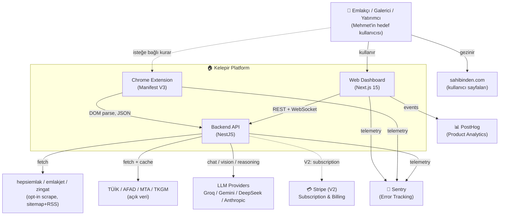
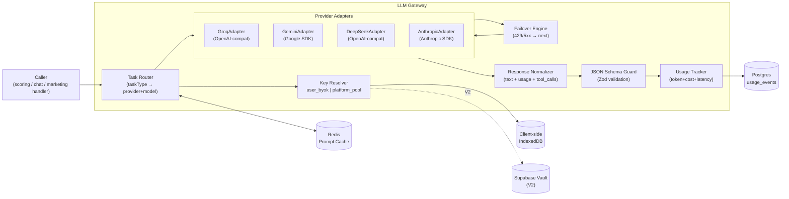
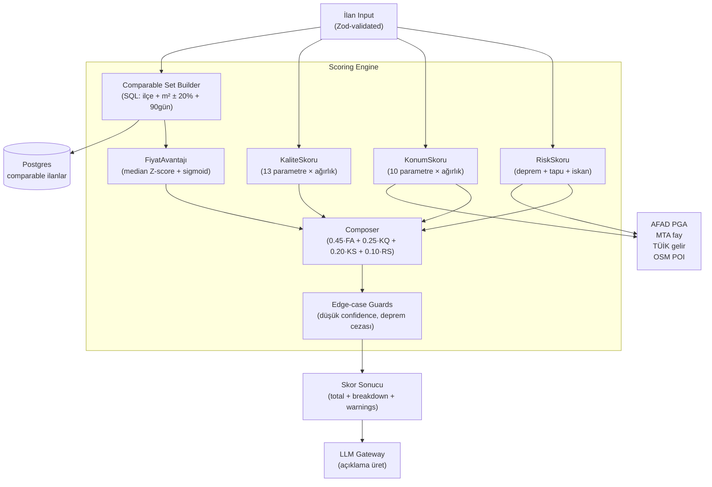
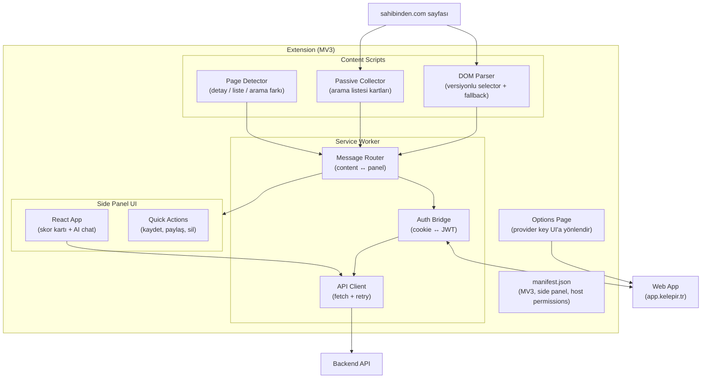
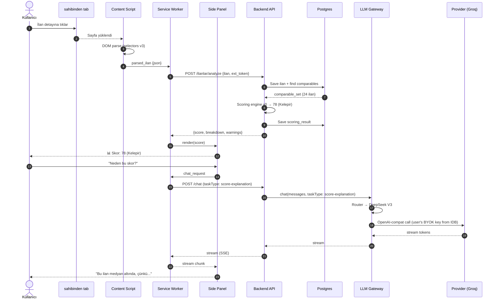
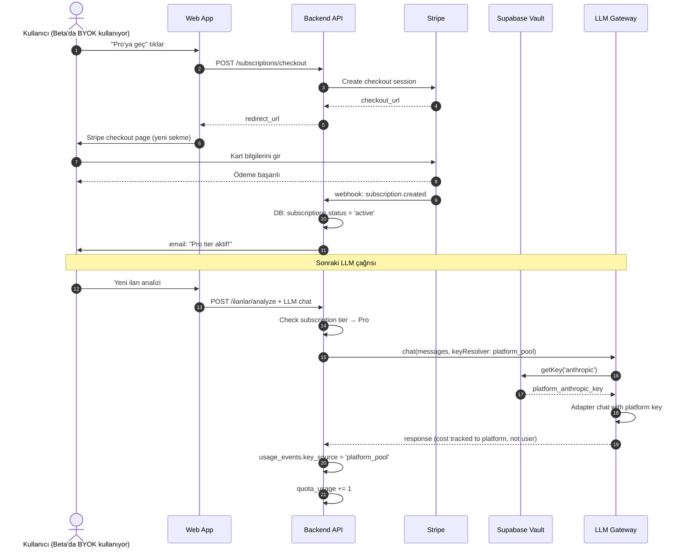
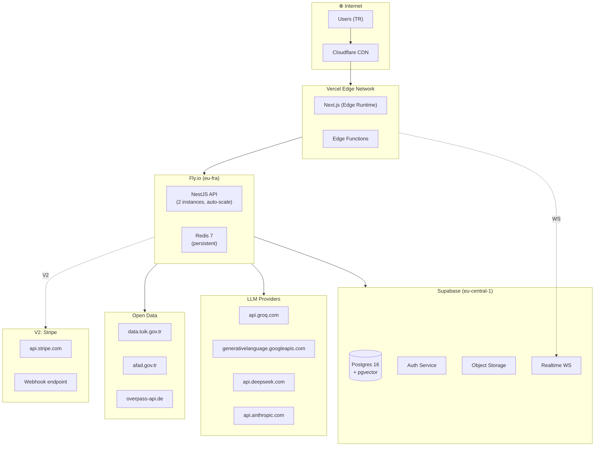

# Sistem Mimarisi Diyagramı v1

**Date:** 21 Mayıs 2026
**Convention:** C4-style (Context → Container → Component), Mermaid

---

## 1. C4 Level 1 — System Context



---

## 2. C4 Level 2 — Container Diagram

```mermaid
flowchart TB
    User["👤 Kullanıcı"]

    subgraph Browser["🌐 Kullanıcı Tarayıcısı"]
        direction TB

        subgraph WebApp["Web App (Next.js)"]
            WebUI["UI Components<br/>(shadcn/ui + Tailwind)"]
            WebState["State / Query<br/>(TanStack Query + Zustand)"]
            WebCrypto["Key Vault<br/>(IndexedDB + AES-GCM)"]
        end

        subgraph Extension["Chrome Extension (MV3)"]
            CS["Content Script<br/>(sahibinden DOM parser)"]
            SW["Service Worker<br/>(auth bridge + API)"]
            SP["Side Panel<br/>(React UI)"]
            EOpts["Options Page"]
        end

        SHTab["sahibinden.com tab<br/>(kullanıcı oturumu)"]
    end

    subgraph Cloud["☁️ Cloud (Vercel + Fly.io + Supabase)"]
        direction TB

        Vercel["Vercel<br/>(Next.js SSR/Edge)"]

        subgraph API["NestJS API (Fly.io)"]
            AuthMod["Auth Module<br/>(JWT verify)"]
            IngestMod["Ingestion Module"]
            ScoreMod["Scoring Module"]
            LLMGW["LLM Gateway"]
            DataMod["External Data Module"]
            BillingMod["Billing Module (V2)"]
            QuotaMod["Quota Enforcement (V2)"]
        end

        subgraph Supabase["Supabase"]
            SBAuth["Auth<br/>(JWT issuer)"]
            SBDB[("PostgreSQL 16<br/>+ pgvector")]
            SBStorage["Storage<br/>(ilan fotoları cache)"]
            SBVault["Vault<br/>(V2: platform keys)"]
        end

        Redis[("Redis<br/>(rate limit + cache)"]
    end

    subgraph External["🌍 External"]
        LLM4["Groq / Gemini / DeepSeek / Anthropic"]
        OpenSrc["TÜİK / AFAD / MTA / Belediye GIS"]
        OtherEmlak["hepsiemlak / emlakjet / zingat"]
        StripeAPI["Stripe (V2)"]
    end

    User --> WebUI
    User --> SHTab

    CS -->|DOM read| SHTab
    CS -->|message| SW
    SP -->|render| User
    SW -->|HTTPS+JWT| Vercel
    SW -->|JWT bridge| WebApp

    WebUI <--> WebState
    WebState --> WebCrypto
    WebState -->|REST+WS| Vercel

    Vercel --> API
    API --> SBAuth
    AuthMod --> SBAuth
    IngestMod --> SBDB
    ScoreMod --> SBDB
    DataMod --> SBDB
    DataMod --> Redis
    LLMGW --> Redis
    BillingMod --> SBDB
    QuotaMod --> Redis

    LLMGW -->|direct or proxy| LLM4
    DataMod --> OpenSrc
    DataMod --> OtherEmlak
    BillingMod --> StripeAPI

    SBStorage <-->|fotoğraflar| API
    SBVault <-->|V2 platform keys| LLMGW
```

---

## 3. C4 Level 3 — LLM Gateway Component



---

## 4. C4 Level 3 — Scoring Engine Component



---

## 5. C4 Level 3 — Chrome Extension Component



---

## 6. Sequence — "Kullanıcı sahibinden'de ilan açıyor, skor görüyor"



---

## 7. Sequence — V2 "Aboneliğe geçiş + managed proxy"



---

## 8. Deployment Diagram



---

## 9. Data Flow — "Bir ilan, A'dan Z'ye"

```mermaid
flowchart LR
    subgraph Ingest["Ingestion"]
        A["Kullanıcı sahibinden'de gezinir"]
        B["Extension DOM parse"]
        C["POST /ilanlar"]
        D["Normalize + validate"]
        E["DB insert"]
    end

    subgraph Enrich["Enrichment"]
        F["Geocode (OSM)"]
        G["AFAD PGA lookup"]
        H["TÜİK mahalle lookup"]
        I["DB update"]
    end

    subgraph Score["Scoring"]
        J["Comparable set sorgu"]
        K["FiyatAvantajı"]
        L["Kalite + Konum + Risk"]
        M["Composer → 0-100"]
        N["DB scoring_results"]
    end

    subgraph Explain["AI Explain"]
        O["LLM Gateway"]
        P["DeepSeek V3 (BYOK)"]
        Q["Stream response"]
        R["UI render"]
    end

    A --> B --> C --> D --> E
    E --> F --> G --> H --> I
    I --> J --> K
    J --> L --> M --> N
    N --> O --> P --> Q --> R
```



---

## 10. Açıklama Notları

- **Senkron mu, async mı?** Skorlama senkron (kullanıcı bekler), enrichment async (kuyrukta — Geocode + AFAD ilk çekimde 2-5s sürebilir; mahalle bazlı sonuçlar cache'lenir).
- **Cache stratejisi:** Redis'te `ilan:{id}:score:v1` 24h TTL; `mahalle:{kod}:enrich` 7g TTL; `prompt:{hash}` 1h TTL.
- **Realtime:** Yeni ilan ingest → Supabase Realtime ile dashboard'daki "yeni ilan geldi" toast.
- **Rate limit:** Per user 60 RPM, per provider key 30 RPM (free tier dostu).
- **Idempotency:** Ingestion `POST /ilanlar` `Idempotency-Key` header bekler (extension URL hash'i).
- **Multi-region:** MVP'de eu-fra (Frankfurt) tek bölge; V3'te eu-istanbul opsiyonu (Türkiye veri tutma yasal gereği için).

---

## 11. Render İçin

Bu dosyadaki tüm Mermaid blokları:

- GitHub README'de native render eder
- VS Code'da "Markdown Preview Mermaid Support" extension ile preview
- mermaid-cli ile PNG/SVG export: `mmdc -i 05-sistem-mimarisi-diyagram.md -o diagrams/`
- mermaid.live editorde tek tek paste edip render edebilirsin

İlerleyen fazlarda bu diyagramlar otomatik build pipeline'ında SVG'ye export edilip dokümantasyon sitesine (Docusaurus veya VitePress) gömülür.
