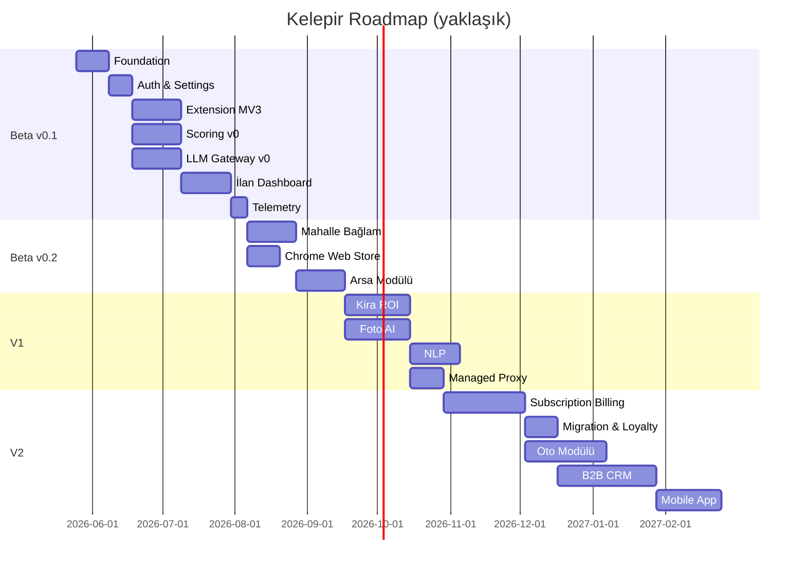

# Roadmap & Feature Prioritization

**Project:** Kelepir (geçici kod adı)
**Date:** 21 Mayıs 2026
**Status:** Draft v1 — onay bekliyor

---

## Faz Özet

| Faz | Hedef Süre | Distribution | Ticari Model | Ana Hedef |
|---|---|---|---|---|
| **MVP / Beta v0.1** | 3-4 ay | Web (private beta) + Extension (dev mode) | BYOK | Bir konut ilanını uçtan uca analiz edebilen ürün |
| **MVP / Beta v0.2** | 5-6 ay | Web (public beta) + Extension (Chrome Web Store) | BYOK | İlk 100-500 emlakçı kullanıcı, feedback döngüsü |
| **V1 — Closed GA** | 7-9 ay | Web + Extension | BYOK (managed proxy hazır ama henüz satılmıyor) | Premium feature seti, foto AI, ROI hesabı |
| **V2 — Public GA** | 10-12 ay | Web + Extension + Mobile (read-only) | **Subscription** (Stripe) + BYOK | Para kazanmaya başla, scale-out |
| **V3 — Enterprise** | 13-18 ay | Web + Extension + Mobile + On-prem | Enterprise kontrat | B2B firma müşterileri |

---

## MVP / Beta v0.1 (Ay 1-3-4) — "Tek İlan, Uçtan Uca"

**Sunulan değer önerisi:** Emlakçı sahibinden'de bir ilanı açar, extension yan paneli ilanı parse eder, deterministik kelepir skorunu gösterir, AI ile "neden kelepir / neden değil" sohbet edebilir, otomatik pazarlama metni üretir.

### Epic 1: Foundation

- [ ] Monorepo (pnpm + Turborepo) iskeleti
- [ ] CI/CD (GitHub Actions): lint + typecheck + test + build + Vercel preview
- [ ] Supabase projesi + Auth (email + magic link)
- [ ] Sentry + PostHog kurulumu
- [ ] DB şeması v1 (users, user_provider_keys, usage_events, **ilanlar**, **scoring_results**, **chat_threads** + V2 için boş şemalar)
- [ ] Tasarım sistemi: shadcn/ui + Tailwind theme (Türkçe yerleşim, sayı/para formatları)

### Epic 2: Authentication & Settings

- [ ] Email + magic link signup/login (Supabase)
- [ ] Master password setup (PBKDF2-derived key, never sent to server)
- [ ] Provider key management UI: Groq, Gemini, DeepSeek, Anthropic ekleme/silme/test
- [ ] Per-task default model seçimi
- [ ] Free tier usage tracker (Groq RPM, Gemini RPD takibi)
- [ ] Settings banner: "🚧 Beta — yakında abonelik geliyor"

### Epic 3: Chrome Extension (MV3)

- [ ] manifest.json (V3) + permissions audit (sadece sahibinden.com)
- [ ] Content script: sahibinden konut ilan sayfası DOM parser (versiyonlu selector + fallback)
- [ ] Side panel UI (React + Vite + Tailwind)
- [ ] Service worker: auth bridge (cookie veya messaging ile web ile session paylaşımı)
- [ ] Passive collector (arama listesi sayfasında scroll'da görünen kartları yakalar)
- [ ] "Bu ilanı kaydet" tek-tık butonu
- [ ] Dashboard'a yönlendirme

### Epic 4: Scoring Engine v0

- [ ] `packages/scoring` paketi (pure TS, framework-bağımsız)
- [ ] Konut parametre şeması (Zod): m², oda, yaş, kat, ısıtma, deprem skoru, mahalle, vs.
- [ ] Comparable ilanlar query (Postgres: aynı ilçe + benzer m² ± %20 + son 90 gün)
- [ ] Kelepir skoru formülü v0 (bkz: `03-skorlama-modeli.md`)
- [ ] Bileşen breakdown (her parametrenin skora katkısı)
- [ ] Birim test paketi (Vitest, 50+ test case)

### Epic 5: LLM Gateway v0

- [ ] `packages/llm-gateway` paketi
- [ ] 4 adapter: GroqAdapter, GeminiAdapter, DeepSeekAdapter, AnthropicAdapter
- [ ] Unified `chat()` arayüzü + streaming
- [ ] Task-type routing (default tablo, kullanıcı override)
- [ ] JSON mode normalize (Zod schema validation)
- [ ] Hata türleri normalize (RateLimit, Auth, Network, Content)
- [ ] Otomatik failover (provider 429/5xx → bir sonraki)
- [ ] Cost calculator (input/output token × provider fiyatı)
- [ ] Usage event emit → DB

### Epic 6: İlan Dashboard

- [ ] İlan listesi sayfası (filtre: ilçe, mahalle, fiyat aralığı, oda, m²)
- [ ] İlan detay sayfası (parametreler + skor breakdown + benzer ilanlar + AI chat)
- [ ] Skor görselleştirme (radar chart veya breakdown bar)
- [ ] AI chat panel (streaming, mesaj geçmişi)
- [ ] Pazarlama metni üretici (template tabanlı + LLM rewrite, copy-to-clipboard)
- [ ] Karşılaştırma görünümü (2-3 ilanı yan yana)

### Epic 7: Telemetry & Quality

- [ ] PostHog event'leri (signup, ilan_analyzed, chat_message, score_viewed)
- [ ] Sentry error tracking (web + extension + api)
- [ ] User feedback widget (NPS + bug report)
- [ ] Selector breakage alarm (sahibinden DOM değişirse Sentry'ye custom event)

**Beta v0.1 Kabul Kriterleri:**

- Bir kullanıcı kaydolup master password belirleyebiliyor
- En az 2 provider key girip test edebiliyor
- Extension'ı kurup sahibinden'de bir ilan açtığında side panel'de skor görüyor
- Web app'te ilan listesi + detay + AI chat çalışıyor
- 10 farklı sahibinden ilan url'ünde parser %95+ doğru parse ediyor
- Skor formülü 50+ birim test geçiyor

---

## MVP / Beta v0.2 (Ay 5-6) — "Public Beta + Çoklu İlçe + Mahalle Bağlamı"

### Epic 8: Mahalle/Bölge Bağlam Katmanı

- [ ] TÜİK açık veri ingestion (nüfus, gelir grupları, yaş dağılımı — ilçe bazlı)
- [ ] AFAD deprem tehlike skor lookup (koordinat → risk derecesi)
- [ ] Mahalle bazlı son N gün fiyat trendi (kullanıcı havuzundan)
- [ ] İl/ilçe/mahalle hierarşi (resmi TÜİK kod listesi)

### Epic 9: Public Beta Hazırlık

- [ ] Chrome Web Store yayını (extension)
- [ ] Onboarding flow (5 adım: signup → master pw → provider key → install ext → ilk ilan)
- [ ] Public landing page (kelepir.tr — hero, demo video, kayıt formu)
- [ ] Türkçe içerik: privacy policy, ToS, KVKK aydınlatma metni
- [ ] Yardım merkezi (5-10 SSS makalesi)
- [ ] Email kampanyası: emlak forumları, sahibinden bayi grupları

### Epic 10: Arsa & Tarla Modülü

- [ ] Arsa/tarla parametre şeması (imar durumu, kullanım izni, paftada konum, ada/parsel)
- [ ] Arsa skorlama formülü v0 (m² fiyatı + imar + konum + altyapı yakınlığı)
- [ ] TKGM parsel sorgu entegrasyonu (kullanıcı manuel girer, biz validate ederiz — public API yok)

**Beta v0.2 Kabul Kriterleri:**

- Chrome Web Store onaylı yayın
- İlk 100 kayıtlı kullanıcı
- Konut + arsa modülleri çalışıyor
- Mahalle bağlam verisi en az İstanbul / Ankara / İzmir için tam

---

## V1 — Closed GA (Ay 7-9) — "Premium Feature'lar"

### Epic 11: Kira & Yatırım ROI Modülü

- [ ] Kira fiyat tahmini (benzer kiralık ilanlar regresyonu)
- [ ] Geri ödeme süresi hesabı (alış / yıllık net kira)
- [ ] AirBnB potansiyeli (Booking ortalama gecelik veya benzer veri kaynağı)
- [ ] Konut kredisi simülasyonu (banka faizleri + KDV + tapu masrafları)
- [ ] Net yatırım getirisi (NPV, IRR) sayfası

### Epic 12: Fotoğraf AI Analizi

- [ ] Gemini Vision / Claude Haiku vision ile ilan fotoğraf analizi
- [ ] Tespit: oda kalitesi, manzara, gün ışığı, balık-gözü lens, yanıltıcı açı
- [ ] Otomatik feature tag (klima, asansör, teras, banyo sayısı, vs.)
- [ ] Fotoğrafa dayalı skor düzeltme katsayısı

### Epic 13: İlan Metni NLP

- [ ] Yanıltıcı kelime tespiti ("acil", "kelepir", "yatırımlık", "fırsat")
- [ ] Bayi/sahibinden mi karar verme (signal analysis)
- [ ] Pazarlık ipucu üretimi (ilan kaç gün, fiyat değişti mi, talep yoğun mu)
- [ ] Sahte ilan riski skoru

### Epic 14: Managed Proxy (V2 Hazırlığı)

- [ ] `apps/api`'ye `POST /llm/chat` proxy endpoint
- [ ] Supabase Vault'ta platform key'leri sakla
- [ ] Rate limit middleware (per user per provider)
- [ ] V2'de açılacak — V1'de internal/admin only

**V1 Kabul Kriterleri:**

- 500+ kayıtlı kullanıcı
- Foto AI %85+ feature tag doğruluğu (manuel review ile)
- Yatırım ROI hesabı 50+ örnek üzerinde piyasa eksperleriyle valide
- Managed proxy internal test'te çalışıyor

---

## V2 — Public GA (Ay 10-12) — "Para Kazanmaya Başla"

### Epic 15: Subscription & Billing (KRİTİK — V2 KİLİDİ)

- [ ] Stripe entegrasyonu (TR support — alternatif: Iyzico, Paratika)
- [ ] Plan tanımları DB'ye yüklenir: Free, Starter, Pro (aylık/yıllık), Enterprise
- [ ] Subscription lifecycle: trialing → active → past_due → canceled
- [ ] Webhook handler: invoice.paid, subscription.updated, payment_failed
- [ ] Customer Portal entegrasyonu (kullanıcı plan yönetir, kart günceller, iptal eder)
- [ ] Plan quota enforcement middleware (aylık ilan sayısı, foto AI sayısı, model whitelist)
- [ ] Quota usage cache (`quota_usage` tablosu, hızlı sorgu)
- [ ] Türkiye vergi: KDV %20 otomatik, Stripe Tax veya Iyzico
- [ ] E-Fatura entegrasyonu (Logo/Paraşüt/Mikro — opsiyonel, kurumsal müşteri için)
- [ ] In-app banner: "Aboneliğinize 5 ilan analizi kaldı" / "Bu modeli kullanmak için Pro'ya geçin"

### Epic 16: Migration & Beta Loyalty

- [ ] Beta kullanıcılarına otomatik 3 ay Pro plan ücretsiz (Stripe coupon)
- [ ] "Erken Destekçi" rozeti (profil + paylaşılan içeriklerde görünür)
- [ ] Migration UX: "Beta key'inizi koruyun veya abonelik ile değiştirin" seçimi
- [ ] Hybrid mod: kullanıcı hem subscription'da hem BYOK ile manuel override

### Epic 17: Galericilik (Oto) Modülü

- [ ] Sahibinden oto kategorisi DOM parser (km, model yılı, vites, motor, donanım)
- [ ] TRAMER entegrasyonu (kullanıcı plaka/TC girer, kaza/hasar geçmişi)
- [ ] Oto deterministik skor formülü (km vs yaş eğrisi, donanım fiyat katkısı, marka amortismanı)
- [ ] Donanım veritabanı (model + paket kombinasyonu fiyat etkisi)
- [ ] Galerici dashboard varyantı (envanter yönetimi)

### Epic 18: B2B Emlakçı CRM

- [ ] Portföy yönetimi (kayıtlı ilanlar + müşteri talepleri eşleştirme)
- [ ] Müşteri profili (talep kriterleri: mahalle, fiyat, oda, m²)
- [ ] Otomatik eşleştirme bildirimi ("Müşteriniz Ahmet'in kriterlerine uyan yeni ilan çıktı")
- [ ] Pazarlama paketi: sosyal medya (Instagram, Facebook) post + story üretimi
- [ ] Çoklu kullanıcı (ofis için 3-5 kişilik takım)
- [ ] Lead funnel raporu (görüntülenme → ilgi → randevu → satış)

### Epic 19: Mobile App (Read-Only)

- [ ] React Native veya Expo ile basit mobil app
- [ ] Dashboard görüntüleme + AI chat + push notification
- [ ] Extension yok (mobile'da web app sahibinden açar)
- [ ] Push: yeni eşleşme, abonelik bildirimi, kelepir alarm

**V2 Kabul Kriterleri:**

- Stripe webhook %99.9 uptime
- İlk 50 ödeyen abone
- KDV/E-fatura yasal denetimden geçer
- Oto modülü TRAMER ile çalışıyor
- B2B CRM en az 10 emlak ofisinde pilot

---

## V3 — Enterprise & Türkiye'ye Özel İnovasyon (Ay 13-18)

### Epic 20: Off-Market & İcra Modülü

- [ ] UYAP icra-iflas ihale takip (manuel ingest + auto-alert)
- [ ] Banka gayrimenkul portföyleri (10+ banka sitesi sitemap)
- [ ] TOKİ ve Emlak Konut projeleri
- [ ] Otomatik alarm + skor (off-market ilanlar için ayrı kelepir formülü)

### Epic 21: Belediye GIS & Kentsel Dönüşüm

- [ ] Büyükşehir belediyeleri GIS entegrasyon (İBB, ABB, İZSU vs. açık veri)
- [ ] İmar durumu sorgu (parsel → imar planı katmanı)
- [ ] Kentsel dönüşüm bölgesi tespiti
- [ ] Riskli yapı / iskan durumu
- [ ] Yapı denetim raporu lookup (mevcut ise)

### Epic 22: Deprem & Zemin Detay

- [ ] AFAD detaylı tehlike (PGA, spektral ivme — TBDY parametreleri)
- [ ] 1999 öncesi/sonrası bina ayrımı
- [ ] Fay hattı mesafesi (MTA diri fay haritası)
- [ ] Zemin türü (varsa belediye verisi)
- [ ] Deprem risk skoru bağımsız bir başlık

### Epic 23: Multi-Tenant SaaS & White Label

- [ ] Workspace/organization yapısı (firma + kullanıcılar)
- [ ] Custom domain (örn. abc-emlak.kelepir.tr)
- [ ] Beyaz etiket: logo, renk, font değişimi
- [ ] Admin dashboard (kullanım, gelir, kullanıcı yönetimi)
- [ ] SSO (SAML, OIDC) — kurumsal müşteri için
- [ ] On-prem deployment paketi (Docker Compose + Kubernetes Helm chart)

### Epic 24: Sokak Fiyat Tarihi

- [ ] Bir sokak/mahalle için 2-3 yıllık fiyat eğrisi
- [ ] İndirim takibi (ilan kaç gün açık kaldı, ne kadar düşürüldü)
- [ ] Sahip değişikliği tahmini (ilan kalktı + tapu hareket simülasyonu)

**V3 Kabul Kriterleri:**

- En az 3 büyük emlak ofisi ile beyaz etiket kontratı
- Enterprise self-serve onboarding
- 5000+ aktif kullanıcı
- Aylık ₺500K+ MRR (Mehmet'in hedefine bağlı)

---

## Risk & Bağımlılık Matrisi

| Risk | Etki | Olasılık | Hafifletme |
|---|---|---|---|
| sahibinden DOM değişikliği | Yüksek (parser kırılır) | Yüksek | Versiyonlu selector + Sentry alarm + manuel hotfix < 24h |
| sahibinden hukuki uyarı | Çok yüksek (ürün durur) | Orta | Avukat görüşü; "user-assisted ingestion" konumlanması; ihtarname akış planı |
| LLM provider fiyat artışı / model deprecation | Orta | Yüksek (Gemini 2.0 zaten deprecate oldu!) | Multi-provider abstraction + günlük fiyat monitor + 30 günlük migration buffer |
| Stripe TR kullanılamazsa | Yüksek (V2 kilidi) | Düşük | Iyzico / Paratika backup planı |
| Kullanıcı master password kaybı | Orta | Orta | Recovery code (16 karakter) + güvenli wallet'a yedekleme önerisi |
| AAA UX gecikmesi (tek geliştirici) | Yüksek | Yüksek | Tasarım sistemini erken kilitle, shadcn/ui hazır bileşen kullan, custom component yapma |

---

## KPI Hedefleri

| Metric | MVP v0.1 | MVP v0.2 | V1 | V2 (yıl sonu) |
|---|---|---|---|---|
| Kayıtlı kullanıcı | 10 (private) | 100 | 500 | 2.500 |
| Haftalık aktif kullanıcı (WAU) | 5 | 50 | 200 | 1.000 |
| Analiz edilen ilan / ay | 100 | 2.000 | 10.000 | 50.000 |
| MRR (₺) | 0 | 0 | 0 | 100.000 |
| NPS | n/a | >30 | >40 | >50 |
| Parser doğruluk | 95% | 97% | 98% | 99% |

---

## Bağımlılıklar

