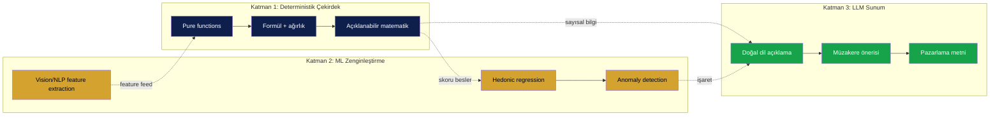
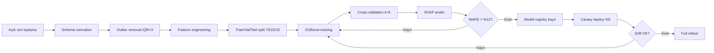
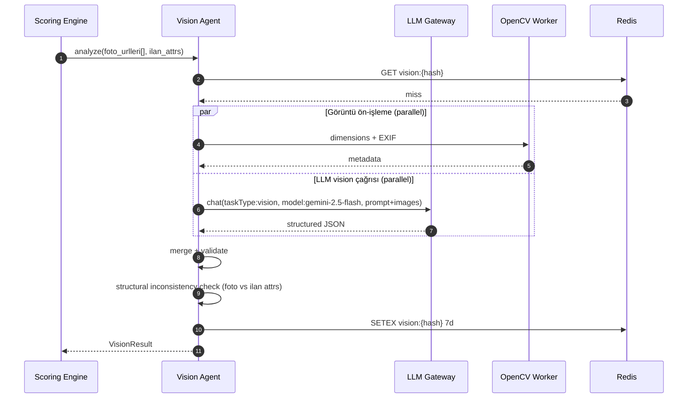
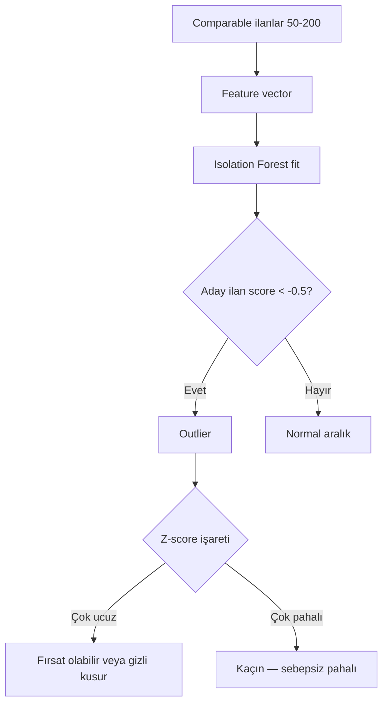

# 10 — AAA Skorlama Motoru Spesifikasyonu

| Alan | Değer |
|---|---|
| **Doküman versiyonu** | 1.0 |
| **Statü** | Proposed (uygulanmayı bekliyor) |
| **Son güncelleme** | 22 Mayıs 2026 |
| **Yazar** | Pusula Mühendislik |
| **Hedef okuyucu** | Backend mühendisleri, ML mühendisleri, ürün liderliği, kalibrasyon ekibi |
| **Önceki versiyon** | `03-skorlama-modeli.md` (v0) — bu doküman onun AAA halefidir |

## Amaç

Pusula skorlama motorunun prodüksiyon kalitesinde, açıklanabilir, kalibre edilebilir, çoklu-dikey ve adaptif bir tasarımını ortaya koymak. Hedef: bir konut, arsa veya oto ilanını 80+ parametre üzerinden değerlendirip, eksik veride dahi anlamlı sonuç üreten, kullanıcıya neden o skoru aldığını natural language ile sunabilen bir sistem.

## Kapsam

Bu doküman skorlama motorunun *iç tasarımını* ve API kontratını tanımlar. Skorlama motorunu kullanan agent'ların orkestrasyonu `11-multi-agent-mimarisi.md`, veri eksikliği stratejisi `13-veri-mevcudiyeti-ve-dinamik-skor.md`, kalibrasyon `14-kalibrasyon-ve-deney-protokolu.md` dokümanlarında ayrı ele alınır.

---

## 1. Felsefe

Pusula skorlama motoru üç katmanlı bir mimaride çalışır. Her katmanın sorumluluğu, çıktısı ve denetlenebilirliği bağımsızdır.



**Değişmez kurallar:**

1. **LLM sayısal skoru asla değiştirmez.** LLM, deterministik katmanın çıktısını doğal dile çevirir; sayısal değerleri override edemez.
2. **Her bileşen açıklanabilir.** Skorun her alt-bileşeni `(parametre, ağırlık, normalize edilmiş değer, katkı)` dörtlüsüyle traceable.
3. **Eksik veri, sıfır skor demek değildir.** Adaptif ağırlık yeniden dağıtımı, confidence skoru ile birlikte raporlanır.
4. **Vertical-agnostic core.** `@pusula/scoring-core` her dikey için ortak; konut/arsa/oto özel paketleri kendi parametre setlerini ekler.
5. **Versioning zorunlu.** Her skor sonucu `formul_versiyonu`, `model_version`, `feature_set_version` taşır.

---

## 2. Ana Formül

Toplam skor 8 pillar'ın ağırlıklı toplamıdır. Tüm pillar'lar `[0, 100]` aralığında normalize edilir.

```
Skor = w_p · FiyatAvantajı
     + w_q · Kalite
     + w_l · Konum
     + w_r · Risk
     + w_v · Vision
     + w_n · NLP
     + w_d · PazarDinamiği
     + w_f · FinansalModel
```

**Varsayılan ağırlık dağılımı (konut, v1.0):**

| Pillar | Sembol | Ağırlık | Gerekçe |
|---|---|---|---|
| Fiyat Avantajı | `w_p` | 0.32 | Kelepir tanımının özü |
| Kalite | `w_q` | 0.16 | Düşük kaliteli "ucuz" ev cazip değildir |
| Konum | `w_l` | 0.14 | Mahalle bağlamı |
| Risk | `w_r` | 0.10 | Deprem + hukuki + ilan riski |
| Vision | `w_v` | 0.08 | Fotoğraf analizi |
| NLP | `w_n` | 0.06 | Metin sinyalleri |
| Pazar Dinamiği | `w_d` | 0.08 | Likidite + sezonsallık |
| Finansal Model | `w_f` | 0.06 | ROI + maliyet gerçeği |

Toplam = 1.00. Kullanıcı persona'sına göre runtime'da yeniden ağırlıklandırılır (örn. yatırımcı → `w_f += 0.10`, `w_v -= 0.05`, `w_n -= 0.05`).

### 2.1 Yorum bantları

| Skor | Etiket | Renk | UI davranışı |
|---|---|---|---|
| 85-100 | Kaçırılmaz | Koyu yeşil `#15803d` | Push notification + star |
| 70-84 | Kelepir | Yeşil `#16A34A` | Highlight |
| 55-69 | İyi Fiyat | Açık yeşil `#65A30D` | Normal |
| 40-54 | Piyasa | Gri `#6B7280` | Normal |
| 25-39 | Pahalı | Turuncu `#EA580C` | Uyarı banner |
| 0-24 | Aşırı Pahalı | Kırmızı `#DC2626` | Uyarı + LLM "kaçın" mesajı |

---

## 3. Pillar Detayları

### 3.1 Fiyat Avantajı (`w_p = 0.32`)

#### Girdiler

| Parametre | Tip | Kaynak | Zorunlu |
|---|---|---|---|
| `ilan_fiyatı` | int (TL) | İlan | Evet |
| `net_m2` | int | İlan | Evet |
| `comparable_set` | İlanlar listesi | Postgres query | Min 5 |
| `hedonic_tahmin` | float (TL) | ML modeli | Hayır (varsa ağırlık verilir) |

#### Hesap

```
ilan_m2_tl = ilan_fiyatı / net_m2

# Yöntem A: Komşu istatistik
median_m2 = median(comparable_set.fiyat_per_m2, outlier_filter=IQR×3)
iqr = Q3 - Q1
z_score = (median_m2 - ilan_m2_tl) / iqr  # pozitif = ucuz

# Yöntem B: Hedonic regression (varsa)
beklenen_m2_tl = hedonic_tahmin / net_m2
hedonic_z = (beklenen_m2_tl - ilan_m2_tl) / hedonic_std

# Birleştirme (Yöntem B varsa ağırlıklı ortalama)
if has_hedonic:
    final_z = 0.4 × z_score + 0.6 × hedonic_z
else:
    final_z = z_score

skor = clamp(100 × sigmoid(final_z × 1.5), 0, 100)
```

#### Edge case'ler

| Durum | Davranış |
|---|---|
| `comparable_set.count < 5` | Skor = 50 (nötr), `confidence: low`, kullanıcıya "yeterli karşılaştırma yok" uyarısı |
| `iqr ≤ 0` (homojen pazar) | Yöntem A skip, sadece hedonic veya nötr |
| Hedonic model yüklü değil | Yöntem A tek başına, `model_unavailable: true` log |
| Outlier filtreden 50%+ veri düştü | `data_quality: poor` flag |

#### Hedonic Regression Modeli

`@pusula/hedonic` paketi, Türkiye konut pazarı için eğitilmiş regresyon modeli sunar.

**Feature seti (v0.2.1):**

```
features = [
  log(net_m2),
  bina_yasi,
  bina_yasi²,
  kat_seviyesi,
  oda_sayisi_kategorik,
  ilce_one_hot,
  mahalle_embedding (128-dim, pgvector),
  isitma_kategorik,
  asansor_binary,
  otopark_kategorik,
  site_icinde_binary,
  cephe_embedding,
  ay_of_year_sin,
  ay_of_year_cos,
  yil_faiz_oranı,
  yil_usd_try
]
```

**Algoritma:** XGBoost (cache + warm start uyumlu) veya LightGBM. Sklearn `GradientBoostingRegressor` MVP fallback.

**Çıktı:**

```typescript
interface HedonicPrediction {
  predicted_price_tl: number;
  confidence_interval_95: [number, number];
  feature_importances: Array<{ feature: string; shap_value: number }>;
  model_version: string;  // "hedonic_v0.2.1"
  data_freshness: string; // "2026-04-15" — eğitim verisinin son tarihi
}
```

**Eğitim Pipeline:**



### 3.2 Kalite (`w_q = 0.16`)

13 alt-parametre (eski 03 dokümanından genişletildi). Detay matriks:

| Alt-parametre | İç ağırlık | Mapping fonksiyonu | Kaynak |
|---|---|---|---|
| Bina yaşı | 0.18 | piecewise: <5→95, <15→75, <30→55, <50→35, else→20 | İlan |
| Net m² | 0.13 | oda sayısına göre beklenen vs gerçek oran | İlan |
| Brüt/net oranı | 0.08 | <1.15→95, ..., >1.35→35 | İlan |
| Oda dağılımı | 0.08 | tip + salon m² | İlan |
| Banyo sayısı | 0.04 | 1→70, 2→85, 3+→90 | İlan |
| Kat konumu | 0.09 | zemin→30, 1-3→80, 4-7→90, 8+→70, çatı→60 | İlan |
| Bina kat sayısı | 0.04 | 3-5→85, 6-15→70, 15+→55 | İlan |
| Isıtma | 0.09 | kombi→90, merkezi→60, soba→25, ... | İlan |
| Asansör | 0.03 | var→90, yok+kat≥3→30, yok+kat<3→70 | İlan |
| Otopark | 0.05 | kapalı→90, açık→75, yok+İST/ANK→40 | İlan |
| Eşyalı | 0.02 | eşyalı→+5 bonus | İlan |
| Site içi | 0.03 | site→85, apt→55, müstakil→70 | İlan |
| Krediye uygun | 0.02 | uygun→85, kısmen→60, değil→30 | İlan |

#### Hesap

```
kalite_score = sum(w_i × map_i(value_i)) / sum(w_i where data_available)
```

Eksik parametreler için ağırlıklar yeniden normalize edilir (bkz. §6).

### 3.3 Konum (`w_l = 0.14`)

10 alt-parametre (03'ten korundu).

**Önemli geliştirme:** Mahalle gentrifikasyon skoru artık 12-ay/24-ay/36-ay üç pencerede hesaplanır ve birleşik bir momentum değeri üretir.

```
gentrifikasyon_momentum =
    0.5 × fiyat_change_12ay
  + 0.3 × fiyat_change_24ay
  + 0.2 × fiyat_change_36ay
```

### 3.4 Risk (`w_r = 0.10`)

7 alt-parametre (03'ten korundu) + 2 yeni:

- **Tapu çakışması** (V2): TKGM API ile aynı parsel üzerinde başka ilan var mı (multiple listing detection)
- **Kentsel dönüşüm bölgesi** (V2): belediye GIS verisi

### 3.5 Vision Pillar (`w_v = 0.08`) — YENİ

Çok modlu görsel analiz.

#### Alt-parametreler

| Alt-parametre | Tip | Algoritma | Model |
|---|---|---|---|
| Fotoğraf sayısı | int | count >= 8 ideal | — |
| Çözünürlük ortalaması | float (MP) | >= 1.5 MP ideal | EXIF parse |
| Doğal ışık skoru | 0-100 | HSV histogramı + ortalama luminance | OpenCV |
| Manzara tespiti | enum (deniz/park/sokak/duvar/yok) | classifier | Gemini Vision veya CLIP |
| Oda temizlik/dekorasyon skoru | 0-100 | LLM vision | Gemini 2.5 Flash |
| Eşya kalite skoru | 0-100 | LLM vision | Gemini 2.5 Flash |
| Gizlenen kusur tespiti | bool + liste | LLM vision detection prompt | Claude Haiku 4.5 vision |
| Lens distorsiyon flag | bool | EXIF + perspective angle inference | OpenCV + heuristic |
| Görsel-yapısal tutarsızlık | bool + liste | structured comparison | LLM tool use |

#### Vision Agent Akışı



#### Vision Prompt (sistem prompt'u)

```
Sen Pusula'nın görsel analiz uzmanısın. Verilen ilan fotoğraflarını analiz ederek
aşağıdaki JSON şemasına göre çıktı ver. Asla yorum yazma, sadece JSON döndür.

{
  "natural_light_score": 0-100,
  "scene_class": "deniz" | "park" | "sokak" | "duvar" | "yok",
  "cleanliness_score": 0-100,
  "decoration_score": 0-100,
  "furniture_quality_score": 0-100,
  "hidden_defects": [
    {"type": "nem" | "catlak" | "kuf" | "boya_dokulmesi" | "diger",
     "confidence": 0.0-1.0,
     "location": "duvar" | "tavan" | "zemin" | "pencere" | "diger"}
  ],
  "lens_distortion_detected": boolean,
  "perceived_room_size_inconsistency": boolean,
  "notes": "Türkçe 1-2 cümle özet"
}

Kurallar:
1. Asla "muhteşem", "harika" gibi pazarlama sözcükleri kullanma
2. Hidden_defects sadece %70+ emin olduğun şeyleri içersin
3. Fotoğraflarda olmayan şeyleri uydurma
```

### 3.6 NLP Pillar (`w_n = 0.06`) — YENİ

İlan başlığı + açıklaması üzerinde dil işleme.

#### Alt-parametreler

| Alt-parametre | Tip | Algoritma |
|---|---|---|
| Yanıltıcı sözcük yoğunluğu | 0-100 (yüksek = kötü) | sözlük tabanlı: ["acil","kelepir","sahibinden","muhteşem","harika","ucuz","fırsat"] / kelime sayısı × 100 |
| Eksik bilgi sinyali | bool + liste | regex: kat, brüt, krediye uygun, ısıtma anahtarları |
| Dil hatası indeksi | 0-100 | hunspell veya LLM-based grammar check |
| Kopyala-yapıştır flag | bool | trigram benzerlik aynı ilan veren'in diğer ilanlarıyla |
| Tonalite skoru | -100..+100 | objektif (+) vs satışçı (-), LLM classifier |
| Hidden feature extraction | string[] | LLM NER: "manzaralı", "asansörlü", "renove edilmiş" yapısal olmayan ama metinde geçenler |
| Şüphe lexicon hit | string[] | spesifik kelimeler ("hisseli","2-B","tahsisli","acele") |

#### Hidden Feature Reconciliation

Eğer NLP "manzaralı" tespit ediyor ama yapısal `manzara: null` ise:

```typescript
if (nlp.hidden_features.includes('manzara') && ilan.cephe === null) {
  warnings.push('Metinde "manzara" geçiyor ama yapısal alanda belirtilmemiş — doğrulanmalı');
  vision_agent.priorityHint('scene_class_focus');
}
```

### 3.7 Pazar Dinamiği (`w_d = 0.08`) — YENİ

Likidite ve makro bağlam.

| Alt-parametre | Hesap | Veri kaynağı |
|---|---|---|
| DOM (Days on Market) | now - ilan.created_at | İlanlar tablosu |
| İndirim sayısı | count(price_history < current) | `ilan_price_history` (yeni tablo) |
| Toplam indirim % | (max_price - current) / max_price | `ilan_price_history` |
| Mahalle 30g fiyat değişimi % | aylık aggregate | `mahalle_enrichment` |
| Mahalle 90g fiyat değişimi % | 3-aylık aggregate | `mahalle_enrichment` |
| Mahalle stok değişimi | count(active) son 30g delta | İlanlar tablosu |
| Sezonsallık katsayısı | ay × tarihsel ortalama | TÜİK + iç havuz |
| Faiz oranı bağlamı | TCMB politika faizi | TCMB API |
| Görüntülenme sayısı (proxy) | ilan_page_views | Sahibinden DOM scrape (varsa) |

#### Likidite skoru

```
likidite = (1 - normalize(DOM, 0, 180)) × 0.4
        + (1 - normalize(indirim_yuzde, 0, 30)) × 0.3
        + normalize(mahalle_stok_azalmasi, 0, 0.2) × 0.3
```

Yüksek likidite = ilan hızla satılır, indirim potansiyeli düşük.

### 3.8 Finansal Model (`w_f = 0.06`) — YENİ

Yatırımcı/alıcı persona'sı için kritik.

| Alt-parametre | Hesap |
|---|---|
| Banka ekspertiz tahmini | Hedonic model ± %5 |
| Kredi limiti tahmini | ekspertiz × 0.80 (mevcut yönetmelik) |
| Aylık taksit (örnek senaryo) | 0.10x = peşin, 0.90x kredi, 120 ay, %1.95 aylık faiz |
| Toplam masraf yükü | tapu_harci (%4) + KDV (1+1 değil ise) + eksper (~₺7K) + noter |
| Toplam gerçek maliyet | fiyat + masraflar |
| Mahalle ortalama kira | iç havuz `kiralik_ilanlar` benzer kriter |
| Yıllık brüt kira getirisi | (aylık_kira × 12) / toplam_maliyet × 100 |
| Net kira getirisi | brüt - %25 (vergi+gider+boş kalma) |
| Geri ödeme süresi (yıl) | toplam_maliyet / yıllık_net_kira |
| AirBnB potansiyeli (V1) | Booking ortalama × 0.55 (ortalama doluluk) |

#### Persona Bazlı Vurgu

Eğer kullanıcı persona = "yatırımcı" ise, finansal pillar UI'da öne çıkar ve ana skor hesabında `w_f = 0.16` (varsayılan 0.06'dan +10) olur. Bu yeniden ağırlıklandırma `13-veri-mevcudiyeti-ve-dinamik-skor.md`'de detaylı.

---

## 4. Anomaly + Şüphe Katmanı

Skorun üzerinde, bağımsız bir anomaly detection katmanı çalışır.

### 4.1 Isolation Forest

Comparable set üzerinde unsupervised — bu ilan outlier mı?



### 4.2 Şüphe Skoru

Kasten gizlenmiş sinyaller toplamı:

```python
suspicion = 0
if foto_sayisi < 3: suspicion += 20
if kat is None: suspicion += 15
if brut_net_belirsiz: suspicion += 10
if sahip_emlakci_belirsiz: suspicion += 10
if aciklama.length < 100: suspicion += 10
if "acele" in title.lower() or "acil" in title.lower(): suspicion += 15
if vision.hidden_defects.count > 2: suspicion += 20
# clamp
suspicion = min(suspicion, 100)
```

Şüphe skoru ≥ 50 ise, ana skora ceza uygulanır (skor × 0.85) ve LLM açıklamasında üst sırada uyarı.

### 4.3 Komşu Korelasyon

```sql
SELECT count(*) as komsu_count, avg(fiyat_per_m2) as komsu_avg
FROM ilanlar
WHERE sokak = :sokak
  AND id != :aday_id
  AND created_at > NOW() - INTERVAL '180 days'
  AND status = 'aktif';
```

Eğer aynı sokakta 3+ aktif ilan varsa ve aday ilan onlardan %25+ ucuz/pahalı ise → flag.

---

## 5. Adaptif Veri Mevcudiyeti

Detaylı algoritma `13-veri-mevcudiyeti-ve-dinamik-skor.md`'de. Bu bölüm sadece arayüzü tarif eder.

### 5.1 Skor Sonucu Tipinin Genişletilmesi

```typescript
interface SkorSonucuV1 {
  toplam: number;             // 0-100
  etiket: SkorEtiketi;
  confidence: number;         // 0-100 (yeni)
  veri_kalitesi: {
    pillar_coverage: Record<PillarKey, number>; // her pillar için 0-100
    eksik_kritik_alanlar: string[];
    fallback_kullanılan: string[]; // hangi data source fallback'ti
  };
  pillars: Record<PillarKey, PillarResult>;
  alt_bilesenler: Record<string, AltBilesenResult>;
  anomaly: AnomalyResult;
  comparable: KomparableOzet;
  uyarilar: Uyari[];
  hesap_zamani: string;
  formul_versiyonu: string;
  model_versions: {
    hedonic?: string;
    vision?: string;
    nlp?: string;
    anomaly?: string;
  };
}

interface Uyari {
  seviye: 'info' | 'warning' | 'critical';
  kod: string;          // 'low_confidence', 'high_seismic_risk', vs.
  mesaj_tr: string;
  ilgili_pillar?: PillarKey;
}
```

---

## 6. Multi-Vertical Mimarisi

### 6.1 Paket Yapısı

```
packages/
├── scoring-core/         # Soyut çekirdek
│   ├── src/
│   │   ├── types.ts      # PillarKey, Result, Context tipleri
│   │   ├── engine.ts     # AdaptiveScoringEngine abstract class
│   │   ├── normalize.ts  # sigmoid, z-score, clamp
│   │   ├── confidence.ts # confidence calculus
│   │   └── anomaly.ts    # Isolation Forest wrapper
│   └── README.md
├── scoring-konut/        # Konut dikey paketi (ana MVP)
│   ├── src/
│   │   ├── pillars/      # her pillar bir dosya
│   │   ├── parameters.ts # 80+ parametre tanımı + ağırlık
│   │   ├── KonutEngine.ts extends AdaptiveScoringEngine
│   │   └── index.ts
│   └── README.md
├── scoring-arsa/         # V0.2'de aktif
├── scoring-oto/          # V2'de aktif
├── scoring-ticari/       # V3'te aktif
└── hedonic/              # ML modelleri
    ├── src/
    │   ├── train.py      # Python — model training pipeline
    │   ├── predict.ts    # TypeScript — inference (ONNX runtime)
    │   ├── models/       # versioned model artifacts
    │   └── tests/
    └── README.md
```

### 6.2 Abstract Engine Kontratı

```typescript
// scoring-core/src/engine.ts

export abstract class AdaptiveScoringEngine<
  TInput,
  TContext,
  TResult extends SkorSonucu
> {
  abstract readonly vertical: 'konut' | 'arsa' | 'oto' | 'ticari';
  abstract readonly formulVersion: string;
  abstract readonly pillarDefinitions: ReadonlyArray<PillarDefinition>;

  /**
   * Ana entry point. Pure function: aynı input + context → aynı output.
   */
  abstract score(input: TInput, context: TContext): Promise<TResult>;

  /**
   * Dinamik ağırlık yeniden hesaplama (persona, eksik veri).
   */
  protected redistributeWeights(
    availability: PillarAvailability,
    persona?: UserPersona
  ): Record<PillarKey, number> {
    // implementation in concrete class
    throw new Error('Must implement');
  }

  /**
   * Test edilebilirlik için: belirli pillar'ı bağımsız çağır.
   */
  abstract scorePillar<P extends PillarKey>(
    pillar: P,
    input: TInput,
    context: TContext
  ): Promise<PillarResult>;
}
```

### 6.3 Konut Engine örneği

```typescript
// scoring-konut/src/KonutEngine.ts

export class KonutEngine extends AdaptiveScoringEngine<
  KonutInput,
  ScoringContext,
  KonutSkorResult
> {
  readonly vertical = 'konut' as const;
  readonly formulVersion = 'konut_v1.0';
  readonly pillarDefinitions = KONUT_PILLAR_DEFINITIONS;

  constructor(
    private readonly hedonic: HedonicService,
    private readonly anomaly: AnomalyService,
    private readonly visionAgent: VisionAgent,
    private readonly nlpAgent: NLPAgent,
    private readonly logger: Logger
  ) {
    super();
  }

  async score(input: KonutInput, ctx: ScoringContext): Promise<KonutSkorResult> {
    // 1. Pillar'ları paralel çağır
    const [fa, kq, kl, ks, vp, np, pd, fm] = await Promise.all([
      this.scorePillar('fiyat_avantaji', input, ctx),
      this.scorePillar('kalite', input, ctx),
      this.scorePillar('konum', input, ctx),
      this.scorePillar('risk', input, ctx),
      this.scorePillar('vision', input, ctx),
      this.scorePillar('nlp', input, ctx),
      this.scorePillar('pazar_dinamigi', input, ctx),
      this.scorePillar('finansal_model', input, ctx),
    ]);

    // 2. Availability hesapla
    const availability = computeAvailability([fa, kq, kl, ks, vp, np, pd, fm]);

    // 3. Ağırlıkları yeniden dağıt
    const weights = this.redistributeWeights(availability, ctx.user_persona);

    // 4. Toplam skor
    const toplam = weighted_sum([fa, kq, kl, ks, vp, np, pd, fm], weights);

    // 5. Anomaly
    const anomaly = await this.anomaly.detect(input, ctx);

    // 6. Şüphe cezası
    const final = anomaly.suspicion >= 50 ? toplam * 0.85 : toplam;

    // 7. Sonuç paketle
    return this.composeResult(input, { fa, kq, kl, ks, vp, np, pd, fm }, weights, anomaly, final);
  }

  async scorePillar(pillar: PillarKey, input: KonutInput, ctx: ScoringContext): Promise<PillarResult> {
    // Switch pillar'a göre uygun handler'ı çağır
    // ...
  }
}
```

---

## 7. API Kontratı

### 7.1 Sync API

```http
POST /api/scoring/konut
Content-Type: application/json
Authorization: Bearer <jwt>

{
  "input": {...KonutInput},
  "context_request": {
    "include_comparables": true,
    "include_vision": true,
    "include_market_dynamics": true,
    "max_latency_ms": 8000
  },
  "user_persona": "buyer" | "investor" | "agent" | "researcher",
  "explain_language": "tr"
}
```

**Response (200 OK):**

```json
{
  "skor": {...KonutSkorResult},
  "explanation_pending": true,
  "explanation_url": "/api/scoring/{id}/explanation"
}
```

LLM açıklaması ayrı endpoint'ten alınır (streaming için).

### 7.2 Streaming Explanation

```http
GET /api/scoring/{id}/explanation
Accept: text/event-stream
```

Server-Sent Events ile chunks.

### 7.3 Recompute

```http
POST /api/scoring/{id}/recompute
```

Yeni veri (örn. async enrichment tamamlandı) varsa skor güncellenir, eski versiyon `scoring_history` tablosunda kalır.

---

## 8. Performance Hedefleri

| Senaryo | p50 | p95 | p99 | Açıklama |
|---|---|---|---|---|
| Pure deterministik skor | 30 ms | 80 ms | 150 ms | Vision/NLP atlı |
| Tam skor (Vision dahil) | 2 s | 5 s | 8 s | Vision LLM ağır |
| Cache hit | 5 ms | 15 ms | 30 ms | Redis 24h TTL |
| Explanation streaming first token | 400 ms | 800 ms | 1.5 s | LLM provider'a bağlı |

---

## 9. Versioning ve Backward Compat

Her major version (`v1` → `v2`) için:

1. Yeni engine paralel deploy edilir (`KonutEngineV2`)
2. Eski skor sonuçları DB'de `formul_versiyonu` ile saklanır
3. UI iki versiyon arasında karşılaştırma gösterebilir
4. Migration tool: eski skorları batch ile yeniden hesapla

Minor version (`v1.0` → `v1.1`) için:

- Sadece ağırlık değişimi olabilir
- Mevcut feature seti korunur
- Drop-in replace

Detay: `14-kalibrasyon-ve-deney-protokolu.md`

---

## 10. FMEA (Failure Mode and Effects Analysis)

| Hata Modu | Etki | Şiddet (1-5) | Sıklık (1-5) | Tespit (1-5) | RPN | Mitigation |
|---|---|---|---|---|---|---|
| Hedonic model NaN üretir | Skor 0 görünür | 5 | 2 | 3 | 30 | NaN guard + fallback yöntem A |
| Vision LLM 429 | Skor eksik pillar | 3 | 4 | 2 | 24 | Adapter failover + adaptif ağırlık |
| Comparable set boş | Skor = 50 nötr | 2 | 3 | 1 | 6 | UI'da uyarı + manuel girdi seçeneği |
| Sahibinden DOM değişti | Parse hatası, ingest 0 | 5 | 3 | 3 | 45 | Versioned selector + Sentry alarm + 24h SLA fix |
| Mahalle key eşleştirme yanlış | Konum skoru hatalı | 4 | 2 | 4 | 32 | Fuzzy match + manuel override admin UI |
| Anomaly model false positive | İlan yanlışlıkla şüpheli | 3 | 3 | 3 | 27 | Threshold tuning + güven aralığı |
| Persona yeniden ağırlıklandırma yanlış | Yatırımcıya kalite vurgusu eksik | 3 | 2 | 4 | 24 | Persona test suite + A/B |
| Kalibrasyon drift'i fark edilmez | Skorlar zamanla bozulur | 4 | 4 | 5 | 80 | Aylık drift detection cron + dashboard |

RPN = Risk Priority Number (Şiddet × Sıklık × Tespit). RPN > 50 olanlar V1 öncesi çözülecek.

---

## 11. Capability Maturity

| Yetenek | MVP (v0.1) | V1 (v1.0) | V2 (v2.0) |
|---|---|---|---|
| 4 pillar (fiyat/kalite/konum/risk) | ✅ | ✅ | ✅ |
| 8 pillar (+ Vision/NLP/Pazar/Finansal) | ❌ | ✅ | ✅ |
| Hedonic regression | ❌ | ✅ (basit XGBoost) | ✅ (LightGBM + mahalle embedding) |
| Anomaly detection | ❌ | ✅ (Isolation Forest) | ✅ (+ DBSCAN ensemble) |
| Adaptif ağırlık | Kısmen | ✅ Tam | ✅ Persona-aware |
| Multi-vertical (arsa, oto) | ❌ | ✅ Arsa | ✅ + Oto |
| ML model versioning | ❌ | ✅ | ✅ MLflow entegre |
| Explanation streaming | ❌ | ✅ | ✅ Multi-turn diyalog |
| Confidence skoru | Kısmen | ✅ Per pillar | ✅ Per parametre |

---

## 12. Karar Tablosu — Hangi Yöntemi Kullan?

| Comparable count | Hedonic var | Foto var | Sonuç |
|---|---|---|---|
| ≥ 15 | ✅ | ≥ 5 | Tam stack (Yöntem A+B + Vision + NLP) |
| ≥ 15 | ✅ | < 5 | Vision pillar skip, ağırlık yeniden dağıtılır |
| 5-14 | ✅ | ≥ 5 | Yöntem A+B, confidence ↓ |
| 5-14 | ❌ | ≥ 5 | Sadece Yöntem A, confidence ↓ |
| < 5 | ✅ | herhangi | Sadece Hedonic tahmin, comparable bilgisi yok |
| < 5 | ❌ | herhangi | Skor = 50 nötr, "yeterli veri yok" uyarısı |

---

## 13. Açık Sorular

1. Hedonic eğitimi için ilk veri seti nereden? — TÜİK + Endeksa API + manuel scrape ToS uyumlu kısımlar
2. Vision API maliyeti — Gemini 2.5 Flash mı yoksa Claude Haiku mı default? Test ile karar.
3. Multi-tenant scoring: ileride emlakçı firma kendi ağırlıklarını ayarlayabilir mi? (V3 konusu)
4. Skor lokalizasyonu — Türkçe haricinde başka dil gerekecek mi? Şu an hayır.

---

## 14. Bağlantılı Dokümanlar

- `02-ADR-001-mimari-kararlar.md` — D14 (AAA scoring stack), D17 (Multi-vertical core)
- `11-multi-agent-mimarisi.md` — Skorlama Ajanı agent kartı
- `13-veri-mevcudiyeti-ve-dinamik-skor.md` — Adaptif ağırlık matematiği
- `14-kalibrasyon-ve-deney-protokolu.md` — Hedonic + ana ağırlıklar kalibrasyonu
- `15-observability-ve-slo.md` — Scoring engine SLO'ları
- `16-test-stratejisi.md` — Scoring contract testleri
