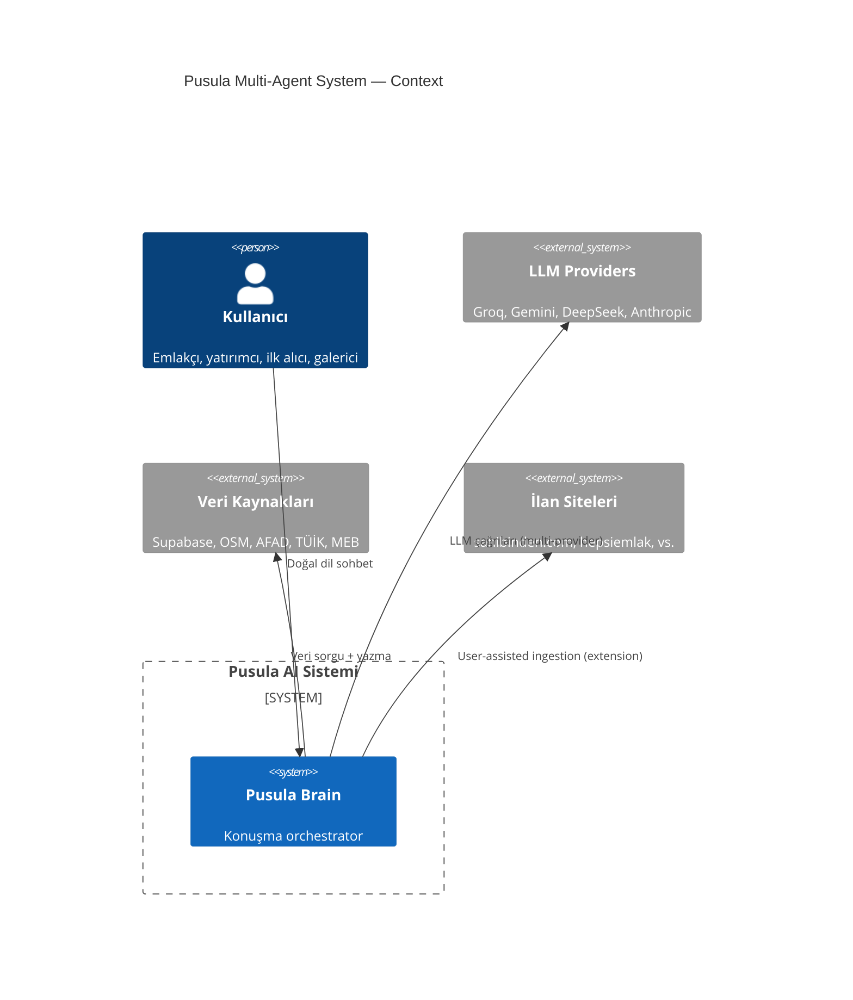
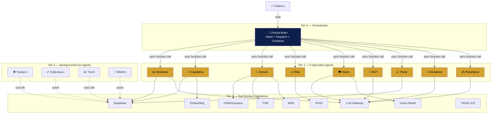
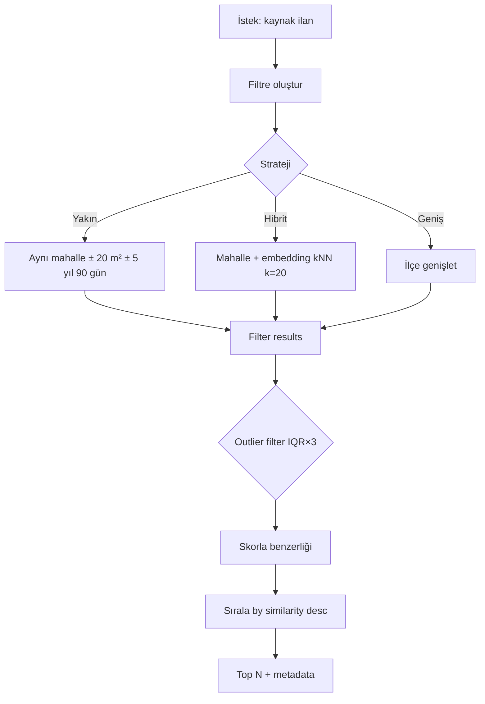
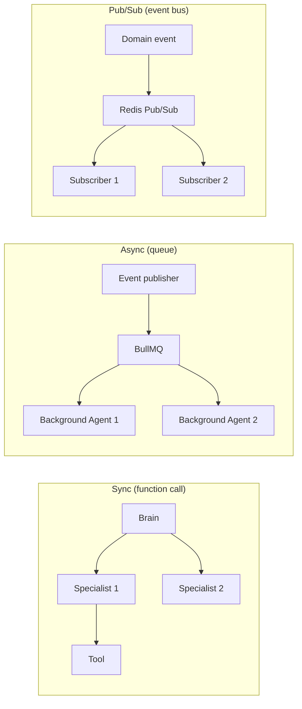
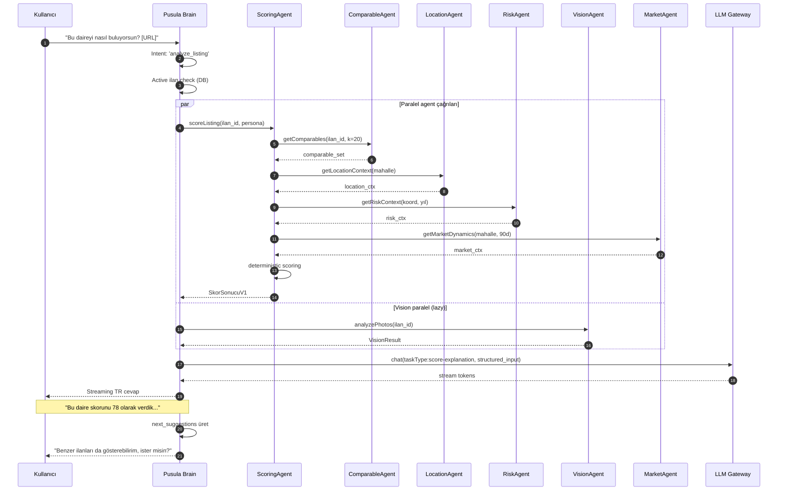
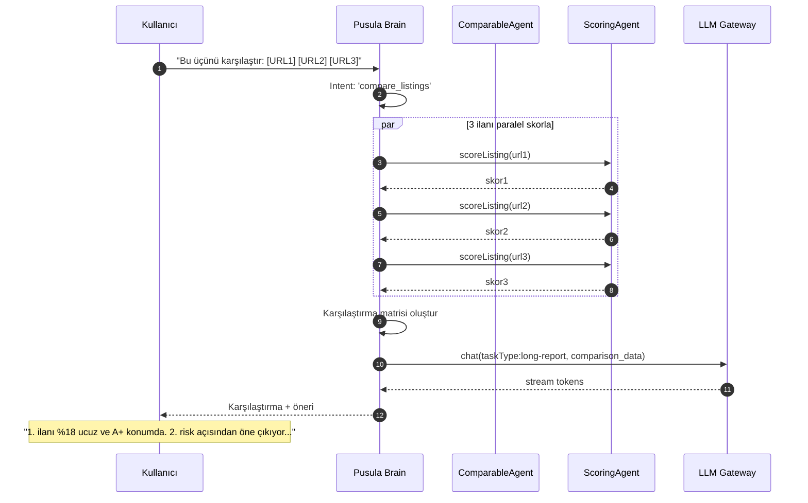
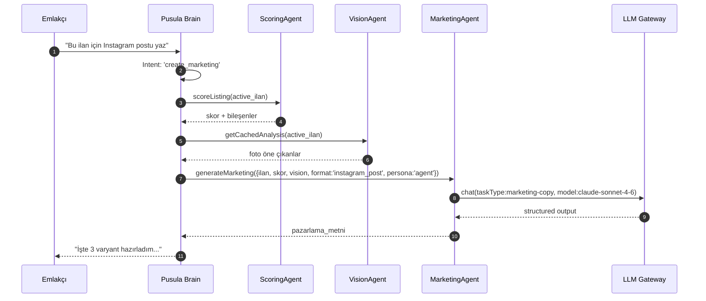

# 11 — Multi-Agent Mimarisi

| Alan | Değer |
|---|---|
| **Doküman versiyonu** | 1.0 |
| **Statü** | Proposed |
| **Son güncelleme** | 22 Mayıs 2026 |
| **Yazar** | Pusula Mühendislik |
| **Hedef okuyucu** | Mimar, backend mühendisleri, ML mühendisleri |

## Amaç

Pusula'nın tüm AI yetkinliklerini tek monolitik LLM çağrısı yerine **uzmanlaşmış agent'lar** üzerinden dağıtmak. Bu mimari hem maliyet (her görev için optimal model), hem kalite (her uzmanlık alanında özel prompt + araç), hem de güvenilirlik (failure isolation) için zorunludur.

## Kapsam

Bu doküman 4-katmanlı agent hiyerarşisini, her agent'ın kontratını, iletişim protokolünü, FMEA'sını ve SLO'larını tanımlar. Çalışan kod iskeleti `packages/agents/` altında üretilir. Skorlama motorunun iç tasarımı `10-aaa-skorlama-spec.md`'de, sohbet UX'i `12-konusmasal-mod-spec.md`'de.

---

## 1. C4 Level 1 — System Context



## 2. C4 Level 2 — Container



## 3. Tier 0 — Pusula Brain (Orchestrator)

### Agent Kartı

| Alan | Değer |
|---|---|
| **Ad** | Pusula Brain |
| **Tip** | Orchestrator (Tier 0) |
| **Sorumluluk** | Sohbet ön yüzü, intent classification, agent dispatch, sonuç birleştirme, persona yönetimi |
| **Default model** | Claude Sonnet 4.6 (function calling + uzun bağlam + Türkçe) |
| **Yedek modeller** | GPT-4o (Anthropic erişimi yoksa), Gemini 2.5 Pro (uzun rapor için) |
| **Statefulness** | Stateful (session memory, conversation context) |
| **State store** | Postgres `chat_threads` + `chat_messages` + Redis hot cache |
| **Çalışma modu** | Sync (kullanıcı bekler) + opsiyonel SSE streaming |
| **SLO p50** | 600 ms (ilk token) |
| **SLO p95** | 1.5 s (ilk token), 12 s (tam yanıt) |
| **Error budget** | %0.5 (ayda ~3.6 saat) |
| **Concurrency** | Per user 1 active conversation, global max 200 |

### Input Kontratı

```typescript
interface BrainInput {
  user_id: string;
  thread_id: string;
  message: string;
  attachments?: Array<{ type: 'image' | 'url' | 'file'; ref: string }>;
  active_ilan_id?: string;  // kullanıcı bir ilan üzerinde konuşuyorsa
  persona?: UserPersona;     // sohbet boyunca lock'lu
  preferred_locale: 'tr';
}
```

### Output Kontratı

```typescript
interface BrainOutput {
  thread_id: string;
  reply: {
    text: string;                    // doğal dil
    rich_components?: Array<RichComponent>; // skor kartı, karşılaştırma tablosu, vs.
  };
  metadata: {
    intent: IntentClass;
    persona: UserPersona;
    agents_invoked: AgentName[];
    total_latency_ms: number;
    cost_usd: number;
    cache_hits: number;
    trace_id: string;
  };
  next_suggestions?: string[];       // kullanıcıya gösterilebilecek sonraki adımlar
}
```

### State Machine (özet)

Tam state machine `12-konusmasal-mod-spec.md`'de. Brain'in iç state'i:

```
IDLE → DISPATCHING → AGGREGATING → COMPOSING → STREAMING → IDLE
                ↘ ERROR_RECOVERY ↗
```

### Tool Definitions (Function Calling)

Brain'in çağırabileceği 9 specialist agent + utility fonksiyonları:

```typescript
const BRAIN_TOOLS = [
  {
    name: 'scoring_agent',
    description: 'Bir ilan için kelepir skoru hesapla',
    parameters: ScoringRequestSchema,
  },
  {
    name: 'comparable_agent',
    description: 'Bir ilana benzer ilanları getir + sırala',
    parameters: ComparableRequestSchema,
  },
  {
    name: 'location_agent',
    description: 'Bir mahalle/lokasyon için bağlam bilgisi',
    parameters: LocationRequestSchema,
  },
  {
    name: 'risk_agent',
    description: 'Deprem, tapu, kentsel dönüşüm risk analizi',
    parameters: RiskRequestSchema,
  },
  {
    name: 'vision_agent',
    description: 'İlan fotoğraflarını analiz et',
    parameters: VisionRequestSchema,
  },
  {
    name: 'nlp_agent',
    description: 'İlan metnini analiz et',
    parameters: NLPRequestSchema,
  },
  {
    name: 'market_agent',
    description: 'Pazar dinamiği (DOM, trend, sezonsallık)',
    parameters: MarketRequestSchema,
  },
  {
    name: 'negotiation_agent',
    description: 'Pazarlık taktiği ve marj tahmini',
    parameters: NegotiationRequestSchema,
  },
  {
    name: 'marketing_agent',
    description: 'Pazarlama metni / sosyal post üret',
    parameters: MarketingRequestSchema,
  },
];
```

### FMEA — Pusula Brain

| Hata Modu | Etki | Şiddet | Sıklık | Tespit | RPN | Mitigation |
|---|---|---|---|---|---|---|
| LLM 429 (rate limit) | Yanıt gecikme | 3 | 4 | 1 | 12 | Multi-provider failover (LLM Gateway zaten yapar) |
| Intent classification yanlış | Yanlış agent çağrılır | 4 | 3 | 4 | 48 | Düşük güvende clarifying question, confidence eşiği 0.65 |
| Tool call infinite loop | Maliyet patlar, timeout | 5 | 1 | 2 | 10 | Max iteration = 6, total budget = $0.20/turn |
| Hallucination (uydurma agent) | Yanlış cevap | 5 | 2 | 3 | 30 | Tool whitelist + strict validation + reflective check |
| Context window overflow | Eski mesajlar atılır | 2 | 3 | 1 | 6 | Sliding window 12 turn, summarize-old strategy |
| Persona drift | Sohbet ortasında ton değişir | 3 | 2 | 4 | 24 | Persona her turn'da system prompt'a re-inject |
| Stream interrupt | UI yarım kalır | 2 | 2 | 1 | 4 | Stream resumption + idempotent message_id |

---

## 4. Tier 1 — 9 Specialist Agent

### 4.1 Skorlama Ajanı

| Alan | Değer |
|---|---|
| **Ad** | Skorlama Ajanı (`ScoringAgent`) |
| **Tip** | Specialist (Tier 1) |
| **Sorumluluk** | İlan parametrelerinden kelepir skoru üretmek |
| **Statefulness** | Stateless (her çağrı bağımsız) |
| **Deterministik kısım** | Tüm matematik (formül, normalize, ağırlık) |
| **LLM kısmı** | Yok (sadece açıklama Brain'e bırakılır) |
| **Default model** | — (deterministik) |
| **Latency hedef p50** | 50 ms |
| **Latency hedef p95** | 200 ms |
| **Error budget** | %0.1 |

#### Input/Output Kontratı

```typescript
// packages/agents/src/contracts/scoring.ts
export const ScoringRequest = z.object({
  ilan: KonutInput,
  context_options: z.object({
    include_comparables: z.boolean().default(true),
    include_vision: z.boolean().default(false), // expensive
    include_market: z.boolean().default(true),
    persona: UserPersona.optional(),
  }),
  trace_id: z.string().uuid(),
});

export const ScoringResponse = z.object({
  result: SkorSonucuV1,
  pillar_durations_ms: z.record(z.number()),
  total_duration_ms: z.number(),
  trace_id: z.string().uuid(),
});
```

#### FMEA

| Hata Modu | Etki | RPN | Mitigation |
|---|---|---|---|
| Hedonic NaN | Skor 0 | 30 | NaN guard + sadece Yöntem A fallback |
| Comparable query timeout | Skor gecikir | 24 | Query timeout 3s + cached fallback |
| Anomaly model crash | Şüphe katmanı yok | 15 | Graceful skip + warning |

### 4.2 Kıyaslama Ajanı (Comparable)

| Alan | Değer |
|---|---|
| **Ad** | Kıyaslama Ajanı (`ComparableAgent`) |
| **Sorumluluk** | Benzer ilanları getir, sırala, yan-yana karşılaştırma JSON üret |
| **Deterministik** | Query + sıralama |
| **LLM** | Yok (Brain "neden bu kıyaslandı" açıklamasını üretir) |
| **Latency p95** | 400 ms |

#### Algoritma



#### Embedding Bazlı Similarity

```typescript
similarity = 0.4 * geographic_distance_inv
           + 0.3 * vector_cosine(ilan_embedding, candidate_embedding)
           + 0.2 * (1 - abs(m2_diff) / max_m2)
           + 0.1 * temporal_proximity_inv
```

### 4.3 Konum Ajanı

| Alan | Değer |
|---|---|
| **Ad** | Konum Ajanı (`LocationAgent`) |
| **Sorumluluk** | Mahalle bağlamı: ulaşım, sosyo-ekonomik, POI, gentrifikasyon |
| **Tools** | OSM/Overpass, TÜİK, MEB, Belediye GIS (V3) |
| **Cache** | Mahalle bazlı 7 gün TTL (Redis) |
| **Latency p95** | 600 ms (cache miss), 50 ms (cache hit) |

### 4.4 Risk Ajanı

| Alan | Değer |
|---|---|
| **Ad** | Risk Ajanı (`RiskAgent`) |
| **Sorumluluk** | Deprem (AFAD), tapu, iskan, kentsel dönüşüm |
| **Tools** | AFAD, TKGM (V2), Belediye GIS (V3) |
| **Latency p95** | 300 ms |

### 4.5 Vision Ajanı

| Alan | Değer |
|---|---|
| **Ad** | Vision Ajanı (`VisionAgent`) |
| **Sorumluluk** | Multi-modal fotoğraf analizi |
| **Default model** | Gemini 2.5 Flash (multimodal + ucuz + hızlı) |
| **Fallback** | Claude Haiku 4.5 (vision) |
| **Cache** | Foto hash bazlı 30 gün |
| **Latency p95** | 4 s (cache miss), 30 ms (hit) |
| **Cost guardrail** | İlan başına max $0.02 |

### 4.6 NLP Ajanı

| Alan | Değer |
|---|---|
| **Ad** | NLP Ajanı (`NLPAgent`) |
| **Sorumluluk** | İlan metni analizi: yanıltıcı kelime, tonalite, hidden feature |
| **Hybrid** | Sözlük tabanlı (deterministik) + LLM (semantic) |
| **Default model** | DeepSeek V3 (ucuz + Türkçe iyi) |
| **Latency p95** | 800 ms |

### 4.7 Pazar Ajanı

| Alan | Değer |
|---|---|
| **Ad** | Pazar Ajanı (`MarketAgent`) |
| **Sorumluluk** | DOM, indirim takibi, mahalle trend, sezonsallık, makro context (TCMB) |
| **Tools** | Supabase aggregate queries, TCMB API |
| **Cache** | Mahalle bazlı 6 saat TTL |
| **Latency p95** | 500 ms |

### 4.8 Müzakere Ajanı

| Alan | Değer |
|---|---|
| **Ad** | Müzakere Ajanı (`NegotiationAgent`) |
| **Sorumluluk** | Pazarlık marj tahmini, taktik önerisi, müşteriye mesaj draft |
| **Input** | Skorlama + Pazar + NLP sonuçları |
| **LLM** | Claude Sonnet 4.6 (kaliteli yazım) |
| **Latency p95** | 2 s |

#### Çıktı Örneği

```typescript
interface NegotiationOutput {
  marj_tahmini_yuzde: { min: number; likely: number; max: number };
  taktik: 'agresif' | 'orta' | 'temkinli';
  taktik_gerekçe: string;
  ipuçları: string[];
  müşteri_mesaj_draft: string;
  red_flags: string[];
}
```

### 4.9 Pazarlama Ajanı

| Alan | Değer |
|---|---|
| **Ad** | Pazarlama Ajanı (`MarketingAgent`) |
| **Sorumluluk** | İlan açıklaması, sosyal post, müşteri mesaj template'leri |
| **LLM** | Claude Sonnet 4.6 (yazım kalitesi) |
| **Tonalite** | Persona'ya göre — emlakçı → profesyonel, satıcı → enerjik |
| **Latency p95** | 3 s (uzun metin) |

#### Output formatları

| Format | Uzunluk | Kullanım |
|---|---|---|
| `ilan_aciklama` | 500-1500 kelime | sahibinden ilan formu |
| `instagram_post` | 100-250 kelime + hashtag | Instagram caption |
| `instagram_story` | 30-80 kelime | Story overlay |
| `whatsapp_müşteri` | 100-200 kelime | WhatsApp pazarlama |
| `email_müşteri` | 200-400 kelime | Email newsletter |
| `linkedin_post` | 150-300 kelime | Profesyonel ağ |

---

## 5. Tier 2 — Background/Cron Agents

### 5.1 Toplayıcı Ajanı

| Alan | Değer |
|---|---|
| **Ad** | Toplayıcı (`CollectorAgent`) |
| **Tetikleyici** | Cron (6 saatte bir) + event (kullanıcı kayıtlı arama günceller) |
| **Sorumluluk** | İzinli kaynaklardan ilan toplama, mahalle data refresh, faiz oranı çekme |
| **Queue** | BullMQ `collector-queue` |
| **Retry** | 3x exponential backoff (1m, 5m, 30m) |
| **Idempotency** | URL hash bazlı dedup |
| **Dead letter queue** | `collector-dlq` → Sentry alert |

### 5.2 Doğrulayıcı Ajanı

| Alan | Değer |
|---|---|
| **Ad** | Doğrulayıcı (`ValidatorAgent`) |
| **Tetikleyici** | Event: yeni ilan ingest edildi |
| **Sorumluluk** | Schema validation, duplicate check, sahibinden DOM parse v.v. integrity |
| **Çıktı** | DB'ye `data_quality_flags` kolonuna yazma |

### 5.3 Trend Ajanı

| Alan | Değer |
|---|---|
| **Ad** | Trend (`TrendAgent`) |
| **Tetikleyici** | Cron (her gün 03:00) |
| **Sorumluluk** | Mahalle bazlı 30/60/90/180 gün fiyat trendi, anomaly detection drift |

### 5.4 Bildirim Ajanı

| Alan | Değer |
|---|---|
| **Ad** | Bildirim (`NotificationAgent`) |
| **Tetikleyici** | Event: yeni ilan skoru ≥ 75 + kullanıcı kayıtlı filtre eşleşmesi |
| **Sorumluluk** | Push (web), email, opsiyonel WhatsApp Business API entegrasyonu |
| **Throttling** | Per user 5/saat, 20/gün |

---

## 6. Tier 3 — Tool Workers

Pure stateless servisler. HTTP/RPC fonksiyonları. Her biri kendi paketinde veya `packages/agents/src/tools/` altında.

| Tool | Sorumluluk | Versiyon | SLA |
|---|---|---|---|
| `LLMGateway` | Multi-provider LLM çağrısı | v1 | 99.5% |
| `OSMClient` | Overpass API geocoding + POI | v1 | 99.0% (3rd party) |
| `AFADClient` | Deprem tehlike bandı lookup | v1 | 95.0% |
| `TUIKClient` | TÜİK açık veri | v1 | 95.0% |
| `MEBClient` | Okul listesi | v1 | 95.0% |
| `SupabaseClient` | DB + Auth | v1 | 99.9% |
| `EmbeddingService` | text-embedding (1536-dim) | v1 | 99.5% |
| `VisionClient` | Multimodal LLM çağrısı | v1 | 99.0% |
| `TKGMClient` | Parsel/tapu (V2) | — | — |
| `HedonicService` | Fiyat tahmini ML modeli | v1 | 99.5% |

---

## 7. Inter-Agent Communication

### 7.1 İletişim Türleri



### 7.2 Mesaj Formatı

Tüm inter-agent mesajları Zod schema-validated. Her mesaj zorunlu meta alanlar içerir:

```typescript
export const AgentMessageMeta = z.object({
  trace_id: z.string().uuid(),          // OpenTelemetry trace
  span_id: z.string(),                  // OpenTelemetry span
  parent_span_id: z.string().optional(),
  user_id: z.string().uuid(),
  session_id: z.string(),
  thread_id: z.string().optional(),
  timestamp: z.string().datetime(),
  source_agent: z.string(),
  target_agent: z.string(),
  message_id: z.string().uuid(),
  retry_count: z.number().int().min(0).default(0),
});

export const AgentMessage = z.object({
  meta: AgentMessageMeta,
  schema_version: z.string(),  // "1.0"
  body: z.unknown(),           // agent'a özgü payload
});
```

### 7.3 Event Bus Topic'leri

| Topic | Publisher | Subscribers |
|---|---|---|
| `ilan.ingested` | Web/Extension API | ScoringAgent, ValidatorAgent, TrendAgent |
| `ilan.scored` | ScoringAgent | NotificationAgent (eşleşme kontrolü) |
| `mahalle.enriched` | LocationAgent | ScoringAgent (recompute kuyruğu) |
| `user.persona_changed` | Brain | tüm Specialist'ler (cache invalidate) |
| `subscription.upgraded` | Billing | Quota service |

---

## 8. Senaryo: "Bu ilan kelepir mi?" — Full Flow



## 9. Senaryo: "Karşılaştırma Talebi"



## 10. Senaryo: "Pazarlama Metni Üret"



---

## 11. Decision Table — Hangi Agent Çalışır?

| Kullanıcı Intent | Brain → çağrılan agent'lar | Mod | Tipik latency |
|---|---|---|---|
| "Bu ilanı analiz et" | Scoring, Comparable, Location, Risk, Market, Vision (lazy) | Sync | 4-8 s |
| "X ile Y'yi karşılaştır" | Scoring (her biri), Comparable | Sync | 6-12 s |
| "Mahalle X'te ne var?" | Location, Market | Sync | 1-2 s |
| "İlan metnimi düzelt" | NLP, Marketing | Sync | 3-5 s |
| "Pazarlık nasıl yapayım?" | Scoring (varsa), Negotiation | Sync | 2-4 s |
| "Instagram postu yaz" | Marketing | Sync | 2-3 s |
| "Bu fotoğrafları analiz et" | Vision | Sync | 3-5 s |
| "Kayıtlı aramamı çalıştır" | Brain → DB query → top N için Scoring | Async batch | 30-60 s |
| Yeni ilan ingest edildi | Validator (event), Scoring (event), Notification | Async event | < 5 s |

---

## 12. FMEA — Sistem Geneli

| Hata Modu | Etki | Şiddet | Sıklık | Tespit | RPN | Mitigation |
|---|---|---|---|---|---|---|
| Brain LLM timeout | Kullanıcı yanıt alamaz | 5 | 3 | 1 | 15 | 8s hard timeout + "Kısa cevapla devam edeyim mi?" fallback |
| Specialist agent crash | İlgili pillar eksik | 3 | 2 | 2 | 12 | Adaptif ağırlık skip + Sentry alert |
| Tool worker (3rd party) down | OSM/AFAD veri yok | 3 | 4 | 2 | 24 | Cache fallback + degraded mode banner |
| Trace_id kaybı | Debug imkânsızlaşır | 4 | 1 | 5 | 20 | Mandatory middleware + CI lint kuralı |
| Background queue stuck | Bildirimler gecikir | 3 | 2 | 3 | 18 | DLQ monitoring + auto-restart |
| Persona drift mid-conversation | Yanlış ton | 3 | 2 | 4 | 24 | Persona her turn re-inject + Brain self-check prompt |
| Function call recursion | Maliyet patlar | 5 | 1 | 3 | 15 | Max depth 6 + total $ budget per turn |
| Concurrent same-user calls | Race condition | 2 | 3 | 3 | 18 | Per-user lock (Redis) |

---

## 13. SLO Özet Tablosu

| Agent | p50 latency | p95 latency | error rate | availability | error budget/ay |
|---|---|---|---|---|---|
| Pusula Brain | 600 ms | 1.5 s | <0.5% | 99.5% | 3h 36m |
| Skorlama | 50 ms | 200 ms | <0.1% | 99.9% | 43m |
| Kıyaslama | 150 ms | 400 ms | <0.2% | 99.5% | 3h 36m |
| Konum | 100 ms | 600 ms | <0.5% | 99.0% | 7h 12m |
| Risk | 80 ms | 300 ms | <0.3% | 99.5% | 3h 36m |
| Vision | 2 s | 4 s | <1.0% | 99.0% | 7h 12m |
| NLP | 300 ms | 800 ms | <0.5% | 99.0% | 7h 12m |
| Pazar | 200 ms | 500 ms | <0.3% | 99.5% | 3h 36m |
| Müzakere | 1 s | 2 s | <0.5% | 99.0% | 7h 12m |
| Pazarlama | 1.5 s | 3 s | <0.5% | 99.0% | 7h 12m |

Detaylı tracing schema → `15-observability-ve-slo.md`

---

## 14. Capability Maturity

| Yetenek | MVP | V1 | V2 | V3 |
|---|---|---|---|---|
| Pusula Brain (orchestrator) | ✅ Basit intent classifier | ✅ Persona-aware | ✅ Multi-turn memory | ✅ Long-term user profile |
| Skorlama | ✅ 4 pillar | ✅ 8 pillar | ✅ ML enrichment | ✅ Real-time recompute |
| Kıyaslama | ✅ SQL filter | ✅ + embedding kNN | ✅ + reranker | ✅ Personalized |
| Vision | ❌ | ✅ Tek model | ✅ Ensemble | ✅ Custom fine-tune |
| NLP | ❌ | ✅ Sözlük + LLM | ✅ NER fine-tune | ✅ Multi-language |
| Pazar | Kısmi | ✅ DOM + trend | ✅ + macro | ✅ + forecast |
| Müzakere | ❌ | ✅ Heuristic | ✅ + ML marj | ✅ Multi-turn negotiation sim |
| Pazarlama | ❌ Basit | ✅ Persona-aware | ✅ A/B test variants | ✅ Multi-channel auto-publish |
| Background agents | ❌ | ✅ Basit cron | ✅ Event-driven | ✅ Predictive prefetch |

---

## 15. Bağlantılı Dokümanlar

- `02-ADR-001-mimari-kararlar.md` — D13 (Multi-agent orchestration)
- `10-aaa-skorlama-spec.md` — Skorlama agent detayı
- `12-konusmasal-mod-spec.md` — Brain'in konuşma state machine'i
- `13-veri-mevcudiyeti-ve-dinamik-skor.md` — Specialist'ler arası veri akışı
- `15-observability-ve-slo.md` — Detaylı SLO + tracing
- `16-test-stratejisi.md` — Agent contract testing
- `packages/agents/` — Çalışan kod iskeleti
