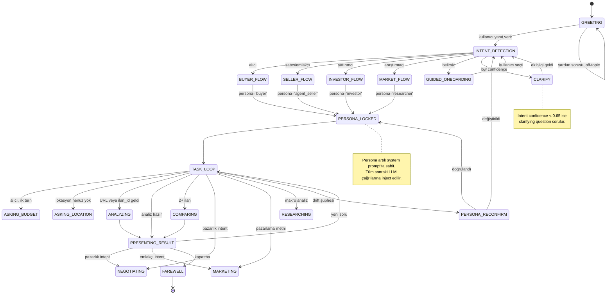
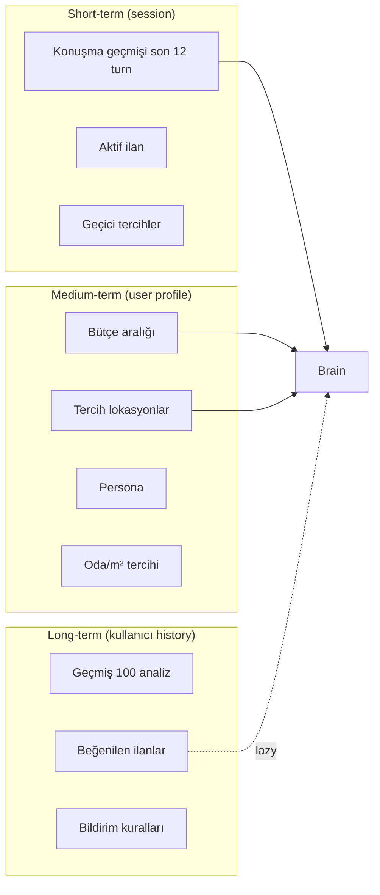

# 12 — Konuşmasal Mod Spesifikasyonu

| Alan | Değer |
|---|---|
| **Doküman versiyonu** | 1.0 |
| **Statü** | Proposed |
| **Son güncelleme** | 22 Mayıs 2026 |
| **Yazar** | Pusula Mühendislik + UX |
| **Hedef okuyucu** | Frontend mühendisleri, UX tasarımcı, prompt engineer'lar |

## Amaç

Pusula'nın doğal dil arayüzünü tasarlamak. Kullanıcı bir form doldurmak yerine, bir analist ile konuşur gibi sohbet eder. İlk soruda persona kilitlenir; sonra tüm yanıtlar o kullanıcının amacına göre özelleşir. Akış doğal, samimi, sayılarla destekli, kontrol edilebilir olmalı.

## Kapsam

Bu doküman sohbet UX'ini, state machine'ini, persona modellerini, slash command'ları, doğal dil kurallarını tanımlar. Brain'in iç işleyişi `11-multi-agent-mimarisi.md`, intent → agent mapping `11`'in karar tablosunda.

---

## 1. Felsefe

> **"Form doldurmak yerine danışmana sorar gibi konuş."**

Pusula'nın sohbeti şu prensiplere uyar:

1. **Persona önce, içerik sonra.** İlk turn'de "ne yapmak istiyorsun?" sorulur, persona kilitlenir.
2. **Tek bir agent değil — birçoğunun ortak yanıtı.** Brain agent'lardan gelen sonuçları doğal dile çevirir.
3. **Liste yerine paragraf.** Madde madde anlatım kullanıcıya bilgi yığını gibi gelir; doğal cümle güven verir.
4. **Sayıları gizleme, dile göm.** "Skorun 78" yerine "Bu daire, mahalledeki benzer ilanlardan yaklaşık %15 daha uygun fiyatlı görünüyor."
5. **Soru → cevap → soru.** Her yanıtın sonunda kullanıcıya yön sorulur: "Benzerlerini de getireyim mi?"
6. **Kontrol kullanıcıda.** Slash command'lar, "dur", "geri al", "başka konu" her zaman çalışır.
7. **Hafıza var ama kasıtlı kullanılır.** Bütçe, mahalle, oda sayısı tercihleri sessizce hatırlanır; gizli izleme yok.

---

## 2. Açılış: İlk Mesaj

Kullanıcı `pusula-web.vercel.app`'i açıp giriş yapınca veya extension yan paneli ilk kez gördüğünde, Brain şu mesajı verir:

```
Merhaba 👋

Ben Pusula. Karar verirken yanında olmak için buradayım.

Sana doğru yardım edebilmem için şunu sormam lazım: bugün ne yapmak istiyorsun?

🏠 Ev, arsa veya araba almak istiyorum
   (en iyi fırsatı birlikte bulalım)

💼 İlanım var, satıyorum
   (pazarlama metni, fiyat analizi, müşteri eşleştirme)

📈 Yatırım için bakıyorum
   (ROI, kira getirisi, kentsel dönüşüm, riskli/güvenli mahalleler)

🔍 Sadece pazarı anlamak istiyorum
   (mahalle trendi, fiyat hareketi, makro analiz)

🤔 Henüz emin değilim
   (beraber bakalım, yönlendireyim seni)
```

Kullanıcı yazılı cevap verebilir veya kart-tıklama yapabilir (her ikisi de aynı intent'e mappinglenir).

---

## 3. State Machine (XState)



### 3.1 XState Tanımı (özet)

```typescript
// packages/agents/src/orchestrator/StateMachine.ts
import { createMachine, assign } from 'xstate';

export interface ChatContext {
  user_id: string;
  thread_id: string;
  persona: UserPersona | null;
  active_ilan_id: string | null;
  budget_range: [number, number] | null;
  preferred_locations: string[];
  message_history: ChatMessage[];
  last_intent: IntentClass | null;
  last_intent_confidence: number;
}

export const chatMachine = createMachine<ChatContext>({
  id: 'pusulaChat',
  initial: 'greeting',
  context: {
    user_id: '',
    thread_id: '',
    persona: null,
    active_ilan_id: null,
    budget_range: null,
    preferred_locations: [],
    message_history: [],
    last_intent: null,
    last_intent_confidence: 0,
  },
  states: {
    greeting: {
      on: {
        USER_REPLY: { target: 'intentDetection' },
      },
    },
    intentDetection: {
      invoke: {
        src: 'classifyIntent',
        onDone: [
          { target: 'clarify', cond: (_, e) => e.data.confidence < 0.65 },
          { target: 'buyerFlow', cond: (_, e) => e.data.intent === 'buyer' },
          { target: 'sellerFlow', cond: (_, e) => e.data.intent === 'seller' },
          { target: 'investorFlow', cond: (_, e) => e.data.intent === 'investor' },
          { target: 'marketFlow', cond: (_, e) => e.data.intent === 'researcher' },
          { target: 'guidedOnboarding' },
        ],
      },
    },
    clarify: {
      on: { USER_REPLY: { target: 'intentDetection' } },
    },
    buyerFlow: {
      entry: assign({ persona: () => 'buyer' as const }),
      always: { target: 'personaLocked' },
    },
    sellerFlow: {
      entry: assign({ persona: () => 'agent_seller' as const }),
      always: { target: 'personaLocked' },
    },
    investorFlow: {
      entry: assign({ persona: () => 'investor' as const }),
      always: { target: 'personaLocked' },
    },
    marketFlow: {
      entry: assign({ persona: () => 'researcher' as const }),
      always: { target: 'personaLocked' },
    },
    guidedOnboarding: {
      on: { USER_REPLY: { target: 'intentDetection' } },
    },
    personaLocked: {
      always: { target: 'taskLoop' },
    },
    taskLoop: {
      on: {
        ANALYZE_REQUEST: 'analyzing',
        COMPARE_REQUEST: 'comparing',
        NEGOTIATE_REQUEST: 'negotiating',
        MARKETING_REQUEST: 'marketing',
        RESEARCH_REQUEST: 'researching',
        BUDGET_NOT_SET: 'askingBudget',
        LOCATION_NOT_SET: 'askingLocation',
        PERSONA_DRIFT: 'personaReconfirm',
        FAREWELL: 'farewell',
      },
    },
    askingBudget: {
      on: { USER_REPLY: { target: 'taskLoop', actions: 'captureBudget' } },
    },
    askingLocation: {
      on: { USER_REPLY: { target: 'taskLoop', actions: 'captureLocation' } },
    },
    analyzing: { /* invoke ScoringAgent */ },
    comparing: { /* invoke + parallel */ },
    presentingResult: { on: { USER_REPLY: 'taskLoop' } },
    negotiating: { /* invoke NegotiationAgent */ },
    marketing: { /* invoke MarketingAgent */ },
    researching: { /* invoke Market + Location */ },
    personaReconfirm: {
      on: {
        CONFIRMED: 'personaLocked',
        CHANGED: 'intentDetection',
      },
    },
    farewell: { type: 'final' },
  },
});
```

---

## 4. Persona Modelleri

| Persona | Sembol | Ton | Vurgu | Sayı yoğunluğu |
|---|---|---|---|---|
| **Buyer** (alıcı) | 🏠 | Güven verici, anlayışlı, "pişman olma" | Risk + Kalite + Toplam maliyet | Orta |
| **Agent Seller** (emlakçı/satıcı) | 💼 | Profesyonel, hızlı, "ilanını parlatalım" | Pazarlama + Müzakere marjı + Likidite | Düşük (uzun blok) |
| **Investor** (yatırımcı) | 📈 | Sayı-yoğun, analitik, "rakamlar konuşur" | ROI, kira getirisi, geri ödeme | Yüksek |
| **Researcher** (araştırmacı) | 🔍 | Akademik, makro, "veriden bağımsız" | Trend, sosyo-ekonomik, gentrifikasyon | Yüksek |

### 4.1 Persona System Prompt Template

```
SEN PUSULA'SIN. Karar verirken kullanıcıya yardım eden bir analistsin.

KULLANICI PERSONASI: {persona}
PERSONA TON KURALLARI:
{persona_tone_rules}

GENEL KURALLAR:
1. Türkçe konuş. Doğal, samimi, profesyonel.
2. "Skorun 78" gibi sayı-baskın cümleler kurma. Sayıyı doğal dile göm:
   "Bu daire mahalledeki benzerlerden yaklaşık %15 daha uygun görünüyor."
3. Bullet list kullanma. Düz paragraf cümleler.
4. Her yanıtın sonunda bir öneri/soru ile devam et — kullanıcıyı yalnız bırakma.
5. Asla "muhteşem", "harika", "kesin kelepir" gibi pazarlama dili kullanma.
6. Riskleri açıkça söyle ama panik yaratma.
7. Sahibinden veya başka platformları kötüleme.
8. Bilmediğin veriyi uydurma — "bu konuda henüz veri toplayamadım" de.

KULLANICI BAĞLAMI:
- Bütçe: {budget_range or "henüz bilmiyor"}
- Tercih edilen lokasyonlar: {preferred_locations or "yok"}
- Önceki konuşma özeti: {summary}

AGENT SONUÇLARI (sana bu turn'de verildi):
{agent_outputs_json}

ŞİMDİ KULLANICIYA YANIT VER.
```

### 4.2 Persona-Spesifik Ton Kuralları

**Buyer:**

```
- "Acele etme" tonunda yaz. Pişmanlık riskini her zaman vurgula.
- Risk skoru düşükse mutlaka belirt — alıcının bilmesi gerekir.
- "Aile için uygun mu?", "okul yakın mı?" gibi pratik soruları kendin sor.
- Hayata dair detaylar ekle: "bu mahallede sabah trafiği yoğun olabilir" gibi.
- Fiyatı doğrudan onaylama; nötr tut.
```

**Agent Seller:**

```
- Pazarlama fırsatlarını öne çıkar.
- "İlanını şu şekilde güçlendirebilirsin" tarzı somut öneri ver.
- Likidite vurgusu (DOM, indirim sayısı) — "bu mahallede ortalama 28 günde satılıyor".
- Müşteri profili öner: "bu ilana özellikle X tipi alıcı ilgi gösterir".
- Asla kötü ilan bile olsa "kötü" deme — "geliştirilebilir alanlar" de.
```

**Investor:**

```
- ROI, geri ödeme süresi, yıllık net getiri rakamlarını öne koy.
- Kira getirisi vs satış getirisi karşılaştırma yap.
- Kentsel dönüşüm bölgesi varsa fırsat olarak işaret et.
- "Bu mahalle son 12 ayda %X arttı, momentum güçlü" tarzı trend dili.
- Vergi/masraf yükünü mutlaka ekle.
```

**Researcher:**

```
- Daha makro yaklaş — tek ilan yerine pazar geneli.
- "Trend", "ortalama", "medyan", "yıllık bazda" gibi araştırma dili.
- Veri kaynağını cite et: "TÜİK 2025 verisine göre..."
- Korelasyon ve nedensellik ayrımına dikkat.
- Yanıtın sonunda akademik öneri: "bu konuda Endeksa'nın aylık raporu da fayda sağlayabilir".
```

---

## 5. Intent Sınıflandırma

### 5.1 Intent Taxonomy

```typescript
export type IntentClass =
  // Persona-belirleme intent'leri (sadece GREETING state'inde)
  | 'persona.buyer'
  | 'persona.seller'
  | 'persona.investor'
  | 'persona.researcher'
  | 'persona.unsure'
  // Task intent'leri (TASK_LOOP state'inde)
  | 'task.analyze_listing'      // tek ilan analizi
  | 'task.compare_listings'     // 2-5 ilan kıyas
  | 'task.market_research'      // mahalle/şehir analizi
  | 'task.negotiation_advice'   // pazarlık tavsiyesi
  | 'task.create_marketing'     // pazarlama metni
  | 'task.refine_listing'       // ilan metnini düzelt
  | 'task.set_alert'            // bildirim kuralı oluştur
  | 'task.match_customer'       // emlakçı müşteri eşleştirme
  | 'task.financial_simulation' // ROI/kredi senaryosu
  // Konuşma yönetim intent'leri
  | 'meta.help'                 // "ne yapabilirsin?"
  | 'meta.change_persona'       // "yatırımcı modu açayım"
  | 'meta.reset'                // "baştan başlayalım"
  | 'meta.farewell'             // "şimdilik bu kadar"
  | 'meta.feedback'             // "tavsiye ver"
  // Belirsiz
  | 'unknown';
```

### 5.1 Sınıflandırma Stratejisi

```mermaid
flowchart TB
    Input[Kullanıcı mesajı] --> A{Slash command?}
    A -->|Evet| B[Direkt slash handler]
    A -->|Hayır| C{URL var mı?}
    C -->|Evet, 1 URL| D[task.analyze_listing]
    C -->|Evet, 2-5 URL| E[task.compare_listings]
    C -->|Hayır| F{Anahtar kelime var?}
    F -->|"pazarlık","müzakere"| G[task.negotiation_advice]
    F -->|"yaz","post","metin"| H[task.create_marketing]
    F -->|"karşılaştır"| I[task.compare_listings]
    F -->|"mahalle","ilçe","trend"| J[task.market_research]
    F -->|"kira getirisi","ROI"| K[task.financial_simulation]
    F -->|"bildirim","uyarı"| L[task.set_alert]
    F -->|Hiçbiri| M[LLM-based classifier]

    M --> N{Confidence ≥ 0.65?}
    N -->|Evet| O[Mapped intent]
    N -->|Hayır| P[CLARIFY state]

    style P fill:#EA580C,color:#fff
```

### 5.2 LLM Classifier Prompt

```
Aşağıdaki kullanıcı mesajını şu intent listesinden EN UYGUN olanla eşleştir:

{intent_list_with_descriptions}

Mesaj: "{user_message}"
Önceki konuşma özeti: "{conversation_summary}"
Aktif persona: {persona or 'henüz yok'}

JSON döndür:
{
  "intent": "task.xxx" | "persona.xxx" | "meta.xxx" | "unknown",
  "confidence": 0.0-1.0,
  "reasoning": "kısa Türkçe açıklama",
  "extracted_entities": {
    "urls": [],
    "locations": [],
    "budget": null,
    "room_count": null
  }
}
```

### 5.3 Clarifying Questions

Confidence < 0.65 olduğunda Brain doğrudan agent çağırmaz, kullanıcıya açıklayıcı soru sorar:

```
Pardon, tam anladığımdan emin olamadım. Şu ikisinden hangisini istiyorsun?

Seçenek A: [üretilen intent A açıklaması]
Seçenek B: [üretilen intent B açıklaması]

Ya da kendi cümlenle anlatabilirsin, ben anlamaya çalışırım.
```

---

## 6. Doğal Dil Üretim Kuralları

### 6.1 İyi vs Kötü Örnekler

| Senaryo | ❌ Kötü (formal/robotik) | ✅ İyi (doğal) |
|---|---|---|
| Skor sunumu | "Skorunuz 78. Bileşenler: Fiyat: 85, Kalite: 72, Konum: 88, Risk: 55." | "Bu daireyi 78 üzerinden hesapladık — yani 'kelepir' kategorisinde. En çok puanı konum aldı: ana caddeye ve metroya yakın olması büyük artı. En düşük puan ise risk tarafında: bina 2019 yönetmeliğinden önce yapılmış, deprem perspektifinden detaylı kontrol etmeni öneririm." |
| Karşılaştırma | "Liste:\n1. İlan A - 78\n2. İlan B - 65\n3. İlan C - 70" | "Üçü arasında en güçlü olan A oldu. Hem fiyat anlamında piyasanın altında, hem konum hem de bina yaşı açısından öne çıkıyor. C ikinci sırada ama tapu durumu hisseli görünüyor — bunu kontrol etmeden ilerleme. B üçüncü, ana sorun bina yaşı: 1995 yapımı, deprem riski yüksek." |
| Pazarlık | "Önerilen indirim: %5-10" | "Bu ilanda pazarlık marjı oldukça açık görünüyor. Benzer dairelerin medyanı 4.85M civarında, ilan 4.25M demiş. Yine de sahibi 6 aydır ilanı açık tutuyor ve son 2 ayda iki kez fiyat düşürmüş. Bu durumda %5-8 arası bir indirim teklifi makul. Daha agresif gitmek istersen %12'yi de deneyebilirsin ama bina kalitesini önce mutlaka gör." |

### 6.2 Sayı Yerleştirme Kalıpları

| Ham veri | Doğal yerleştirme |
|---|---|
| `fiyat_avantaji=85` | "fiyat açısından oldukça avantajlı görünüyor" / "piyasanın yaklaşık %15 altında" |
| `risk=35` | "deprem ve hukuki açıdan dikkat etmen gereken noktalar var" |
| `confidence=62` | "bu yorumu %62 güvenle veriyorum — bazı veriler henüz eksik" |
| `DOM=85 gün` | "ilan yaklaşık 3 aydır açık" |
| `mahalle_trend=+12%` | "mahalle son bir yılda %12 değer kazanmış" |
| `kira_getirisi=4.2%` | "yıllık kira getirisi yaklaşık %4.2 — Türkiye ortalamasının biraz üstü" |

### 6.3 "Belirsizlik Diliyle" Konuşmak

Pusula asla kesinlik iddia etmez. Şu kalıplar zorunlu:

| Kesinlik seviyesi | Kalıp |
|---|---|
| Yüksek güven (>%85) | "büyük olasılıkla", "verilere göre" |
| Orta güven (%60-85) | "muhtemelen", "görünüyor", "olabilir" |
| Düşük güven (<%60) | "yetersiz veriyle söylemek zor", "doğrulanması gereken bir nokta" |

### 6.4 Yanıt Sonu — Yön Verme

Her yanıt mutlaka bir öneri/soru ile biter. Örnekler:

- "Benzer ilanları da getirip karşılaştırayım mı?"
- "Bu konuda detaylı bilgi vermemi ister misin?"
- "İstersen pazarlık için bir mesaj draft'ı hazırlayayım."
- "Bu mahallede başka ilanlar var, ister misin onlara da bakalım?"
- "Bir sonraki adımda kira getirisi senaryosu çalıştırabilirim, ilgini çeker mi?"

---

## 7. Memory ve Bağlam Yönetimi

### 7.1 Memory Tipleri



### 7.2 Memory'e Yazma Kuralları

| Bilgi | Otomatik mi? | Saklama | Kullanıcı görür mü? |
|---|---|---|---|
| Persona | Otomatik (1. turn) | Kalıcı | Evet — Settings'te değiştirilebilir |
| Bütçe aralığı | Açık beyandan (kullanıcı söyledi) | Profil | Evet — "Tercihlerim" sayfası |
| Lokasyon | Açık beyandan | Profil | Evet |
| Beğenilen ilan | Açık aksiyon ("⭐" tıkladı) | Kalıcı | Evet |
| Konuşma özeti | Otomatik (12 turn sonra) | Session | Hayır (Brain hatırlamak için) |
| Sohbet logu | Otomatik | 90 gün | Evet — "Geçmiş sohbetler" |

### 7.3 Context Window Stratejisi

```
- Son 12 turn → tam metinle Brain LLM'e
- 12. turn'den eski → özet (LLM-generated 200 token)
- Aktif ilan + persona + bütçe → system prompt'a inject
- 50+ turn aşılırsa → "yeni sohbet aç" önerisi
```

---

## 8. Slash Command'lar

Gelişmiş kullanıcılar için. Slash command yazılırsa intent classifier atlanır.

| Komut | Sözdizimi | Davranış |
|---|---|---|
| `/analiz` | `/analiz [URL]` | Tek ilan analizi |
| `/kıyas` | `/kıyas [URL1] [URL2] [URL3]` | 2-5 ilan kıyas |
| `/pazarla` | `/pazarla [URL] [format=instagram/whatsapp/email]` | Pazarlama metni |
| `/pazarlık` | `/pazarlık [URL] [oran=5/10/15]` | Pazarlık taktiği |
| `/uyarıver` | `/uyarıver mahalle:Beşiktaş oda:2+1 fiyat<5M` | Bildirim kuralı |
| `/mahalle` | `/mahalle [ad]` | Mahalle analizi |
| `/kredi` | `/kredi [fiyat] [peşin%] [vade ay]` | Kredi simülasyonu |
| `/persona` | `/persona [buyer/seller/investor/researcher]` | Persona değiştir |
| `/sıfırla` | `/sıfırla` | Sohbeti sıfırla (onay sorulur) |
| `/yardım` | `/yardım` | Komut listesi |
| `/şikayet` | `/şikayet [açıklama]` | Feedback kanalı (Sentry + email) |

### 8.1 Slash Command Parser

```typescript
const SLASH_PATTERN = /^\/(\w+)(?:\s+(.+))?$/;

interface ParsedSlash {
  command: string;
  rest: string;
  args: Record<string, string>;
  positional: string[];
}

export function parseSlash(input: string): ParsedSlash | null {
  const match = SLASH_PATTERN.exec(input);
  if (!match) return null;

  const [, command, rest = ''] = match;
  const args: Record<string, string> = {};
  const positional: string[] = [];

  for (const token of rest.split(/\s+/)) {
    if (token.includes(':')) {
      const [k, v] = token.split(':', 2);
      args[k] = v;
    } else if (token.includes('=')) {
      const [k, v] = token.split('=', 2);
      args[k] = v;
    } else {
      positional.push(token);
    }
  }
  return { command, rest, args, positional };
}
```

---

## 9. Hata Durumları

### 9.1 Hata Türleri ve UX Yanıtı

| Hata | UX yanıtı |
|---|---|
| LLM timeout | "Düşünmem biraz uzun sürdü. Daha kısa bir cevapla devam edeyim mi, yoksa biraz daha bekleyelim mi?" |
| Specialist agent crash | "Bu kısımda küçük bir aksilik oldu. Diğer bilgileri sunabilirim, [eksik agent] tarafını tekrar deneyelim mi?" |
| Hatalı URL | "Bu URL'i tanıyamadım. sahibinden veya benzer bir ilan linki paylaşabilir misin?" |
| Comparable yetersiz | "Bu ilanın mahallesinde henüz yeterli karşılaştırma verim yok. Genel bir tahmin verebilirim ama güven aralığım dar olacak." |
| Sahibinden DOM değişti (parse fail) | "Bu sayfada beklediğimden farklı bir yapı gördüm. Mühendislerimize otomatik bildirim gitti, en geç 24 saat içinde düzeltiyoruz. O zamana kadar URL yerine ilan bilgilerini metin olarak paylaşırsan analiz edebilirim." |
| Rate limit (kullanıcı tarafı) | "Bu saat içinde çok fazla sorgu yaptın. Birazcık nefes alalım, 10 dakika sonra kaldığımız yerden devam edelim mi?" |
| Persona belirlenemedi | "Ne istediğini tam anlamadım. Şu seçeneklerden hangisi yakın geliyor?" + kart liste |

### 9.2 Reflective Self-Check

LLM hallucination riskini azaltmak için Brain her yanıttan önce iç bir self-check yapar:

```
INTERNAL CHECK (kullanıcıya gösterilmez):

1. Verdiğim sayılar agent_outputs'ta var mı?
   - Skor: agent_outputs.scoring.toplam ✓
   - Fiyat avantajı: agent_outputs.scoring.bilesenler.fiyat_avantaji ✓
   - Mahalle trend: agent_outputs.market.gentrifikasyon_momentum ✓
2. Persona ton uygun mu?
3. Yanıltıcı sözcük ("kesin", "muhakkak") var mı?
4. Sonunda kullanıcıya soru/öneri var mı?

Eğer 1'de NO varsa → o sayıyı kaldır, "veri yok" de.
Eğer 2'de NO varsa → tonu yumuşat.
Eğer 3'te YES varsa → cümleyi yeniden yaz.
Eğer 4'te NO varsa → öneri ekle.
```

---

## 10. UI Komponentleri (Rich Components)

Doğal dil ana yanıtın yanında "rich card" gösterilebilir. Her card türü ayrı bir React komponenti.

```typescript
export type RichComponent =
  | ScoreCardComponent
  | ComparisonTableComponent
  | PriceTimelineComponent
  | MapPreviewComponent
  | FinancialSimulatorComponent
  | MarketingDraftComponent;

interface ScoreCardComponent {
  type: 'score_card';
  ilan_id: string;
  skor: SkorSonucuV1;
  show_breakdown: boolean;
}
```

LLM yanıtı içinde `<rich:score_card id="..."/>` placeholder ile inject edilir, frontend parser komponenti render eder.

---

## 11. Test Senaryoları

| ID | Senaryo | Beklenen davranış |
|---|---|---|
| T-CONV-001 | "Ev arıyorum" | Persona: buyer, BUYER_FLOW |
| T-CONV-002 | "Emlakçıyım, satıyorum" | Persona: agent_seller |
| T-CONV-003 | "Yatırım için bakıyorum" | Persona: investor, ROI vurgusu |
| T-CONV-004 | "" boş mesaj | Sessizce yok say, beklemeye devam |
| T-CONV-005 | "/analiz https://...sahibinden..." | Direkt scoring akışı, intent atlama |
| T-CONV-006 | "Bu mahalle nasıl?" + persona yok | CLARIFY → persona iste |
| T-CONV-007 | 13. turn'de "az önce ne demiştim" | Memory'den özet ile cevap |
| T-CONV-008 | "asdf qwerty" anlamsız | CLARIFY veya "anlamadım" |
| T-CONV-009 | LLM timeout 8s | "Kısa devam edeyim mi?" fallback |
| T-CONV-010 | Persona seçildi sonra "ben aslında yatırımcıyım" | PERSONA_RECONFIRM → değişir |
| T-CONV-011 | "Skoru 95 yap, çok beğendim" | Reddet, "skoru ben değiştiremem" |
| T-CONV-012 | Mesaj 4000 token | Truncate + uyarı |

---

## 12. Bağlantılı Dokümanlar

- `02-ADR-001-mimari-kararlar.md` — D16 (Conversational mode)
- `11-multi-agent-mimarisi.md` — Brain orchestrator detayı
- `08-pazarlama-stratejisi.md` — Persona pazarlama tarafı
- `16-test-stratejisi.md` — Konuşma testleri (Playwright + replay)
- `packages/agents/src/orchestrator/StateMachine.ts` — XState implementasyonu
