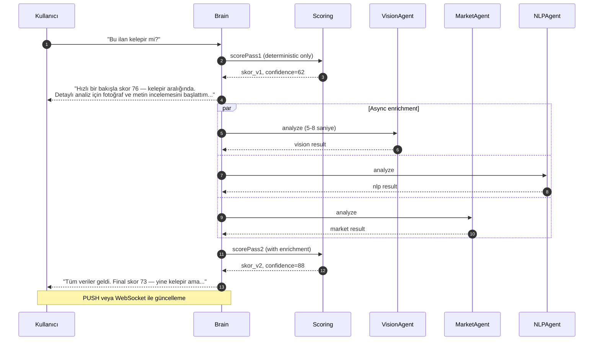
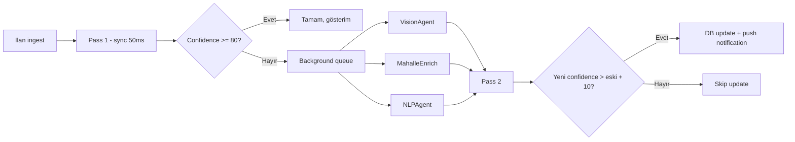
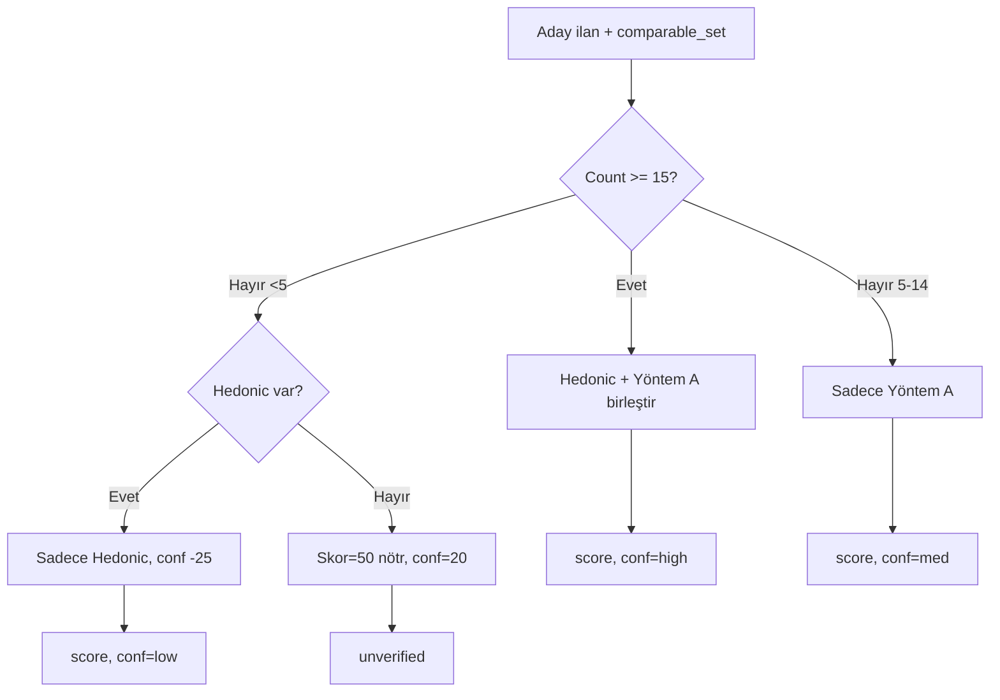
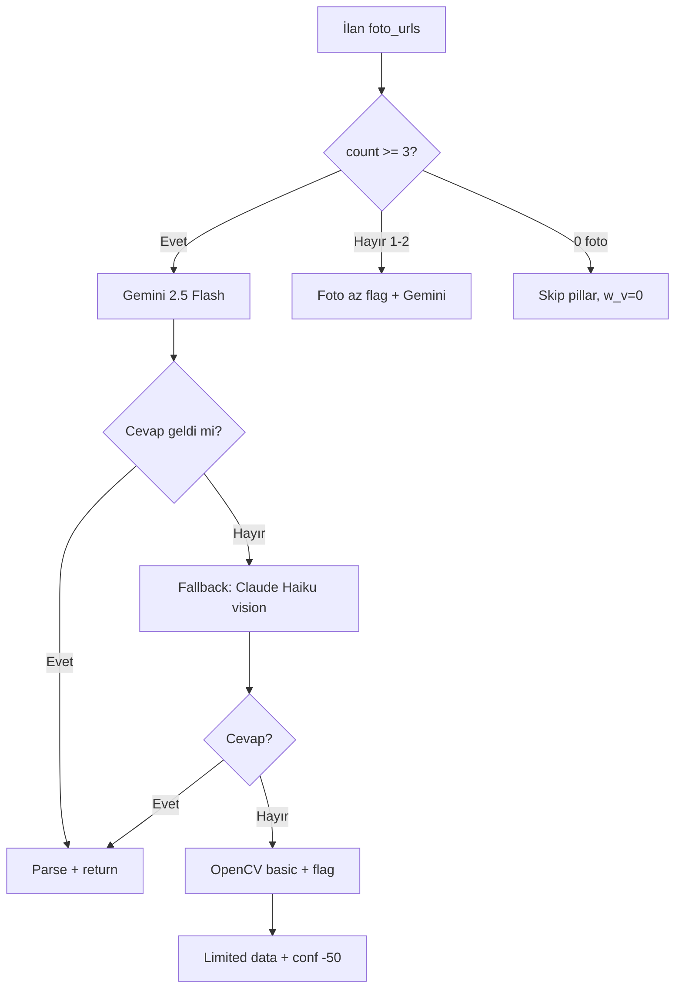
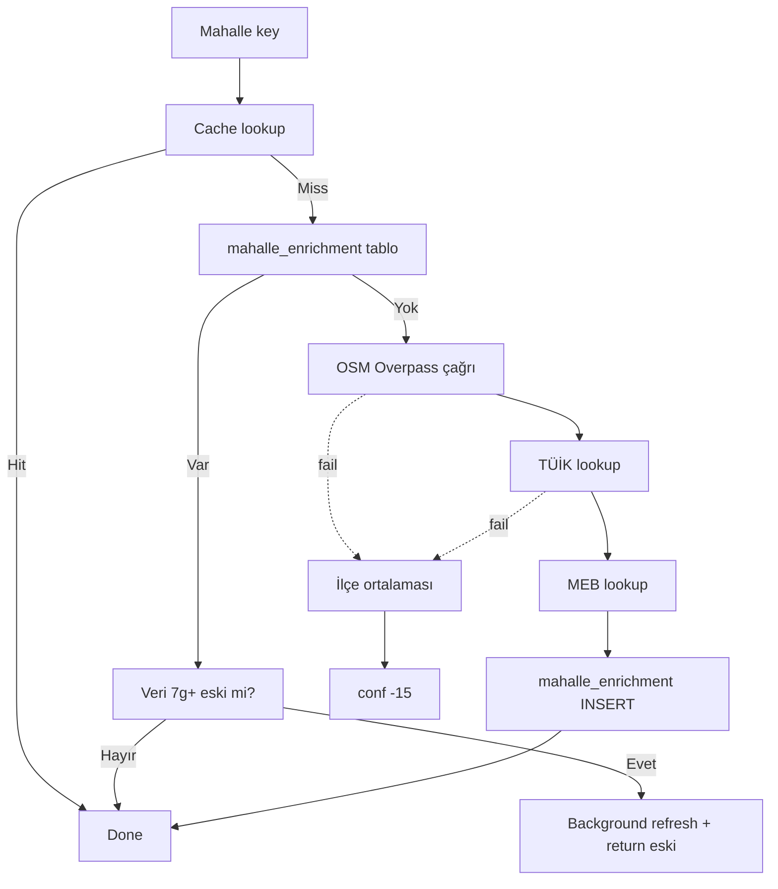
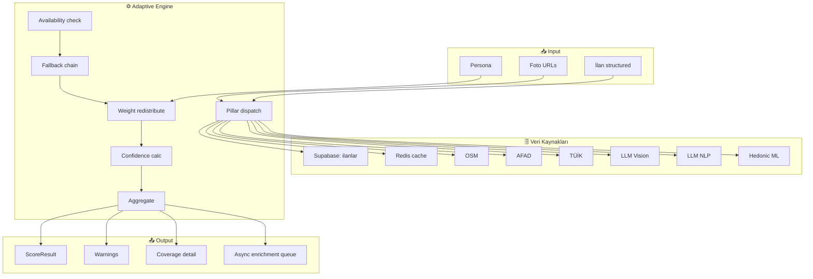

# 13 — Veri Mevcudiyeti ve Dinamik Skor

| Alan                  | Değer                                                 |
| --------------------- | ----------------------------------------------------- |
| **Doküman versiyonu** | 1.0                                                   |
| **Statü**             | Proposed                                              |
| **Son güncelleme**    | 22 Mayıs 2026                                         |
| **Yazar**             | Pusula Mühendislik                                    |
| **Hedef okuyucu**     | Backend mühendisleri, ML mühendisleri, ürün liderliği |

## Amaç

Türkiye emlak/oto pazarında her ilan için tüm 80+ parametre asla mevcut olmayacak. Pusula'nın "eksik veri" durumunda nasıl davranacağını, hangi fallback'leri kullanacağını, ağırlıkları dinamik olarak nasıl yeniden dağıtacağını ve kullanıcıya bu durumu nasıl iletişimle açıklayacağını tanımlar.

## Kapsam

Bu doküman skorlama motorunun adaptif davranışını matematiksel ve algoritmik olarak tanımlar. Skor formülünün kendisi `10-aaa-skorlama-spec.md`'de.

---

## 1. Felsefe

Üç temel ilke:

1. **Eksik veri 0 değil "bilinmiyor"dur.** Bir parametre yoksa, o parametre için skor 0 değildir; **agirlik yeniden dağıtılır**.
2. **Confidence, skorun yanındaki kardeş ölçüsüdür.** Her skor + confidence çiftiyle döner.
3. **Kullanıcıya neyin eksik olduğu söylenir.** Şeffaflık güveni inşa eder.

---

## 2. Veri Mevcudiyeti Sözlüğü

Her parametre için bir **mevcudiyet tanımı** ve **fallback zinciri** vardır.

### 2.1 Fallback Chain Tipi

```typescript
export interface DataSourceChain<T> {
  parameter: string;
  primary: DataSource<T>;
  secondary?: DataSource<T>;
  tertiary?: DataSource<T>;
  confidence_loss: {
    secondary: number; // 0-100, primary kullanılamazsa confidence ne kadar düşer
    tertiary: number;
  };
  required: boolean; // Eğer hiçbir fallback çalışmıyorsa hata mı, devam mı?
}

export interface DataSource<T> {
  name: string;
  description: string;
  fetch: (input: any, ctx: Context) => Promise<T | null>;
  ttl_seconds: number;
  cost_estimate_usd: number;
  rate_limit_per_min: number;
}
```

### 2.2 Kritik Parametreler için Fallback Tablosu

| Parametre                | Primary                  | Secondary                          | Tertiary                     | Confidence loss | Required     |
| ------------------------ | ------------------------ | ---------------------------------- | ---------------------------- | --------------- | ------------ |
| `deprem_tehlike_bandi`   | AFAD koordinat lookup    | İlçe ortalaması (önceden çekilmiş) | İl ortalaması                | -10 / -25       | Hayır        |
| `mahalle_gelir_quintile` | TÜİK mahalle             | TÜİK ilçe                          | TÜİK il                      | -5 / -15        | Hayır        |
| `mahalle_fiyat_ivmesi`   | İç havuz son 12 ay       | İç havuz son 6 ay (daha az veri)   | İlçe ortalaması              | -15 / -30       | Hayır        |
| `comparable_set`         | Aynı mahalle ±20% m² 90g | Aynı ilçe ±25% m² 180g             | Aynı il ±30% m² 365g         | -10 / -25       | Evet (min 5) |
| `bina_yasi`              | İlan                     | LLM extract from text              | OSM yapı yaşı (varsa)        | -20 / -40       | Evet         |
| `net_m2`                 | İlan structured          | LLM extract from text              | —                            | -10 / N/A       | Evet         |
| `oda_sayisi`             | İlan                     | LLM extract                        | Vision (oda say)             | -10 / -30       | Evet         |
| `kat`                    | İlan                     | LLM extract                        | Vision (kat tahmini)         | -15 / -50       | Hayır        |
| `isitma`                 | İlan                     | LLM extract from text              | Default: "bilinmiyor"        | -10 / 0         | Hayır        |
| `metro_mesafe_m`         | OSM Overpass             | Google Maps                        | Mahalle ortalaması           | -5 / -25        | Hayır        |
| `school_mesafe_m`        | MEB + OSM                | OSM tek başına                     | İlçe ortalaması              | -5 / -20        | Hayır        |
| `hedonic_tahmin`         | XGBoost model            | Median fallback                    | Yok (sadece Yöntem A)        | -20 / -40       | Hayır        |
| `vision_analizi`         | Gemini 2.5 Flash         | Claude Haiku vision                | OpenCV basic features        | -15 / -50       | Hayır        |
| `nlp_analizi`            | DeepSeek V3              | Groq Llama 3.3                     | Lexicon-only                 | -10 / -30       | Hayır        |
| `tapu_durumu`            | İlan                     | LLM extract                        | Default "bilinmiyor" + uyarı | -20 / -40       | Hayır        |

---

## 3. Confidence Calculus

### 3.1 Tek Parametre Confidence

Her parametre için:

```
confidence_parameter = base_confidence - sum(losses_from_fallback_usage)

Eğer primary kullanıldı: confidence = 100
Eğer secondary kullanıldı: confidence = 100 - secondary_loss
Eğer tertiary kullanıldı: confidence = 100 - tertiary_loss
Eğer hiçbiri yok: parametre skip + global confidence loss
```

### 3.2 Pillar Confidence

Bir pillar'ın confidence'ı, içindeki parametrelerin ağırlıklı ortalamasıdır:

```
pillar_confidence = sum(w_i × parameter_confidence_i) / sum(w_i)
                    × pillar_coverage_factor

pillar_coverage_factor = data_available_weight / total_weight
```

**Örnek (Kalite pillar):**

```
Mevcut parametreler ve confidence'ları:
- bina_yasi: w=0.20, primary, conf=100
- net_m2: w=0.13, primary, conf=100
- isitma: w=0.09, secondary (LLM extract), conf=90
- kat: yok (skip)
- otopark: yok (skip)
... (diğerleri)

mevcut_ağırlık_toplamı = 0.20 + 0.13 + 0.09 + ... = 0.78
toplam_ağırlık = 1.00

coverage_factor = 0.78 / 1.00 = 0.78

pillar_confidence = ((0.20 × 100 + 0.13 × 100 + 0.09 × 90 + ...) / 0.78) × 0.78
                  ≈ 98 × 0.78
                  ≈ 76
```

### 3.3 Global Confidence

```
global_confidence = sum(pillar_weight_i × pillar_confidence_i)
```

Bu değer kullanıcıya gösterilen ana confidence göstergesidir.

### 3.4 Confidence → UI Etiket

| Range  | Etiket       | UI davranışı                    |
| ------ | ------------ | ------------------------------- |
| 85-100 | Yüksek güven | Yeşil rozet "Skor güvenilir"    |
| 65-84  | Orta güven   | Sarı rozet "Bazı veriler eksik" |
| 40-64  | Düşük güven  | Turuncu rozet "Çok veri eksik"  |
| 0-39   | Çok düşük    | Kırmızı + "Skor verme" önerisi  |

Eğer global_confidence < 40 ise, Brain "bu ilan için yeterli veri toplayamadım" uyarısı verir ve skoru asla göstermez.

---

## 4. Dinamik Ağırlık Yeniden Dağıtımı

### 4.1 Matematik

```
Varsayılan ağırlıklar:
W = {w_p: 0.32, w_q: 0.16, w_l: 0.14, w_r: 0.10, w_v: 0.08, w_n: 0.06, w_d: 0.08, w_f: 0.06}

Her pillar için bir "effective ağırlık" hesaplanır:
w_effective_i = w_i × pillar_coverage_factor_i

Toplam effective ağırlık:
W_total = sum(w_effective_i)

Yeniden normalize:
w_normalized_i = w_effective_i / W_total
```

### 4.2 Persona Bonusu

Persona belirlendiyse, persona-spesifik ağırlık çarpanı uygulanır:

```typescript
const PERSONA_MULTIPLIERS: Record<UserPersona, Partial<Record<PillarKey, number>>> = {
  buyer: {
    risk: 1.5, // alıcı için risk daha önemli
    kalite: 1.2,
    finansal_model: 1.0,
  },
  investor: {
    finansal_model: 2.5,
    pazar_dinamigi: 1.5,
    fiyat_avantaji: 1.2,
    vision: 0.7,
  },
  agent_seller: {
    pazar_dinamigi: 1.5, // likidite önemli
    nlp: 1.3, // ilan metni
    vision: 1.2,
  },
  researcher: {
    konum: 1.5,
    pazar_dinamigi: 2.0,
    fiyat_avantaji: 1.0,
  },
};

function applyPersonaWeights(
  w: Record<PillarKey, number>,
  persona: UserPersona,
): Record<PillarKey, number> {
  const mult = PERSONA_MULTIPLIERS[persona] ?? {};
  const result: Record<PillarKey, number> = {} as any;
  let total = 0;
  for (const [key, val] of Object.entries(w)) {
    const m = mult[key as PillarKey] ?? 1;
    result[key as PillarKey] = val * m;
    total += val * m;
  }
  // Re-normalize sum=1
  for (const key of Object.keys(result)) {
    result[key as PillarKey] /= total;
  }
  return result;
}
```

### 4.3 Tam Algoritma (Pseudo-code)

```python
def compute_adaptive_score(ilan, ctx, persona=None):
    pillars = ['fiyat_avantaji', 'kalite', 'konum', 'risk',
               'vision', 'nlp', 'pazar_dinamigi', 'finansal_model']

    base_weights = DEFAULT_WEIGHTS.copy()

    # 1. Persona uygula
    if persona:
        base_weights = apply_persona_weights(base_weights, persona)

    # 2. Her pillar için coverage hesapla
    pillar_results = {}
    pillar_coverages = {}
    pillar_confidences = {}

    for p in pillars:
        # Pillar parametrelerini hesapla, her parametre için fallback chain çalıştır
        result = score_pillar(p, ilan, ctx)
        pillar_results[p] = result.score
        pillar_coverages[p] = result.coverage  # 0-1
        pillar_confidences[p] = result.confidence  # 0-100

    # 3. Effective ağırlıklar
    effective_weights = {p: base_weights[p] * pillar_coverages[p] for p in pillars}
    total_effective = sum(effective_weights.values())

    # 4. Normalize
    if total_effective < 0.30:  # %30'dan az veri varsa skor verme
        return ScoreResult(
            verdict='insufficient_data',
            confidence=0,
            missing_critical=[p for p in pillars if pillar_coverages[p] < 0.5],
        )

    normalized_weights = {p: effective_weights[p] / total_effective for p in pillars}

    # 5. Ana skor
    total_score = sum(normalized_weights[p] * pillar_results[p] for p in pillars)

    # 6. Global confidence
    global_confidence = sum(normalized_weights[p] * pillar_confidences[p] for p in pillars)

    # 7. Cezalar (anomaly, şüphe)
    suspicion = detect_suspicion(ilan, ctx)
    if suspicion >= 50:
        total_score *= 0.85

    # 8. Sonuç paketle
    return ScoreResult(
        verdict='ok',
        total=clamp(total_score, 0, 100),
        confidence=global_confidence,
        pillars=pillar_results,
        weights_used=normalized_weights,
        coverage_by_pillar=pillar_coverages,
        confidence_by_pillar=pillar_confidences,
        missing_critical=[p for p in pillars if pillar_coverages[p] < 0.5],
        warnings=generate_warnings(pillar_coverages, suspicion),
    )
```

### 4.4 Minimum Viable Score (MVS)

Eğer:

- Toplam effective ağırlık < 0.30 → **skor verme**, "veri yetersiz" mesajı
- `comparable_set.count < 5` ve `hedonic_tahmin == null` → **skor verme**
- `net_m2 == null` veya `fiyat_tl == null` → **skor verme**, kritik veri eksik

UI'da bu durumda kullanıcıya gösterilen mesaj:

```
Bu ilan için yeterli veri toplayamadım. Şu kritik bilgiler eksik:
- Net metrekare
- Comparable veri (mahallede son 90 günde benzer ilan yok)

Bu bilgileri manuel olarak girersen analiz yapabilirim, ya da
bir hafta sonra tekrar dener miyiz? O zamana kadar verimi
arka planda zenginleştirebilirim.
```

---

## 5. Async Enrichment

Bazı veriler hızlıdır (DB sorgu, cache), bazıları yavaştır (Vision LLM, OSM 3rd party). Kullanıcıyı bekletmemek için aşamalı yanıt verilir.

### 5.1 Yanıt Aşamaları



### 5.2 Skor Versiyonlama

Her ilanın birden fazla skor sonucu olabilir (zamanla zenginleşen):

```sql
CREATE TABLE scoring_results (
  id UUID PRIMARY KEY,
  ilan_id UUID REFERENCES ilanlar(id),
  pass_no INT NOT NULL DEFAULT 1,  -- 1=deterministic, 2=enriched, 3=final
  ...
  superseded_by UUID REFERENCES scoring_results(id)
);
```

UI'da gösterilen daima son `superseded_by IS NULL` olan.

### 5.3 Background Enrichment Queue



---

## 6. Pillar-Specific Fallback Tasarımı

### 6.1 Fiyat Avantajı Pillar



### 6.2 Vision Pillar



### 6.3 Mahalle Konum



---

## 7. Kullanıcı İletişimi

Kullanıcıya eksik veri durumu samimi dille anlatılır.

### 7.1 İyi vs Kötü

| ❌ Kötü                                                | ✅ İyi                                                                                                                                                                               |
| ------------------------------------------------------ | ------------------------------------------------------------------------------------------------------------------------------------------------------------------------------------ |
| "Confidence: 62%. Missing: deprem_data, vision_data"   | "Bu skoru %62 güvenle veriyorum — deprem verisini bu mahalle için henüz toplayamadım, fotoğraflar da analize alınmadı. Birkaç saat içinde tamamlanacak, sana bildiririm."            |
| "Data quality: poor"                                   | "Bu ilanda bazı temel bilgiler eksik (kat bilgisi yok, brüt-net oranı belirsiz) — yine de elimde olanlarla bir tahmin verebilirim ama bu sayıların kesinliği düşük."                 |
| "Pillar weights redistributed: vision=0, nlp=0.1, ..." | "Bu ilan için fotoğraf ve metin analizini şimdilik dışarıda bıraktım çünkü ilanda hiç fotoğraf yok ve açıklama çok kısa. O yüzden fiyat ve konum bilgisine daha çok ağırlık verdim." |

### 7.2 Tooltip / Detay Görünüm

UI'da skor kartında bir "ℹ" ikonu, hover ile şu detayı gösterir:

```
Bu skoru nasıl hesapladım?

✓ Fiyat avantajı (%32 ağırlık) — 14 benzer ilanla karşılaştırıldı
✓ Kalite (%16 ağırlık) — 9/13 parametre mevcut
✓ Konum (%14 ağırlık) — OSM + TÜİK veri eksiksiz
○ Risk (%4 ağırlık, normalde %10) — deprem verisi mahalle yerine ilçe ortalamasından alındı
○ Vision (%3 ağırlık, normalde %8) — sadece 2 fotoğraf vardı, analiz sınırlı
○ NLP (henüz yok) — metin analizi arka planda devam ediyor
✓ Pazar (%9) — DOM ve trend veri tam
✓ Finansal (%6) — hedonic model çalıştı

Global confidence: %72 — Orta güven seviyesi.
```

---

## 8. Bilgi Akışı (Data Flow Diagram)



---

## 9. Test Senaryoları

| ID        | Senaryo                                   | Beklenen                                                                            |
| --------- | ----------------------------------------- | ----------------------------------------------------------------------------------- |
| T-AVA-001 | Tüm parametreler tam                      | global_confidence ≥ 95                                                              |
| T-AVA-002 | Sadece fiyat + m² + oda                   | Skor verilir, conf ~40, "yetersiz" uyarı YOK ama düşük güven                        |
| T-AVA-003 | Sadece fiyat + m² (oda yok)               | "Veri yetersiz" sonuç (MVS başarısız)                                               |
| T-AVA-004 | AFAD down                                 | Risk pillar secondary fallback, conf -10                                            |
| T-AVA-005 | Sıfır foto                                | Vision pillar skip, ağırlık diğerlerine dağıtılır                                   |
| T-AVA-006 | Persona=investor, finansal modeli yok     | Persona bonus uygulanır ama coverage düşük → ağırlık yeniden ayarlanır              |
| T-AVA-007 | 50 comparable, hedonic var                | Method A+B birleşik, conf=high                                                      |
| T-AVA-008 | 3 comparable, hedonic yok                 | Fiyat pillar conf çok düşük, MVS sınırı geçti mi kontrol                            |
| T-AVA-009 | Mahalle tamamen yeni (cache yok)          | Async enrichment queue'ya gider, pass 1 düşük conf ile döner, pass 2'de güncellenir |
| T-AVA-010 | Pillar yeniden ağırlıklandırma matematiği | sum(normalized_weights) == 1.00 her zaman                                           |

---

## 10. Performance Hedefleri

| Senaryo                               | p95 latency |
| ------------------------------------- | ----------- |
| Pass 1 (deterministic)                | 200 ms      |
| Pass 2 (with cached enrichment)       | 500 ms      |
| Pass 2 (without cache, all fallbacks) | 5 s         |
| Confidence hesabı                     | 5 ms        |
| Weight redistribution                 | 1 ms        |

---

## 11. Karar Tablosu — Hangi Durumda Skor Ver, Hangi Durumda Verme

| Coverage | comparable_count | net_m2   | Hedonic  | Sonuç                                    |
| -------- | ---------------- | -------- | -------- | ---------------------------------------- |
| ≥ 0.7    | ≥ 5              | Var      | Var      | ✅ Tam skor (conf > 85)                  |
| 0.5-0.7  | ≥ 5              | Var      | Var      | ✅ Orta skor (conf 65-85)                |
| 0.5-0.7  | ≥ 5              | Var      | Yok      | ✅ Orta skor (conf 55-75)                |
| 0.3-0.5  | ≥ 5              | Var      | Var/Yok  | ⚠️ Düşük skor (conf 40-60), uyarı banner |
| < 0.3    | herhangi         | herhangi | herhangi | ❌ Skor verme, MVS başarısız             |
| herhangi | < 5              | Var      | Yok      | ❌ MVS başarısız                         |
| herhangi | herhangi         | Yok      | herhangi | ❌ Kritik veri eksik                     |

---

## 12. Bağlantılı Dokümanlar

- `10-aaa-skorlama-spec.md` — Pillar tanımları
- `11-multi-agent-mimarisi.md` — Agent'lar bu adaptifliği nasıl kullanır
- `14-kalibrasyon-ve-deney-protokolu.md` — Confidence loss değerlerinin kalibrasyonu
- `packages/agents/src/contracts/adaptive.ts` — Algoritma TypeScript implementasyonu
