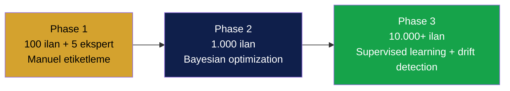
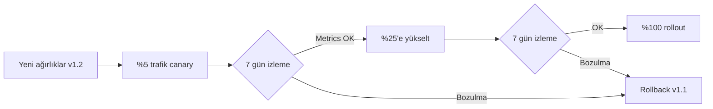
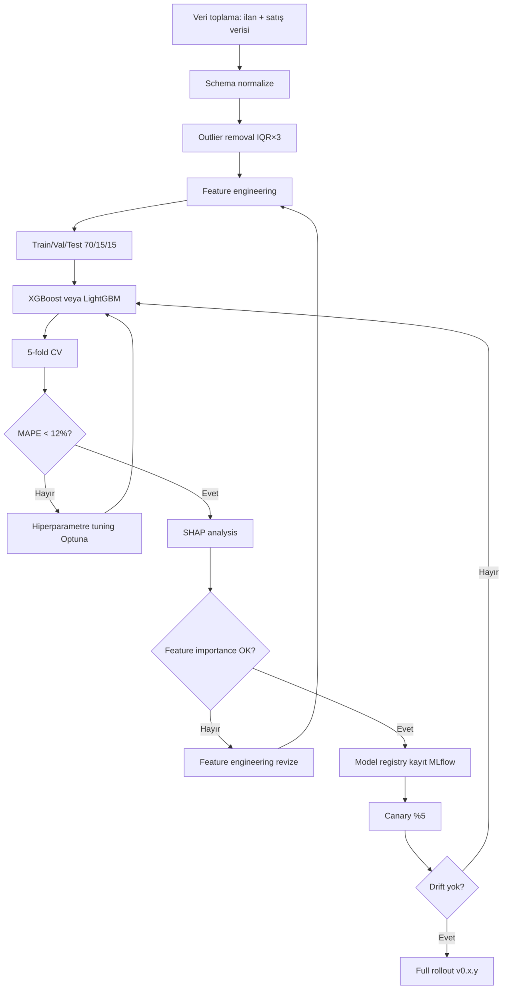
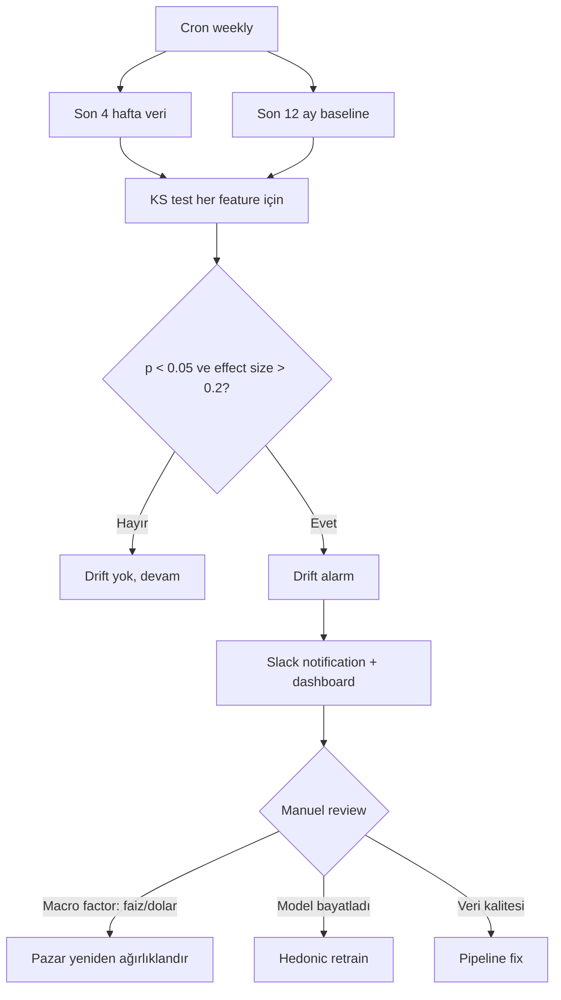

# 14 — Kalibrasyon ve Deney Protokolü

| Alan | Değer |
|---|---|
| **Doküman versiyonu** | 1.0 |
| **Statü** | Proposed |
| **Son güncelleme** | 22 Mayıs 2026 |
| **Yazar** | Pusula ML / Veri Bilimi |
| **Hedef okuyucu** | ML mühendisleri, veri bilimcileri, ürün liderliği |

## Amaç

Skorlama motorunun parametrelerinin (ağırlıklar, sigmoid eğimi, fallback confidence loss değerleri, anomaly threshold'ları, hedonic model hiperparametreleri) zaman içinde **kanıta dayalı** olarak nasıl kalibre edileceğini tanımlamak. Hedef: skorun "evet bu kelepir" iddiası, gerçek piyasa eksperlerinin kararına yüksek korelasyon göstersin.

## Kapsam

Bu doküman üç fazlı kalibrasyon protokolünü, A/B test framework'ünü, metrik tanımlarını, drift detection mekanizmasını ve karar yönetişimini kapsar. Skorun matematiksel formülü `10-aaa-skorlama-spec.md`, eksik veri ayarları `13-veri-mevcudiyeti-ve-dinamik-skor.md`'de.

---

## 1. Felsefe

> **"Kalibre edilmemiş skorlama motoru, kalibre edilmemiş bir teraziye benzer — sayı verir ama anlamsız."**

İlkeler:

1. **Her parametre kanıta dayalı.** "İçimden geldi" değerler yok — her ağırlık, eşik, normalize katsayısı bir veri setine dayanmalı.
2. **Sürekli güncellenebilir.** Pazar değişir (faiz, dolar, mevsim, salgın). Kalibrasyon aylık döngüye girer.
3. **Geri çevrilebilir.** Yeni kalibrasyon eskisinden kötüyse rollback edilebilir.
4. **Şeffaf.** Kullanıcıya "v1.0 formülü kullanıldı" gibi versiyon bilgisi gösterilir.
5. **Bias farkındalığı.** Belirli mahalle, fiyat aralığı, ilan tipi için sistematik sapma var mı izlenir.

---

## 2. Üç Fazlı Kalibrasyon



### 2.1 Phase 1 — Beta (0-3 ay): Ekspert Etiketleme

**Hedef:** İlk 100 ilan için ground truth dataset oluştur.

**Yöntem:**

1. Pusula beta'da 100 ilan toplandı
2. **5 piyasa eksperi** (deneyimli emlakçı / değerleme uzmanı) işe alınır (ücretli, ilan başına ₺50)
3. Her ekspert tüm 100 ilanı bağımsız etiketler:

```typescript
interface ExpertLabel {
  expert_id: string;
  ilan_id: string;
  verdict: 'kacirilmaz' | 'kelepir' | 'iyi_fiyat' | 'piyasa' | 'pahali' | 'asiri_pahali';
  confidence: number;  // 1-5
  reasoning: string;
  timestamp: string;
}
```

4. **Inter-rater agreement** (Cohen's kappa) hesaplanır. κ < 0.6 ise:
   - Belirsiz ilanlar identify edilir
   - Eksperle workshop yapılır, kriterler netleştirilir
   - Re-label edilir

5. Final ground truth = ağırlıklı oy (ekspert güveniyle):

```python
def consolidate_labels(expert_labels: list[ExpertLabel]) -> str:
    votes = defaultdict(float)
    for label in expert_labels:
        votes[label.verdict] += label.confidence
    return max(votes, key=votes.get)
```

**Kalibrasyon hedefi:**

- Pusula'nın ürettiği skor → grid search ile ağırlıklar ayarlanır
- `Spearman correlation` skoru ≥ 0.7 hedefi
- 80% accuracy at "kelepir vs değil" binary classification

**Grid search parametre seti:**

```python
param_grid = {
  'w_p': [0.25, 0.32, 0.40, 0.45],
  'w_q': [0.10, 0.16, 0.22, 0.25],
  'w_l': [0.10, 0.14, 0.20],
  'w_r': [0.05, 0.10, 0.15],
  'w_v': [0.05, 0.08, 0.12],
  'w_n': [0.04, 0.06, 0.08],
  'w_d': [0.05, 0.08, 0.12],
  'w_f': [0.04, 0.06, 0.10],
  'sigmoid_slope': [1.0, 1.5, 2.0],
}
# Constraint: sum(w_*) = 1.0
```

### 2.2 Phase 2 — V1 (3-9 ay): Bayesian Optimization

**Ön koşul:** 1.000 ilan + etiket dataseti (Phase 1 + büyüyen kullanıcı feedback'i ile).

**Yöntem:**

- **Optuna** veya **Ax (Facebook)** ile Bayesian optimization
- Hedef fonksiyon: NDCG@10 maximize

```python
import optuna

def objective(trial):
    weights = {
        'w_p': trial.suggest_float('w_p', 0.20, 0.50),
        'w_q': trial.suggest_float('w_q', 0.08, 0.30),
        'w_l': trial.suggest_float('w_l', 0.08, 0.25),
        'w_r': trial.suggest_float('w_r', 0.04, 0.20),
        'w_v': trial.suggest_float('w_v', 0.03, 0.15),
        'w_n': trial.suggest_float('w_n', 0.03, 0.12),
        'w_d': trial.suggest_float('w_d', 0.04, 0.15),
        'w_f': trial.suggest_float('w_f', 0.03, 0.15),
    }
    # Normalize
    total = sum(weights.values())
    weights = {k: v/total for k, v in weights.items()}

    # Re-score all ilans with new weights
    scores = [score_with_weights(ilan, weights) for ilan in dataset]

    # Compare with ground truth
    ndcg = compute_ndcg(scores, ground_truth_labels)
    return ndcg

study = optuna.create_study(direction='maximize')
study.optimize(objective, n_trials=500)

best_weights = study.best_params
```

**Cross-validation:** 5-fold CV ile aşırı uyum (overfit) kontrolü.

### 2.3 Phase 3 — V2+ (9+ ay): Supervised Learning + Drift Detection

**Ön koşul:** 10.000+ ilan + gerçek satış verisi (ilan satıldı → fiyatla karşılaştır).

**Yöntem:**

1. **Gerçek satış verisi**: bir ilan satıldığında "gerçek fiyat" alınır. Tahmini fiyat (Pusula skoru ile inferred) vs gerçek fiyat karşılaştırılır.
2. **Supervised regression:** `actual_sale_price = f(ilan_features, neighborhood, time)` modeli
3. Bu model **hedonic v2** olur, eski v1'i değiştirir
4. **Drift detection** her hafta çalışır:
   - Son 4 hafta verilerin distribution'u ile son 12 ay karşılaştır
   - **Kolmogorov-Smirnov test** ile dağılım kayması
   - Eğer p < 0.05 ve effect size > 0.2 → drift alarm
   - Otomatik retrain trigger

### 2.4 Faz Geçiş Kriterleri

| Phase | Çıkış kriteri |
|---|---|
| 1 → 2 | 100 ilan etiketlendi, kappa ≥ 0.6, ilk grid search çalıştı, MVP launch |
| 2 → 3 | 1.000 ilan + label, Bayesian opt tamamlandı, NDCG@10 ≥ 0.75 |
| 3 → süreç | 10.000+ ilan, satış verisi akmaya başladı, drift monitor canlı |

---

## 3. Metrik Tanımları

### 3.1 NDCG (Normalized Discounted Cumulative Gain)

**Ne ölçer:** Bir kullanıcı skora göre sıralı listede en üstteki ilanları kontrol ederse, gerçek "iyi" ilanları ne kadar erken görüyor.

```python
def dcg(relevances: list[float], k: int) -> float:
    return sum((2**rel - 1) / log2(i + 2) for i, rel in enumerate(relevances[:k]))

def ndcg(predicted_ranking: list[float], true_relevances: list[float], k: int) -> float:
    sorted_indices = np.argsort(predicted_ranking)[::-1]  # desc
    actual = [true_relevances[i] for i in sorted_indices[:k]]
    ideal = sorted(true_relevances, reverse=True)[:k]
    return dcg(actual, k) / dcg(ideal, k) if dcg(ideal, k) > 0 else 0
```

**Hedef:** NDCG@10 ≥ 0.75 (V1), ≥ 0.85 (V2)

### 3.2 Spearman Correlation

**Ne ölçer:** Pusula skoru ile ekspert sıralaması arasındaki rank correlation.

```python
from scipy.stats import spearmanr

rho, p_value = spearmanr(pusula_scores, expert_scores)
```

**Hedef:** ρ ≥ 0.70 (V1)

### 3.3 Precision@K

**Ne ölçer:** En yüksek K skorlu ilanın yüzde kaçı gerçekten "kelepir"?

```python
def precision_at_k(scores: list[float], labels: list[str], k: int) -> float:
    top_k_indices = np.argsort(scores)[::-1][:k]
    relevant_labels = ['kacirilmaz', 'kelepir']
    hits = sum(1 for i in top_k_indices if labels[i] in relevant_labels)
    return hits / k
```

**Hedef:** Precision@10 ≥ 0.80 (V1)

### 3.4 MAPE (Mean Absolute Percentage Error)

Hedonic regression için.

```python
mape = np.mean(np.abs((y_true - y_pred) / y_true)) * 100
```

**Hedef:** MAPE ≤ 12% (V1), ≤ 8% (V2)

### 3.5 Calibration Error

Skor confidence'ı gerçeği yansıtıyor mu?

**Yöntem:** Skor 70-80 aralığında olan ilanların kaçı gerçekten "kelepir" etiketli? İdealde %75 civarı.

```python
def expected_calibration_error(scores: list[float], labels: list[bool], n_bins: int = 10) -> float:
    bins = np.linspace(0, 100, n_bins + 1)
    ece = 0
    for i in range(n_bins):
        mask = (scores >= bins[i]) & (scores < bins[i+1])
        if mask.sum() == 0: continue
        avg_conf = scores[mask].mean() / 100
        accuracy = labels[mask].mean()
        ece += (mask.sum() / len(scores)) * abs(avg_conf - accuracy)
    return ece
```

**Hedef:** ECE ≤ 0.10 (V1)

### 3.6 Persona-Specific Metrics

| Persona | Ana metrik | Hedef |
|---|---|---|
| Buyer | Pişmanlık oranı (skor 80+ alıp pişman olan) | < 10% |
| Investor | Skor 80+ ROI tahmin vs gerçek MAPE | < 15% |
| Agent Seller | Pazarlama metni → ilan yayınlandığında alınan teklif sayısı | +20% (kontrol grubu vs Pusula) |
| Researcher | Trend tahmininin 3 ay sonra doğrulanma oranı | > 65% |

---

## 4. A/B Test Framework

### 4.1 Canary Deployment

Yeni ağırlıklar veya model versiyonu önce küçük bir kullanıcı dilimine açılır.



**İzlenen metrikler (canary süresince):**

- Skor dağılımının ortalaması (önceki ile karşılaştır — büyük kayma şüphe)
- "Kelepir" oranı (skor 70+) — beklenmeyen artış/düşüş alarm
- Kullanıcı "skoru güvenmiyorum" feedback oranı
- API latency (yeni model yavaş mı?)
- Error rate

### 4.2 Feature Flag

Skor versiyonları kullanıcı bazlı routing edilir.

```typescript
// packages/agents/src/scoring/version-router.ts

export function pickScoreVersion(user_id: string): ScoreVersion {
  const features = featureFlags.getFlags(user_id);

  if (features.includes('scoring_v2_beta')) return 'v2.0-beta';
  if (features.includes('scoring_v1.2_canary')) {
    // %5 hash bucket
    const hash = murmurhash3(user_id + 'scoring_v1.2');
    if (hash % 100 < 5) return 'v1.2';
  }
  return 'v1.1';  // stable
}
```

### 4.3 Persona A/B

Persona-spesifik ağırlık kalibrasyonu için ayrı A/B'ler.

| Test | Kontrol | Varyant | Metrik |
|---|---|---|---|
| Investor için finansal pillar +5% | Default 0.06 | 0.11 | Investor user retention |
| Buyer için risk pillar +5% | Default 0.10 | 0.15 | Buyer "pişmanlık oranı" |
| Vision pillar default ağırlığı | 0.08 | 0.05 / 0.12 | NDCG@10 |

---

## 5. Hedonic Regression Modeli

### 5.1 Pipeline



### 5.2 Model Registry (MLflow)

Her model versiyonu izlenebilir:

```python
import mlflow

with mlflow.start_run(run_name="hedonic_v0.2.1"):
    mlflow.log_params(hyperparameters)
    mlflow.log_metrics({
        "mape": 0.118,
        "rmse": 245000,
        "r2": 0.83,
    })
    mlflow.xgboost.log_model(model, artifact_path="model")
    mlflow.log_artifact("shap_summary.png")
```

UI: `mlflow.pusula.tr` (internal admin) — model history, comparison.

### 5.3 Feature Drift

Her hafta, son ay verilerin feature distribution'u eğitim verisiyle karşılaştırılır. Drift varsa retrain triggers.

```python
from scipy.stats import ks_2samp

for feature in CRITICAL_FEATURES:
    stat, p_value = ks_2samp(train_data[feature], recent_data[feature])
    if p_value < 0.05:
        log_drift_alert(feature, stat, p_value)
        trigger_retrain(feature)
```

---

## 6. Drift Detection (Pazar Değişimi)



### 6.1 Makro Faktör Etkisi

| Faktör | Pusula davranışı |
|---|---|
| TCMB faizi %5+ değişti | Finansal pillar yeniden hesap (kredi tahmini etkilenir) |
| USD/TRY ±%15 | Lüks segment yatırımcı ilgisi değişir, persona ağırlık ayarı |
| Mevsim (yaz/kış) | DOM beklentisi mevsimsel adjusted |
| Salgın / Doğal afet | Tüm pazar drift olur, manuel intervention |
| Yeni vergi yasası | Risk pillar parametre update |

---

## 7. Decision Governance

Kalibrasyon kararları kim verir?

| Karar tipi | Otomatik mi? | Onay | SLA |
|---|---|---|---|
| Hedonic retrain (drift varsa) | Otomatik trigger, manuel canary | ML mühendisi | 48 saat |
| Ağırlık ayarı (küçük, < %2) | Otomatik canary | İzleme yeterli | 7 gün |
| Ağırlık büyük değişim (> %5) | Manuel | Mehmet + ML lider | 30 gün |
| Yeni pillar ekleme | Manuel | Mehmet + tüm ekip | ADR + 90 gün |
| Persona algoritma değişimi | Manuel | Ürün + Mehmet | A/B test min 14 gün |

---

## 8. Tablo: Faz Bazlı Kalibrasyon Hedefleri

| Metrik | Phase 1 hedef | Phase 2 hedef | Phase 3 hedef |
|---|---|---|---|
| NDCG@10 | 0.65 | 0.75 | 0.85 |
| Spearman ρ | 0.60 | 0.70 | 0.80 |
| Precision@10 (kelepir) | 0.70 | 0.80 | 0.90 |
| MAPE (hedonic) | 18% | 12% | 8% |
| Calibration error | 0.20 | 0.10 | 0.05 |
| User trust (NPS-style) | 30 | 50 | 65 |

---

## 9. Veri Setleri

| Set | Kullanım | Boyut hedef | Saklama |
|---|---|---|---|
| `expert_labels` | Phase 1 + ongoing validation | 500+ etiketli ilan | Postgres |
| `user_feedback` | Pasif feedback (kullanıcı "doğru" / "yanlış" tıkladı) | 5K+ etkileşim | Postgres |
| `actual_sales` | Phase 3 ground truth | 1K+ doğrulanmış satış | Postgres + audit log |
| `synthetic_test` | Edge case test seti | 200 hand-crafted | Git repo'da fixture |
| `drift_baseline` | Model eğitim verisi snapshot | 100K+ ilan özelliği | S3 / object storage |

---

## 10. Açık Sorular

1. İlk 5 ekspert nereden? Mehmet'in network'ü mü, profesyonel firma mı?
2. Ekspert etiketleme ücreti: ilan başına ₺50 mantıklı mı? (Toplam: 100 × 5 × ₺50 = ₺25K)
3. MLflow self-host mu, MLflow Tracking Server SaaS mı (Databricks)?
4. Actual sale price verisi — Tapu ve Kadastro açık veri portalında var mı? Yoksa kullanıcı feedback'ten mi?
5. Persona drift A/B testleri kaç ay sürmeli? (Önerim: minimum 14 gün veya 1000 etkileşim)

---

## 11. Bağlantılı Dokümanlar

- `10-aaa-skorlama-spec.md` — Ağırlık tanımları
- `13-veri-mevcudiyeti-ve-dinamik-skor.md` — Confidence loss kalibrasyonu
- `15-observability-ve-slo.md` — Drift dashboards
- `16-test-stratejisi.md` — ML regression suite
- `02-ADR-001-mimari-kararlar.md` — D14 (AAA scoring) + bu doküman'da Phase 3 supervised learning
