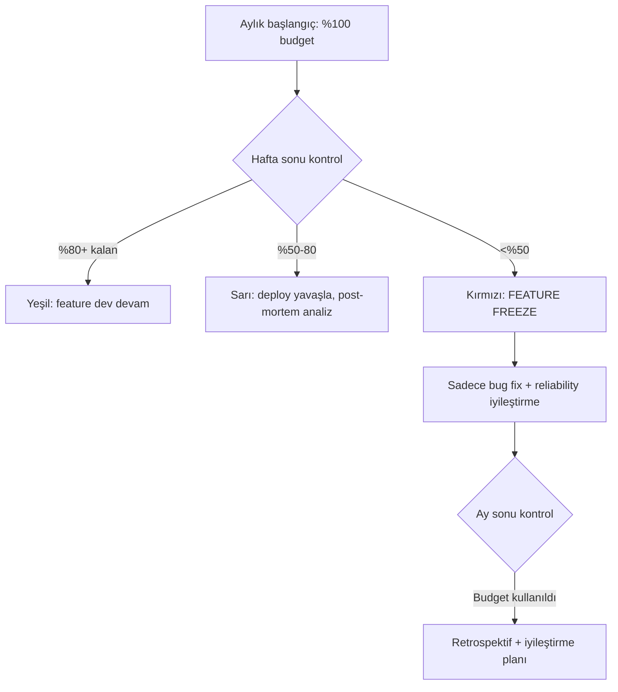
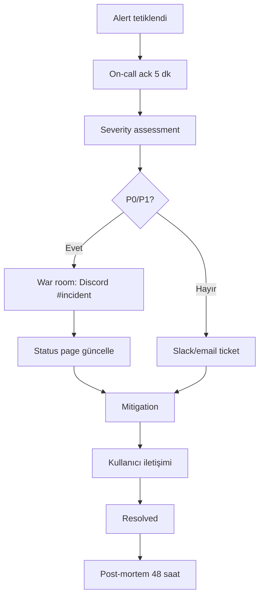

# 15 — Observability ve SLO

| Alan                  | Değer                                          |
| --------------------- | ---------------------------------------------- |
| **Doküman versiyonu** | 1.0                                            |
| **Statü**             | Proposed                                       |
| **Son güncelleme**    | 22 Mayıs 2026                                  |
| **Yazar**             | Pusula SRE / Platform                          |
| **Hedef okuyucu**     | Backend mühendisleri, on-call, ML mühendisleri |

## Amaç

Pusula'nın production ortamında her bileşenin **gözlemlenebilirliğini** (logs, metrics, traces, alerts) ve **servis seviye hedeflerini** (SLO) tanımlamak. "Bir şey yavaş" veya "bir şey kırıldı" şikayetlerine sayısal cevap verebilmek.

## Kapsam

Bu doküman 3 gözlemlenebilirlik direği (log/metric/trace), SLO tanımları, error budget'lar, alerting kuralları ve incident response süreçlerini kapsar.

---

## 1. Felsefe

> **"Ölçemediğin şeyi iyileştiremezsin. Görmediğin şeyi de düzeltemezsin."**

Üç direk:

```mermaid
flowchart LR
    subgraph "Pusula Observability"
        L[📝 Logs<br/>Structured<br/>Sentry + Loki]
        M[📊 Metrics<br/>Prometheus<br/>Grafana]
        T[🔍 Traces<br/>OpenTelemetry<br/>Tempo veya Jaeger]
    end

    Service[Servis/Agent] -.emit.-> L
    Service -.emit.-> M
    Service -.emit.-> T

    L --> Dashboard[Grafana Dashboards]
    M --> Dashboard
    T --> Dashboard

    Dashboard --> Alert[AlertManager]
    Alert --> Slack[Slack/Discord]
    Alert --> PD[PagerDuty<br/>(P0/P1)]
```

**İlkeler:**

1. **Her request bir trace_id taşır.** Frontend → Backend → 3rd party API tüm zincir.
2. **Tüm loglar structured JSON.** Plain text yasak.
3. **PII (kişisel veri) loglarda yok.** Mehmet'in email'i log'da görünmez.
4. **Metric isimleri standart.** `pusula_<bilesen>_<olcum>_<birim>`.
5. **Her SLO için error budget tanımlı.** Bütçe biterse feature freeze.

---

## 2. Logs

### 2.1 Logger Tercihi

`pino` (Node ekosistemi performansı) — `pino-http` Express/Nest için.

### 2.2 Log Structured Schema

Her log satırı şu alanları içerir:

```typescript
interface LogEntry {
  // Mandatory
  timestamp: string; // ISO 8601
  level: 'debug' | 'info' | 'warn' | 'error' | 'fatal';
  service: string; // "pusula-api" | "pusula-web" | "agent-scoring"
  message: string;

  // Tracing
  trace_id: string;
  span_id?: string;
  parent_span_id?: string;

  // Identity
  user_id?: string; // hashed/redacted (last 4 char)
  session_id?: string;
  thread_id?: string;

  // Domain
  ilan_id?: string;
  agent_name?: string;
  intent?: string;
  persona?: string;

  // Performance
  duration_ms?: number;
  status_code?: number;

  // Cost
  llm_cost_usd?: number;
  llm_provider?: string;
  llm_model?: string;
  tokens_input?: number;
  tokens_output?: number;

  // Error (sadece error/fatal'de)
  error?: {
    name: string;
    message: string;
    stack?: string;
    cause?: unknown;
  };

  // Custom fields
  [key: string]: unknown;
}
```

### 2.3 PII Redaction

```typescript
const PII_FIELDS = ['email', 'phone', 'tc_no', 'iban', 'card_number', 'api_key', 'jwt'];

function redactPII(obj: unknown): unknown {
  if (typeof obj !== 'object' || obj === null) return obj;
  const clone: Record<string, unknown> = { ...(obj as Record<string, unknown>) };
  for (const key of Object.keys(clone)) {
    const lower = key.toLowerCase();
    if (PII_FIELDS.some((f) => lower.includes(f))) {
      clone[key] = '[REDACTED]';
    } else if (typeof clone[key] === 'object') {
      clone[key] = redactPII(clone[key]);
    }
  }
  return clone;
}
```

### 2.4 Log Levels Kullanım Kuralları

| Level   | Ne zaman                    | Örnek                                                     |
| ------- | --------------------------- | --------------------------------------------------------- |
| `debug` | Geliştirme, normal'de off   | "Cache miss for key X"                                    |
| `info`  | Normal event'ler            | "Skor hesaplandı: ilan_id=xxx, skor=78"                   |
| `warn`  | Beklenmedik ama recoverable | "Hedonic model NaN döndü, fallback yöntem A kullanılıyor" |
| `error` | Hata, ama servis ayakta     | "LLM provider 429 — failover Gemini'ye"                   |
| `fatal` | Servisi durdurabilecek      | "DB connection pool exhausted"                            |

### 2.5 Log Backends

| Backend          | Kullanım            | Tutma                        |
| ---------------- | ------------------- | ---------------------------- |
| **Sentry**       | Error + fatal       | 90 gün                       |
| **Grafana Loki** | Tüm structured logs | 30 gün hot, 1 yıl cold (S3)  |
| **stdout**       | Console (dev)       | —                            |
| **Render Logs**  | Production tail     | 7 gün (Render Starter limit) |

---

## 3. Metrics

### 3.1 Naming Convention

**Format:** `pusula_<bilesen>_<olcum>_<birim>`

| Bileşen | Örnek                              |
| ------- | ---------------------------------- |
| `agent` | `pusula_agent_latency_seconds`     |
| `llm`   | `pusula_llm_cost_usd_total`        |
| `db`    | `pusula_db_query_duration_seconds` |
| `cache` | `pusula_cache_hit_ratio`           |
| `http`  | `pusula_http_requests_total`       |

**Label kuralları:**

- `service` — pusula-api, pusula-web, agent-x
- `agent_name` — orchestrator, scoring, vision, ...
- `provider` — groq, gemini, deepseek, anthropic
- `model` — claude-sonnet-4-6, gemini-2.5-flash, ...
- `vertical` — konut, arsa, oto, ticari
- `persona` — buyer, agent_seller, investor, researcher
- `result` — success, error, timeout, fallback
- `tier` — free, starter, pro, enterprise (V2+)

**Yasak label'lar:** `user_id`, `ilan_id`, `email` (yüksek cardinality + PII)

### 3.2 Standart Metrik Katalog

```promql
# Agent latency
pusula_agent_latency_seconds_bucket{agent_name="scoring", service="pusula-api"}
pusula_agent_latency_seconds_count{agent_name="scoring"}
pusula_agent_latency_seconds_sum{agent_name="scoring"}

# Agent errors
pusula_agent_errors_total{agent_name="vision", error_type="llm_timeout"}

# LLM
pusula_llm_requests_total{provider="anthropic", model="claude-sonnet-4-6"}
pusula_llm_tokens_total{provider="groq", direction="input"}
pusula_llm_tokens_total{provider="groq", direction="output"}
pusula_llm_cost_usd_total{provider="anthropic"}
pusula_llm_failover_total{from_provider="groq", to_provider="gemini"}

# HTTP
pusula_http_requests_total{path="/api/scoring/konut", method="POST", status_code="200"}
pusula_http_request_duration_seconds{path="/api/scoring/konut"}

# DB
pusula_db_query_duration_seconds{query_type="select", table="ilanlar"}
pusula_db_connections_active{pool="primary"}

# Cache
pusula_cache_hits_total{cache_layer="redis", key_pattern="ilan_score"}
pusula_cache_misses_total{cache_layer="redis", key_pattern="ilan_score"}

# Business
pusula_ilanlar_ingested_total{kategori="konut", source="sahibinden"}
pusula_skor_distribution_bucket{etiket="kelepir", persona="buyer"}
pusula_chat_messages_total{persona="investor", intent="analyze_listing"}

# Subscription (V2)
pusula_subscriptions_active{tier="pro"}
pusula_mrr_try{tier="pro"}
```

### 3.3 Cardinality Kontrolü

Cardinality patlaması (her metric noktanın binlerce label kombinasyonu olması) Prometheus'u öldürür.

| Metric                         | Tahmini cardinality                      |
| ------------------------------ | ---------------------------------------- |
| `pusula_http_requests_total`   | path(20) × method(5) × status(8) = 800 ✓ |
| `pusula_agent_latency_seconds` | agent(15) × histogram bucket(10) = 150 ✓ |
| `pusula_llm_cost_usd_total`    | provider(4) × model(15) = 60 ✓           |

**Yasak (cardinality bomb):**

- `{user_id="xxx"}` — milyonlarca user
- `{ilan_id="xxx"}` — milyonlarca ilan
- `{trace_id="xxx"}` — request başına unique

Bunlar yerine trace'a kayıt et.

### 3.4 Prometheus Hosting

| Ortam | Tercih                                     |
| ----- | ------------------------------------------ |
| Beta  | **Grafana Cloud Free** (10K series limit)  |
| V1    | Grafana Cloud Pro ($49/ay 50K series)      |
| V2+   | Self-hosted Prometheus + Thanos veya Mimir |

---

## 4. Distributed Tracing

### 4.1 OpenTelemetry Setup

```typescript
// packages/agents/src/runtime/TelemetryProvider.ts

import { NodeSDK } from '@opentelemetry/sdk-node';
import { Resource } from '@opentelemetry/resources';
import { SemanticResourceAttributes } from '@opentelemetry/semantic-conventions';
import { OTLPTraceExporter } from '@opentelemetry/exporter-trace-otlp-http';

export function initTelemetry(serviceName: string): NodeSDK {
  return new NodeSDK({
    resource: new Resource({
      [SemanticResourceAttributes.SERVICE_NAME]: serviceName,
      [SemanticResourceAttributes.SERVICE_VERSION]: process.env.APP_VERSION ?? 'dev',
      [SemanticResourceAttributes.DEPLOYMENT_ENVIRONMENT]: process.env.NODE_ENV ?? 'dev',
      'pusula.tenant': 'default',
    }),
    traceExporter: new OTLPTraceExporter({
      url: process.env.OTEL_EXPORTER_OTLP_ENDPOINT,
    }),
    instrumentations: [
      // Auto-instrument express, http, pg, redis, ...
    ],
  });
}
```

### 4.2 Span Konvansiyonları

Her span:

- **Adı:** `<bileşen>.<aksiyon>` — `agent.scoring.score_konut`, `llm.call.anthropic`, `db.query.ilanlar.find_comparable`
- **Status:** `ok` | `error`
- **Attributes:**
  - `agent.name`
  - `agent.tier` (0/1/2/3)
  - `llm.provider`, `llm.model`, `llm.tokens.input`, `llm.tokens.output`, `llm.cost_usd`
  - `db.system`, `db.statement_kind`, `db.rows_affected`
  - `pusula.ilan_id` (yüksek cardinality — sadece trace'ta, metric'te değil)
  - `pusula.persona`, `pusula.intent`

### 4.3 Trace Sampling

| Ortam    | Sampling rate                                   |
| -------- | ----------------------------------------------- |
| Dev      | %100 (her trace)                                |
| Beta     | %100                                            |
| V1 prod  | %20                                             |
| V2+ prod | %5 (head-based) + %100 error trace (tail-based) |

### 4.4 Trace Backend

| Backend                   | Kullanım           |
| ------------------------- | ------------------ |
| **Grafana Tempo** (cloud) | Beta + V1          |
| **Self-hosted Tempo**     | V2+                |
| **Sentry Performance**    | Error trace destek |

---

## 5. SLO Tanımları

### 5.1 SLO Hiyerarşisi

```mermaid
flowchart TB
    A[User SLO<br/>"Pusula çalışır mı?"] --> B[Servis SLO<br/>Brain, API, Web]
    B --> C[Agent SLO<br/>9 specialist + 4 background]
    C --> D[Tool SLO<br/>LLM Gateway, DB, Cache]
```

### 5.2 Pusula Brain (Orchestrator)

| SLO                     | Hedef     | Ölçüm penceresi | Error budget |
| ----------------------- | --------- | --------------- | ------------ |
| Availability            | 99.5%     | 30 gün rolling  | 3h 36m       |
| Latency p50 (ilk token) | < 600 ms  | 30 gün          | %10 ihlal    |
| Latency p95 (ilk token) | < 1500 ms | 30 gün          | %5 ihlal     |
| Latency p95 (tam yanıt) | < 8000 ms | 30 gün          | %5 ihlal     |
| Error rate              | < 0.5%    | 30 gün          | 3.6h         |

### 5.3 Specialist Agents (Tier 1)

| Agent     | p50 latency | p95 latency | error rate | availability | error budget/ay |
| --------- | ----------- | ----------- | ---------- | ------------ | --------------- |
| Skorlama  | 50 ms       | 200 ms      | < 0.1%     | 99.9%        | 43m             |
| Kıyaslama | 150 ms      | 400 ms      | < 0.2%     | 99.5%        | 3h 36m          |
| Konum     | 100 ms      | 600 ms      | < 0.5%     | 99.0%        | 7h 12m          |
| Risk      | 80 ms       | 300 ms      | < 0.3%     | 99.5%        | 3h 36m          |
| Vision    | 2 s         | 4 s         | < 1.0%     | 99.0%        | 7h 12m          |
| NLP       | 300 ms      | 800 ms      | < 0.5%     | 99.0%        | 7h 12m          |
| Pazar     | 200 ms      | 500 ms      | < 0.3%     | 99.5%        | 3h 36m          |
| Müzakere  | 1 s         | 2 s         | < 0.5%     | 99.0%        | 7h 12m          |
| Pazarlama | 1.5 s       | 3 s         | < 0.5%     | 99.0%        | 7h 12m          |

### 5.4 Background Agents (Tier 2)

| Agent       | İşlem completion | Lag    | Error rate | Availability |
| ----------- | ---------------- | ------ | ---------- | ------------ |
| Toplayıcı   | < 30 dk          | < 6h   | < 2%       | 95%          |
| Doğrulayıcı | < 5 s            | < 30 s | < 1%       | 99%          |
| Trend       | < 1 saat         | < 24h  | < 2%       | 95%          |
| Bildirim    | < 30 s           | < 5 dk | < 1%       | 99.5%        |

### 5.5 Tool Workers (Tier 3)

| Tool        | p95 latency | Error rate | Availability    |
| ----------- | ----------- | ---------- | --------------- |
| LLM Gateway | < 5 s       | < 1%       | 99.5%           |
| OSM client  | < 2 s       | < 5%       | 95% (3rd party) |
| AFAD        | < 1 s       | < 5%       | 95%             |
| Supabase    | < 100 ms    | < 0.1%     | 99.9%           |
| Embedding   | < 500 ms    | < 0.5%     | 99.5%           |

### 5.6 Web App

| SLO                                  | Hedef              |
| ------------------------------------ | ------------------ |
| Sayfa LCP (Largest Contentful Paint) | < 2.5 s p75        |
| TTI (Time to Interactive)            | < 5 s p75          |
| CLS (Cumulative Layout Shift)        | < 0.1              |
| Availability                         | 99.9% (Vercel Pro) |

---

## 6. Error Budget Yönetimi



**Feature freeze kuralları (kırmızı durumda):**

- Yeni özellik deploy yasak
- Hotfix + reliability fix serbest
- On-call ekibi devamlı çağrı dinler
- Post-mortem ay sonu zorunlu

---

## 7. Alerting

### 7.1 Alert Seviyeleri

| Seviye | Kim çağrılır               | Yanıt SLA | Örnek                            |
| ------ | -------------------------- | --------- | -------------------------------- |
| **P0** | On-call + Mehmet (telefon) | < 5 dk    | Production tamamen down          |
| **P1** | On-call (Slack + email)    | < 15 dk   | Brain error rate %5+             |
| **P2** | Slack                      | < 1 saat  | Vision agent yavaş ama çalışıyor |
| **P3** | Email + Linear ticket      | < 1 gün   | Cache hit oranı düşmüş           |

### 7.2 Alert Tanımları (Prometheus AlertManager)

```yaml
groups:
  - name: pusula_critical
    interval: 30s
    rules:
      - alert: PusulaApiDown
        expr: up{service="pusula-api"} == 0
        for: 1m
        labels:
          severity: P0
        annotations:
          summary: 'Pusula API down'
          runbook: 'https://docs/runbooks/api-down'

      - alert: BrainErrorRateHigh
        expr: |
          sum(rate(pusula_agent_errors_total{agent_name="orchestrator"}[5m]))
          /
          sum(rate(pusula_agent_latency_seconds_count{agent_name="orchestrator"}[5m]))
          > 0.05
        for: 5m
        labels:
          severity: P1
        annotations:
          summary: 'Brain error rate > 5% (5 dk)'

      - alert: LLMCostBudgetExceeded
        expr: sum(rate(pusula_llm_cost_usd_total[1h])) * 24 * 30 > 1000
        for: 1h
        labels:
          severity: P2
        annotations:
          summary: 'LLM cost projection > $1000/ay'

      - alert: ScoringLatencyP95High
        expr: |
          histogram_quantile(0.95,
            rate(pusula_agent_latency_seconds_bucket{agent_name="scoring"}[5m])
          ) > 0.5
        for: 10m
        labels:
          severity: P1

      - alert: SahibindenParserBroken
        expr: sum(rate(pusula_ilanlar_parse_errors_total{source="sahibinden"}[15m])) > 1
        for: 5m
        labels:
          severity: P0
        annotations:
          summary: 'sahibinden DOM parser bozulmuş — selector güncellenmeli'
          runbook: 'https://docs/runbooks/sahibinden-parser-fix'

      - alert: ScoringDrift
        expr: |
          (avg_over_time(pusula_skor_average{persona="buyer"}[7d])
           -
           avg_over_time(pusula_skor_average{persona="buyer"}[7d] offset 30d))
          / avg_over_time(pusula_skor_average{persona="buyer"}[7d] offset 30d)
          > 0.15
        for: 1h
        labels:
          severity: P2
        annotations:
          summary: 'Skor dağılımı önceki aya göre %15+ kaymış — drift olabilir'
```

### 7.3 Alert Hijyeni

- **Alert fatigue önle**: spam alert'ler suppress kuralı
- **Runbook zorunlu**: her alert'in `runbook` annotation'ı olmalı
- **Quarterly review**: hangi alert'ler sıkça atıyor, hangileri hiç atmıyor, fix edilecek

---

## 8. Dashboards

### 8.1 Ana Dashboard'lar (Grafana)

1. **Executive Overview** — DAU/MAU, MRR (V2+), ilan analiz sayısı, NPS, top errors
2. **System Health** — service up/down, latency, error rate, DB pool, Redis hit ratio
3. **Agent Performance** — her agent için latency, error rate, throughput
4. **LLM Cost & Usage** — provider başına token, USD, failover sayısı
5. **Scoring Quality** — skor dağılımı, persona segmentation, drift detection
6. **User Funnel** — signup → first analysis → repeat → upgrade (V2+)
7. **On-Call** — aktif alert'ler, son 24h incident'lar, error budget durumu

### 8.2 Dashboard'lar Naming

`{service}_{purpose}` — `pusula-api_health`, `agents_performance`, `scoring_quality`

---

## 9. Incident Response

### 9.1 Severity Tanımları (yeniden)

| Sev | Tanım                                               | Örnek                                    |
| --- | --------------------------------------------------- | ---------------------------------------- |
| P0  | Tüm kullanıcılar etkilenir, production tamamen down | Vercel + Render aynı anda down           |
| P1  | %25+ kullanıcı veya kritik özellik                  | Brain çalışmıyor ama dashboard çalışıyor |
| P2  | Belirli özellik veya küçük segment                  | Vision agent yavaş ama yedek çalışıyor   |
| P3  | Cosmetic veya minor                                 | UI typo                                  |

### 9.2 Response Akışı



### 9.3 Post-Mortem Template

Her P0/P1 sonrası 48 saat içinde yazılır:

```markdown
# Incident PM — YYYY-MM-DD — [Başlık]

**Severity:** P0/P1
**Süre:** HH:MM - HH:MM (X dakika)
**Etkilenen:** [kaç kullanıcı, hangi özellikler]

## Özet

[2-3 cümle]

## Etki

- Kullanıcı etkisi
- Gelir etkisi (V2+)
- SLO error budget tüketimi

## Zaman çizgisi

- HH:MM — Event A
- HH:MM — Event B

## Kök neden

[5 why analysis]

## Düzeltme

- [ ] Kısa vadeli mitigation
- [ ] Orta vadeli structural fix
- [ ] Uzun vadeli prevent

## Öğrenilen dersler

- Neyin işe yaradığı
- Neyin daha iyi olabileceği
- Blame değil sistem odaklı
```

---

## 10. Logging Best Practices

| ✅ Yap                                          | ❌ Yapma                           |
| ----------------------------------------------- | ---------------------------------- |
| Structured JSON                                 | Plain string log                   |
| `logger.info("ilan_scored", { ilan_id, skor })` | `console.log("ilan ${id} scored")` |
| PII redact                                      | Raw email/phone log                |
| `trace_id` her log'da                           | Trace'sız log                      |
| Error stack + cause                             | Sadece message                     |
| Cost tracking each LLM call                     | LLM call'u logsuz                  |

---

## 11. Health Endpoint'leri

Her servis için standart endpoint:

```typescript
// GET /health — sığ
{
  "status": "ok",
  "service": "pusula-api",
  "version": "0.0.1",
  "timestamp": "2026-05-22T12:34:56Z"
}

// GET /health/ready — derin (dependencies dahil)
{
  "status": "ok",
  "service": "pusula-api",
  "checks": {
    "database": { "status": "ok", "latency_ms": 12 },
    "redis": { "status": "ok", "latency_ms": 3 },
    "supabase_auth": { "status": "ok" },
    "llm_groq": { "status": "degraded", "reason": "rate_limit_warning" }
  }
}
```

Render `healthCheckPath: /health` kullanır (sığ). Detaylı readiness için ayrı endpoint.

---

## 12. Bağlantılı Dokümanlar

- `11-multi-agent-mimarisi.md` — Agent kartlarında SLO referansları
- `16-test-stratejisi.md` — Chaos engineering testleri SLO sınırlarını doğrular
- `02-ADR-001-mimari-kararlar.md` — D12 (Observability stack)
