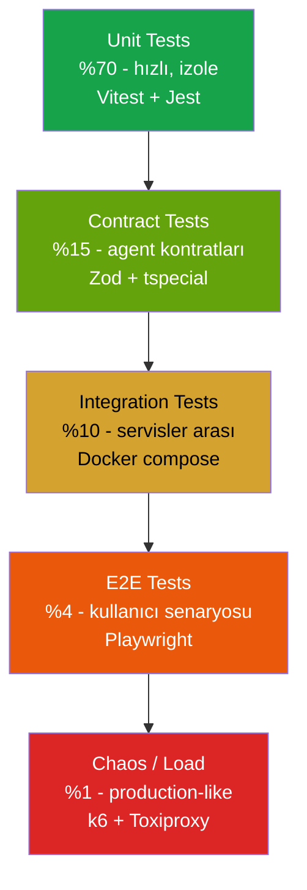

# 16 — Test Stratejisi

| Alan | Değer |
|---|---|
| **Doküman versiyonu** | 1.0 |
| **Statü** | Proposed |
| **Son güncelleme** | 22 Mayıs 2026 |
| **Yazar** | Pusula Mühendislik / QA |
| **Hedef okuyucu** | Tüm mühendisler, QA |

## Amaç

Pusula'nın test stratejisini katmanlı olarak tanımlamak: birim, contract, integration, E2E, ML regression, load, chaos. CI/CD'ye entegre olacak şekilde hangi testler ne zaman koşar, hangi kapı geçilmezse merge engellenmesi gibi politikalar.

## Kapsam

Bu doküman tüm test türlerini, hedef coverage seviyelerini, araçları, CI pipeline'ı ve regresyon stratejisini içerir.

---

## 1. Test Piramidi



**Felsefe:**

1. **Unit ucuz, E2E pahalı.** Mümkün olduğunca aşağı katmanda test yaz.
2. **Contract testler zorunlu.** Agent kontratı kırılırsa CI fail.
3. **Coverage hedef ama tek metric değil.** Bir testin değeri kapsadığı satır sayısı değil yakaladığı bug'lardır.
4. **Flaky test düşmandır.** %95'ten az pass rate olan test ya tamir edilir ya silinir.
5. **Production kadar gerçek değil ama yeterince gerçek.** Test fixture'lar gerçek üretim verisinin anonim örnekleridir.

---

## 2. Unit Tests

### 2.1 Kapsam Hedefi

| Paket | Coverage hedef |
|---|---|
| `@pusula/scoring` | ≥ 95% line, ≥ 90% branch |
| `@pusula/scoring-konut` | ≥ 95% |
| `@pusula/llm-gateway` | ≥ 85% (mock LLM çağrıları) |
| `@pusula/shared` | ≥ 90% (Zod schemas) |
| `@pusula/agents` (specialist'ler) | ≥ 80% |
| `apps/api` (NestJS) | ≥ 75% |
| `apps/web` (UI) | ≥ 60% (UI test E2E'de) |
| `apps/extension` | ≥ 70% (DOM parser kritik) |

### 2.2 Araçlar

- **Vitest** — birincil (hızlı, ESM-native, Jest API uyumlu)
- **@testing-library/react** — React komponent
- **jsdom** — extension content script testleri
- **fast-check** — property-based testing (scoring formülü için)

### 2.3 Örnek: Scoring Pure Function

```typescript
// packages/scoring-konut/test/pillars/fiyat.test.ts
import { describe, it, expect } from 'vitest';
import { fc } from 'fast-check';
import { fiyatAvantajiSkoru } from '../../src/pillars/fiyat';

describe('FiyatAvantajıSkoru', () => {
  it('medyan fiyat → skor ≈ 50', () => {
    const result = fiyatAvantajiSkoru(
      { fiyat_tl: 4_750_000, net_m2: 95 },
      makeComparables(50_000)
    );
    expect(result.skor).toBeCloseTo(50, 0);
  });

  it.each([
    [40_000, 70, 100],    // %20 ucuz
    [60_000, 0, 30],      // %20 pahalı
    [50_000, 35, 65],     // medyanda
  ])('m2 fiyatı %d TL → skor [%d-%d] aralığında', (m2Fiyat, min, max) => {
    const result = fiyatAvantajiSkoru(
      { fiyat_tl: 95 * m2Fiyat, net_m2: 95 },
      makeComparables(50_000)
    );
    expect(result.skor).toBeGreaterThanOrEqual(min);
    expect(result.skor).toBeLessThanOrEqual(max);
  });

  it('property: skor her zaman [0, 100] aralığında', () => {
    fc.assert(
      fc.property(
        fc.integer({ min: 100_000, max: 100_000_000 }),
        fc.integer({ min: 30, max: 500 }),
        fc.integer({ min: 10_000, max: 200_000 }),
        (fiyat, m2, medianM2) => {
          const result = fiyatAvantajiSkoru(
            { fiyat_tl: fiyat, net_m2: m2 },
            makeComparables(medianM2)
          );
          return result.skor >= 0 && result.skor <= 100;
        }
      )
    );
  });

  it('determinism: aynı input → aynı output', () => {
    const input = { fiyat_tl: 4_500_000, net_m2: 95 };
    const comps = makeComparables(50_000, 42);
    const r1 = fiyatAvantajiSkoru(input, comps);
    const r2 = fiyatAvantajiSkoru(input, comps);
    expect(r1).toEqual(r2);
  });
});
```

### 2.4 Anti-Patterns

| ❌ Kötü | ✅ İyi |
|---|---|
| Network çağrısı yapan unit test | Mock'la, integration'a bırak |
| `setTimeout`'la flaky test | `vi.useFakeTimers()` |
| 200 satır test setup | Helper function veya fixture |
| Test isimleri "test 1, test 2" | "skoru medyanda 50 vermeli" |

---

## 3. Contract Tests

### 3.1 Felsefe

Agent'lar arası iletişim kontratı = Zod schema. Bu kontrat değişirse:

- Provider tarafı: yeni schema → eski testler fail
- Consumer tarafı: eski schema → yeni provider çıktısı kabul etmez

Her agent kendi **provider testlerini** ve **consumer testlerini** yazar.

### 3.2 Örnek: Scoring Agent Contract

```typescript
// packages/agents/test/contracts/scoring.contract.test.ts

import { describe, it, expect } from 'vitest';
import { ScoringRequest, ScoringResponse } from '../../src/contracts/scoring';
import { fixturesValid, fixturesInvalid } from './fixtures';

describe('ScoringAgent contract', () => {
  describe('Request validation', () => {
    it('accepts valid scoring request', () => {
      const result = ScoringRequest.safeParse(fixturesValid.scoringRequest);
      expect(result.success).toBe(true);
    });

    it.each(fixturesInvalid.scoringRequests)(
      'rejects invalid request: %s',
      (description, invalidPayload) => {
        const result = ScoringRequest.safeParse(invalidPayload);
        expect(result.success).toBe(false);
      }
    );
  });

  describe('Response shape (provider obligations)', () => {
    it('actual ScoringAgent output matches ScoringResponse schema', async () => {
      const mockAgent = new ScoringAgent(/*...mocked deps...*/);
      const response = await mockAgent.score(fixturesValid.scoringRequest);
      const result = ScoringResponse.safeParse(response);
      expect(result.success).toBe(true);
    });

    it('total skor [0, 100] aralığında', async () => {
      const response = await mockAgent.score(fixturesValid.scoringRequest);
      expect(response.result.toplam).toBeGreaterThanOrEqual(0);
      expect(response.result.toplam).toBeLessThanOrEqual(100);
    });

    it('confidence [0, 100] aralığında', async () => {
      const response = await mockAgent.score(fixturesValid.scoringRequest);
      expect(response.result.confidence).toBeGreaterThanOrEqual(0);
      expect(response.result.confidence).toBeLessThanOrEqual(100);
    });
  });
});
```

### 3.3 Cross-Agent Contract

Brain → Specialist tipi kontratlar için **pact-style** testler:

```typescript
// packages/agents/test/contracts/brain-to-scoring.test.ts

describe('Brain → ScoringAgent contract', () => {
  it('Brain tool call definition matches ScoringAgent input', () => {
    const toolDef = BRAIN_TOOLS.find(t => t.name === 'scoring_agent');
    // toolDef.parameters Zod schema mı? ScoringRequest ile aynı mı?
    expect(toolDef?.parameters).toEqual(ScoringRequest);
  });
});
```

### 3.4 CI Kapısı

```yaml
# .github/workflows/ci.yml
- name: Contract tests
  run: pnpm --filter @pusula/agents test:contracts
  # Bu fail olursa hiçbir PR merge olamaz
```

---

## 4. Integration Tests

### 4.1 Kapsam

- API endpoint → Service → DB → Cache zinciri
- Agent → Tool worker (gerçek HTTP, ama mock backend)
- DB migration smoke testleri

### 4.2 Stack

```yaml
# docker-compose.test.yml
services:
  postgres-test:
    image: postgres:16-alpine
    environment:
      POSTGRES_DB: pusula_test
      POSTGRES_PASSWORD: test
    tmpfs:
      - /var/lib/postgresql/data  # in-memory için hızlı

  redis-test:
    image: redis:7-alpine
    tmpfs:
      - /data

  llm-mock:
    image: wiremock/wiremock
    volumes:
      - ./test/mocks/llm:/home/wiremock
```

### 4.3 Örnek: Scoring API Integration

```typescript
// apps/api/test/integration/scoring.e2e.spec.ts

describe('POST /api/scoring/konut (integration)', () => {
  let app: INestApplication;

  beforeAll(async () => {
    app = await createTestApp();
    await seedFixtures();
  });

  it('returns 200 with valid scoring result', async () => {
    const response = await request(app.getHttpServer())
      .post('/api/scoring/konut')
      .set('Authorization', `Bearer ${testJwt}`)
      .send({ input: fixtures.konutInput, context_request: { /* ... */ } });

    expect(response.status).toBe(200);
    expect(response.body.skor.toplam).toBeGreaterThan(0);
    expect(response.body.skor.formul_versiyonu).toBe('konut_v1.0');
  });

  it('persists scoring_result to DB', async () => {
    await request(app.getHttpServer()).post('/api/scoring/konut').send(/*...*/);
    const rows = await testDb.query('SELECT * FROM scoring_results LIMIT 1');
    expect(rows.rowCount).toBeGreaterThan(0);
  });

  it('handles missing comparable gracefully', async () => {
    await testDb.query('TRUNCATE ilanlar');  // hiç comparable yok
    const response = await request(app.getHttpServer())
      .post('/api/scoring/konut')
      .send({ input: fixtures.konutInput });

    expect(response.body.skor.confidence).toBeLessThan(50);
    expect(response.body.skor.uyarilar).toContainEqual(
      expect.objectContaining({ kod: 'low_comparable' })
    );
  });
});
```

---

## 5. E2E Tests

### 5.1 Araç: Playwright

- Cross-browser (Chromium, Firefox, WebKit)
- Visual regression
- API mocking via `route.fulfill`

### 5.2 Kapsam (MVP Beta)

| Senaryo | Kritiklik |
|---|---|
| Signup + login (magic link) | P0 |
| Settings → BYOK key ekle + test | P0 |
| Dashboard → Ilan ekle (manuel URL) → skor görüntüle | P0 |
| Chat → "bu ilanı analiz et" → skor cevabı | P0 |
| Extension yan panel açma + sahibinden DOM parse | P0 |
| Skor kartı → "neden bu skor?" → AI açıklama streaming | P1 |
| Pazarlama metni üretme | P1 |
| Settings → persona değiştirme | P2 |
| Slash command `/analiz` | P2 |
| Aboneliğe geç → Stripe checkout (test mode) | P1 (V2) |

### 5.3 Örnek E2E Test

```typescript
// e2e/tests/scoring-flow.spec.ts
import { test, expect } from '@playwright/test';

test.describe('Scoring flow', () => {
  test.beforeEach(async ({ page }) => {
    await page.goto('/auth/login');
    await login(page, 'test@pusula.tr');
  });

  test('Kullanıcı bir ilan analiz edebilir', async ({ page }) => {
    await page.goto('/dashboard');
    await page.click('[data-test="add-listing-button"]');

    await page.fill('[data-test="listing-url-input"]', 'https://www.sahibinden.com/ilan/...');
    await page.click('[data-test="analyze-button"]');

    // Loading state
    await expect(page.locator('[data-test="score-loading"]')).toBeVisible();

    // Sonuç beklenir (max 10s)
    await expect(page.locator('[data-test="score-value"]')).toBeVisible({ timeout: 10_000 });

    const scoreText = await page.locator('[data-test="score-value"]').textContent();
    const score = parseInt(scoreText!, 10);
    expect(score).toBeGreaterThanOrEqual(0);
    expect(score).toBeLessThanOrEqual(100);

    // Visual regression
    await expect(page).toHaveScreenshot('score-card.png');
  });
});
```

### 5.4 LLM Mocking

Gerçek LLM çağrısı yapmadan tutarlı E2E için:

```typescript
await page.route('**/api/llm/chat', (route) => {
  route.fulfill({
    contentType: 'application/json',
    body: JSON.stringify({ text: 'Bu daire piyasanın %15 altında görünüyor.' }),
  });
});
```

---

## 6. ML Model Regression Tests

### 6.1 Felsefe

Yeni hedonic model, eski versiyondan kötü olmamalı. CI'da otomatik karşılaştırma.

### 6.2 Test Stratejisi

```python
# packages/hedonic/tests/regression_test.py

import pytest
from hedonic import HedonicModel

GOLDEN_DATASET = load_fixture('golden_100_ilans.parquet')

def test_new_model_not_worse_than_baseline():
    """Yeni model MAPE eski modelden en fazla %2 kötüleyebilir."""
    new_model = HedonicModel.load('candidates/hedonic_v0.3.0.onnx')
    baseline = HedonicModel.load('production/hedonic_v0.2.1.onnx')

    new_mape = compute_mape(new_model, GOLDEN_DATASET)
    baseline_mape = compute_mape(baseline, GOLDEN_DATASET)

    assert new_mape <= baseline_mape * 1.02, (
        f"New model MAPE {new_mape:.2%} is worse than baseline {baseline_mape:.2%} by more than 2%"
    )

def test_specific_predictions_stable():
    """Beklenmedik kayma yok — bilinen 20 ilanın tahminleri ±5% sapabilir."""
    expected = load_fixture('expected_predictions_v0.2.1.json')
    new_model = HedonicModel.load('candidates/hedonic_v0.3.0.onnx')

    for ilan_id, expected_price in expected.items():
        actual = new_model.predict(load_ilan(ilan_id))
        ratio = actual / expected_price
        assert 0.95 <= ratio <= 1.05, (
            f"Ilan {ilan_id} prediction shifted: expected {expected_price}, got {actual}"
        )

def test_fairness_across_neighborhoods():
    """Belirli bir mahalle için sistematik sapma yok."""
    for mahalle in TOP_50_MAHALLE:
        ilanlar = filter_by_mahalle(GOLDEN_DATASET, mahalle)
        if len(ilanlar) < 5: continue
        mape = compute_mape(new_model, ilanlar)
        assert mape < 0.20, f"Mahalle {mahalle} MAPE too high: {mape:.2%}"
```

### 6.3 SHAP Explanation Stability

```python
def test_shap_values_consistent():
    """En önemli 5 feature stabil olmalı — büyük kayma model davranış değişimi demek."""
    new_top5 = top_features_by_shap(new_model)
    baseline_top5 = top_features_by_shap(baseline)
    overlap = set(new_top5) & set(baseline_top5)
    assert len(overlap) >= 3, "Top 5 SHAP features değişti, manuel review gerekli"
```

---

## 7. Load Tests

### 7.1 Araç: k6

```javascript
// load-tests/scoring-burst.js
import http from 'k6/http';
import { check, sleep } from 'k6';

export const options = {
  stages: [
    { duration: '2m', target: 50 },    // ramp up
    { duration: '5m', target: 100 },   // steady
    { duration: '2m', target: 0 },     // ramp down
  ],
  thresholds: {
    http_req_duration: ['p(95)<2000'],   // p95 < 2s
    http_req_failed: ['rate<0.01'],      // <1% error
  },
};

export default function () {
  const payload = JSON.stringify({
    input: { /* fixture konut */ },
    context_request: { include_vision: false }
  });
  const headers = { 'Content-Type': 'application/json', 'Authorization': `Bearer ${__ENV.TOKEN}` };
  const res = http.post('https://api.pusula.tr/api/scoring/konut', payload, { headers });
  check(res, { 'status 200': (r) => r.status === 200 });
  sleep(1);
}
```

### 7.2 Senaryolar

| Senaryo | RPS hedef | Süre | Beklenen |
|---|---|---|---|
| Normal trafik | 10 RPS | 30 dk | Tüm SLO'lar yeşil |
| Burst (kampanya) | 100 RPS | 5 dk | p95 < 5s, hata < %1 |
| Stress (capacity bulma) | 500 RPS | 2 dk | Degraded ama crashless |
| Sustained high | 50 RPS | 6 saat | Memory leak yok |

---

## 8. Chaos Engineering

### 8.1 Araç: Toxiproxy + manual fault injection

### 8.2 Chaos Senaryoları

| Senaryo | Beklenen davranış |
|---|---|
| LLM provider X 30 saniye 500 dönüyor | Failover diğer provider'a, kullanıcı fark etmez |
| DB %5 latency artışı | Cache hit oranı artar, kullanıcı gözle görmez |
| Redis tamamen down | Cache miss'ler DB'ye gider, latency artar ama servis sağlam |
| OSM API timeout | Konum pillar adaptif skip, ağırlık yeniden dağıtılır |
| Vision agent crash loop | Vision pillar 0 ağırlığa düşer, skor verilir |
| Network partition (API ↔ DB) | Health check fail → Render auto-restart |

### 8.3 Chaos Test Örneği

```typescript
// e2e/chaos/llm-failover.spec.ts
test('Groq 30 saniye down → Gemini failover transparent', async ({ page }) => {
  await toxiproxy.disable('groq-proxy');

  const startTime = Date.now();
  await sendChatMessage(page, 'Bu ilanı analiz et: https://...');
  await waitForResponse(page);
  const duration = Date.now() - startTime;

  // Cevap geldi (Gemini'den)
  await expect(page.locator('[data-test="chat-response"]')).toContainText('skor');
  // Latency biraz arttı ama 8s altında
  expect(duration).toBeLessThan(8000);

  // Telemetry'de failover log'u var
  const failovers = await metrics.query('pusula_llm_failover_total{from_provider="groq",to_provider="gemini"}');
  expect(failovers).toBeGreaterThan(0);

  await toxiproxy.enable('groq-proxy');
});
```

---

## 9. CI Pipeline

### 9.1 GitHub Actions Workflow

```yaml
# .github/workflows/ci.yml
name: CI

on:
  pull_request:
  push:
    branches: [main]

jobs:
  lint:
    runs-on: ubuntu-latest
    steps:
      - uses: actions/checkout@v4
      - uses: pnpm/action-setup@v3
      - uses: actions/setup-node@v4
        with:
          node-version: 20
          cache: pnpm
      - run: pnpm install --frozen-lockfile
      - run: pnpm lint
      - run: pnpm typecheck

  unit:
    runs-on: ubuntu-latest
    needs: lint
    steps:
      - uses: actions/checkout@v4
      - uses: pnpm/action-setup@v3
      - uses: actions/setup-node@v4
      - run: pnpm install --frozen-lockfile
      - run: pnpm test:unit --coverage
      - name: Coverage check
        run: |
          COVERAGE=$(jq .total.lines.pct coverage/coverage-summary.json)
          if (( $(echo "$COVERAGE < 80" | bc -l) )); then
            echo "Coverage $COVERAGE% below 80% threshold"
            exit 1
          fi

  contract:
    runs-on: ubuntu-latest
    needs: unit
    steps:
      - run: pnpm test:contracts

  integration:
    runs-on: ubuntu-latest
    needs: contract
    services:
      postgres:
        image: postgres:16-alpine
      redis:
        image: redis:7-alpine
    steps:
      - run: pnpm test:integration

  e2e:
    runs-on: ubuntu-latest
    needs: integration
    steps:
      - run: pnpm exec playwright install
      - run: pnpm test:e2e

  ml-regression:
    runs-on: ubuntu-latest
    if: contains(github.event.pull_request.labels.*.name, 'ml-model')
    steps:
      - run: pip install -r packages/hedonic/requirements.txt
      - run: pytest packages/hedonic/tests/regression_test.py

  deploy-preview:
    runs-on: ubuntu-latest
    needs: [unit, contract, integration]
    if: github.event_name == 'pull_request'
    steps:
      - run: vercel deploy --token ${{ secrets.VERCEL_TOKEN }}
```

### 9.2 Merge Gating

| Test türü | PR merge'i bloklar mı? |
|---|---|
| Lint + typecheck | ✅ Evet |
| Unit tests | ✅ Evet |
| Contract tests | ✅ Evet (kritik) |
| Integration tests | ✅ Evet |
| E2E tests | ✅ Evet (sadece kritik path'ler) |
| ML regression | ✅ Evet (sadece `ml-model` label varsa) |
| Load tests | ❌ Hayır (haftalık ayrı job) |
| Chaos tests | ❌ Hayır (staging'de manuel) |

---

## 10. Test Veri Yönetimi

### 10.1 Fixtures

`tests/fixtures/` altında:

```
tests/fixtures/
├── konut/
│   ├── kelepir-2plus1-besiktas.json
│   ├── pahali-luks-bodrum.json
│   ├── ortalama-3plus1-eyup.json
│   ├── hisseli-tapu-riskli.json
│   └── deprem-riskli-1995.json
├── photos/
│   ├── good-quality.jpg
│   ├── balik-gozu-distorted.jpg
│   ├── hidden-defect-nemli.jpg
│   └── ...
├── comparables/
│   └── besiktas-2plus1-90-100m2.json (50 ilan)
└── llm_responses/
    └── score_explanation_kelepir.txt
```

### 10.2 Production Veri Anonimizasyonu

Production'dan test fixture üretirken:

```typescript
function anonymize(ilan: KonutInput): KonutInput {
  return {
    ...ilan,
    kaynak_id: hash(ilan.kaynak_id).slice(0, 8),
    ilan_url: 'https://example.com/anonymized',
    baslik: 'Anonymized listing',
    aciklama: undefined,
    foto_urlleri: [],
    // PII alanları silinir
  };
}
```

---

## 11. Snapshot ve Visual Regression

### 11.1 UI Snapshot

```typescript
// Playwright visual regression
await expect(page).toHaveScreenshot('score-card.png', {
  maxDiffPixels: 100,
  threshold: 0.2,
});
```

### 11.2 Skor Snapshot

```typescript
// Belirli 10 ilan için skor çıktısı sabit kalmalı (regression catch)
test('Snapshot skor — fixture 1', async () => {
  const result = await scoreFixture('konut/kelepir-2plus1-besiktas.json');
  expect(result).toMatchSnapshot({
    toplam: expect.closeTo(78, 1),  // ±1 puan toleransı
    etiket: 'kelepir',
    'pillars.fiyat_avantaji.deger': expect.closeTo(85, 2),
  });
});
```

---

## 12. Flakiness Yönetimi

### 12.1 Detection

CI'da her testin son 30 koşusunda pass oranı izlenir:

```python
flaky_threshold = 0.95
if pass_rate < flaky_threshold:
    mark_test_as_flaky(test_name)
```

### 12.2 Yanıt

| Pass rate | Aksiyon |
|---|---|
| < 95% | Issue açılır, flaky label |
| < 90% | 1 hafta içinde fix veya skip |
| < 70% | Test silinir (yetersiz) |

---

## 13. Test Pyramid Health Check

Her ay otomatik raporlanır:

```
Pusula Test Pyramid Health — 2026-06
============================================
Unit tests:        2,341 (target ratio: 70%)  → 68% ⚠️
Contract tests:    342   (target: 15%)        → 12% ⚠️
Integration:       128   (target: 10%)        → 15% ✓
E2E:               34    (target: 4%)         → 4%  ✓
Chaos/Load:        8     (target: 1%)         → 1%  ✓

Coverage:
  scoring:       96.2%  ✓
  llm-gateway:   84.1%  ⚠️ (target 85%)
  agents:        72.3%  ❌ (target 80%)

Flaky tests: 3 (down from 7 last month) ✓
Avg CI duration: 14m 22s (up from 11m) ⚠️
```

---

## 14. Bağlantılı Dokümanlar

- `02-ADR-001-mimari-kararlar.md` — Tüm mimari kararlar test edilebilir
- `10-aaa-skorlama-spec.md` — Scoring birim testleri kapsamı
- `11-multi-agent-mimarisi.md` — Agent contract testleri
- `13-veri-mevcudiyeti-ve-dinamik-skor.md` — Adaptif algoritma test edilmeli
- `14-kalibrasyon-ve-deney-protokolu.md` — ML regression suite
- `15-observability-ve-slo.md` — SLO ihlali otomatik test edilebilir
